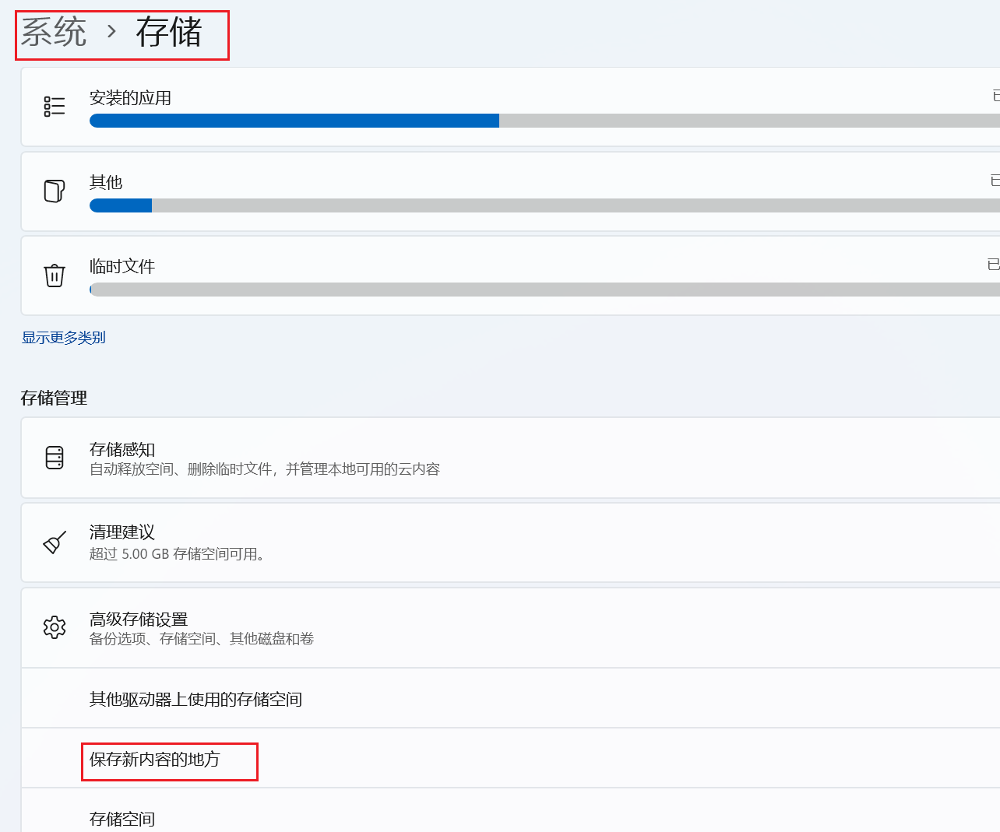
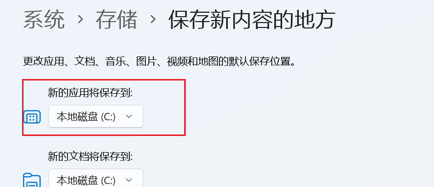
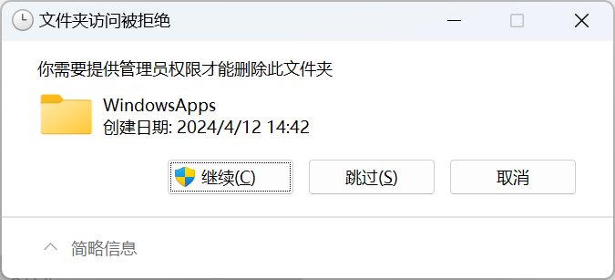
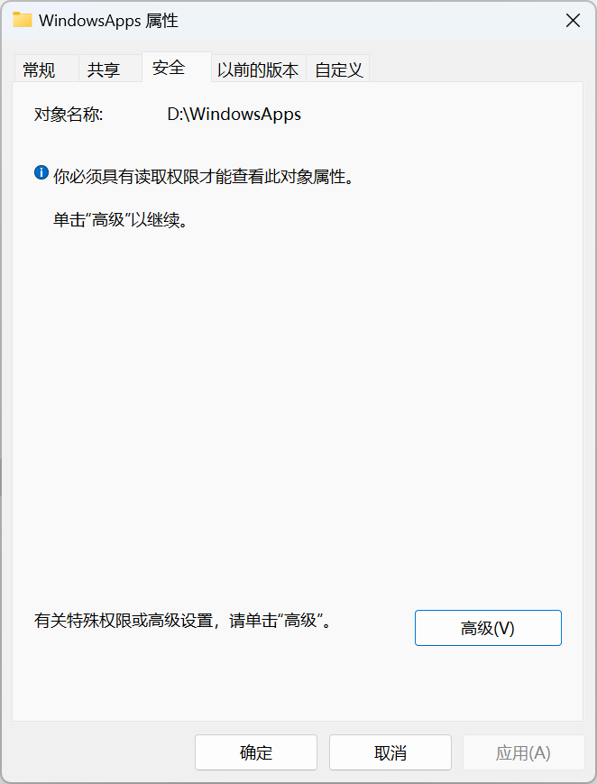
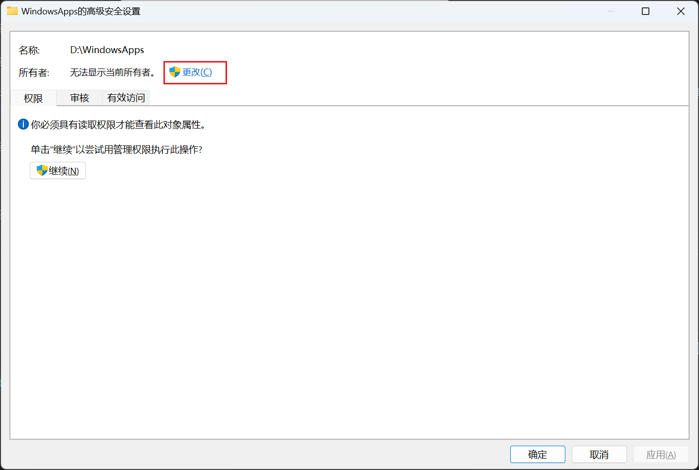
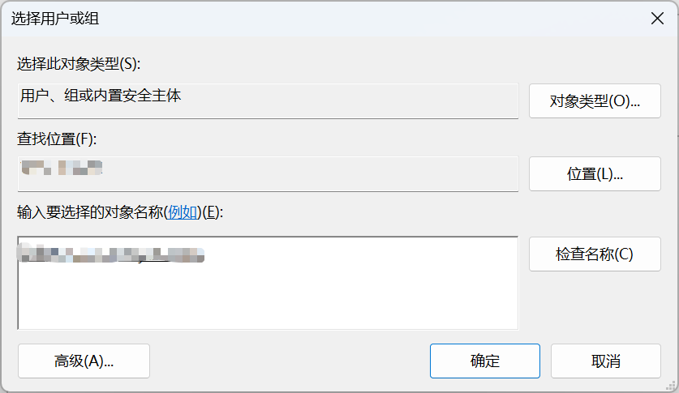
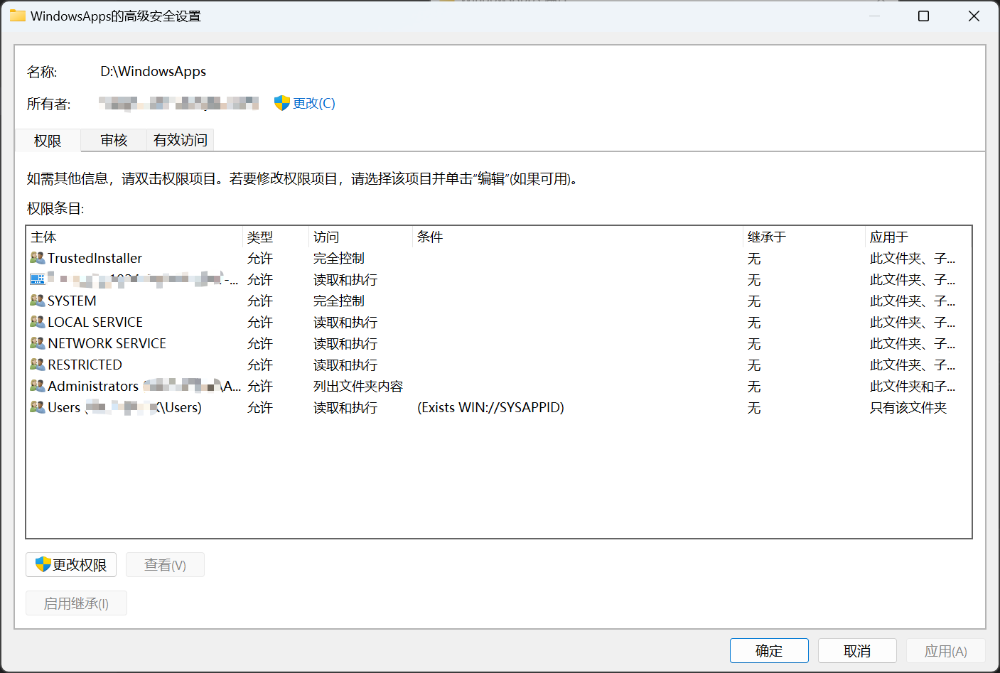
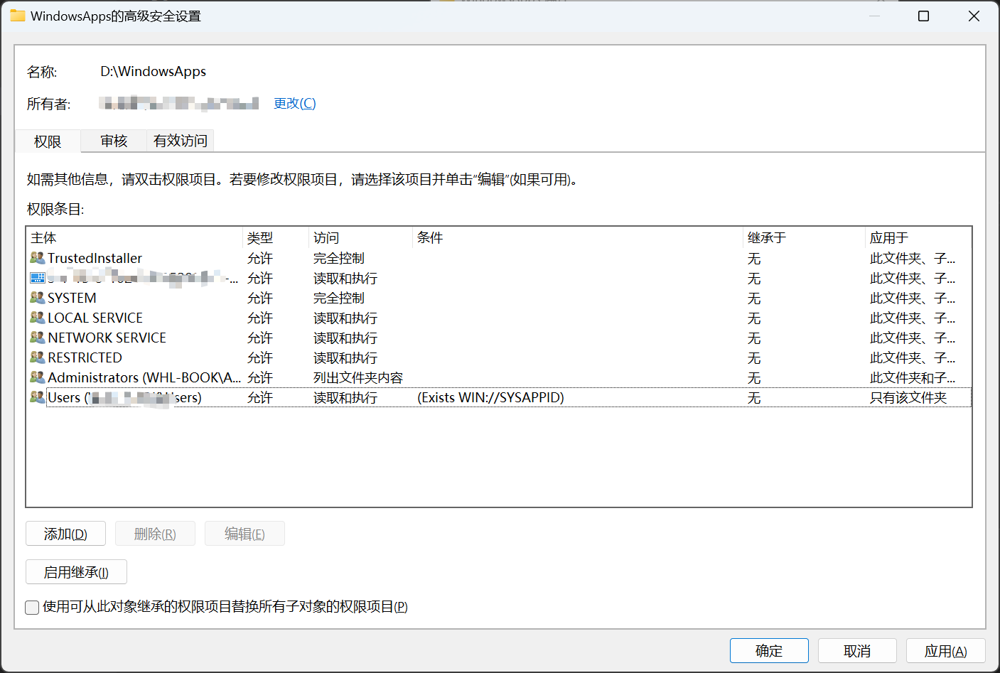
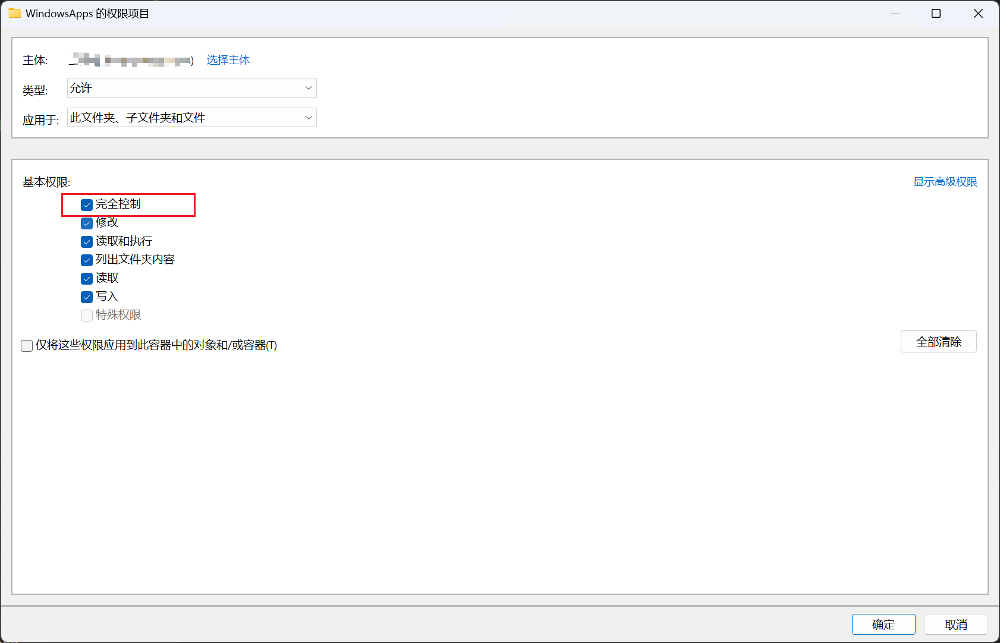

# Windows 系统删除 WindowsApps 文件夹

在Microsoft Store上安装的应用，会在Windows系统中创建一个`WindowsApps`文件夹，用来存放Windows应用的安装文件，这个文件夹在系统盘（C:）中，想要将应用安装到其他盘符中，需要在设置中`系统>存储>保存新内容的地方>将新的应用保存到`修改为其他盘即可。

但是当我们修改后又换成其他的位置，将盘符更改完成后，发现在原来的盘中还是保留有这个文件夹，删除发现没有权限，即使是管理员也无法删除。

首先修改文件的所有者`文件夹右键>属性>安全>高级`

选择要更改的用户，即当前的用户名，微软账号为邮箱地址，本地账号为账户名。

更改后需要确定并重新打开安全选项。

点击更改权限，添加权限，添加完全控制的权限，之后这个文件夹就可以删除了。

## 参考文档

[如何删除 Windows 10 系统生成的 WindowsApps 文件夹](https://blog.csdn.net/WPwalter/article/details/79394709)
