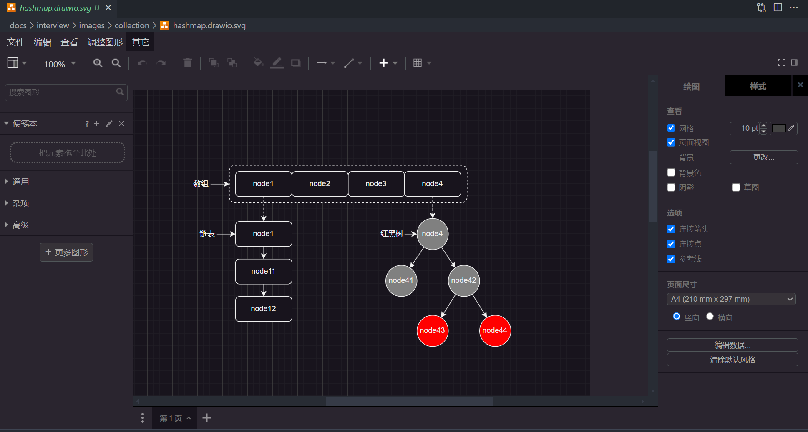

# 在Markdown中使用Draw.io

在编写markdwon时有时候需要画流程图、类图、实体关系图等，首先想到的是扩展Markdown语法，使其支持流程图等。

比较流行的流程图的markdown的扩展主要有：[PlantUML](https://plantuml.com)、[Mermaid](https://mermaid.js.org)等，这些都可以像编写代码一样，通过纯文本的方式编写流程图，然后在markdown中直接渲染出来，但是这些markdown语法并不能满足我们的一些复杂的需求，尤其是既要表达清楚又要图画的美观，这个很难实现，即使可以实现那要实现理想的效果，这无疑要花费很多不必要的时间在美化上面。

## Draw.io

[Draw.io](https://www.drawio.com/)是一个免费开源的图表编辑器，你可以在浏览器端直接编辑，可以下载桌面端，甚至可以在vscode中安装[Draw.io Integration](https://marketplace.visualstudio.com/items?itemName=hediet.vscode-drawio)插件来编辑。

drawio 支持直接编辑`.drawio`、`.drawio.png`、`.drawio.svg`、`.drawio.xml`等文件。vscode的drawio插件默认支持这几种后缀的文件，如果要想不加`drawio`后缀，需要在插件设置中添加支持，但是不建议这样做，因为其他的图片格式等不一定是drawio可编辑的，也不一定是流程图，这样在打开这类文件的时候就会发生冲突。

