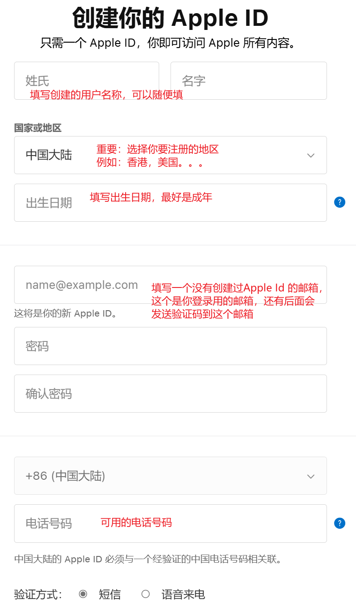
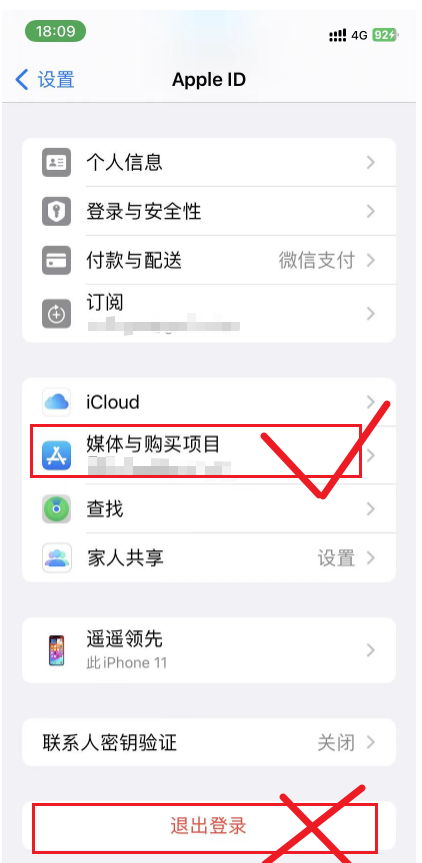
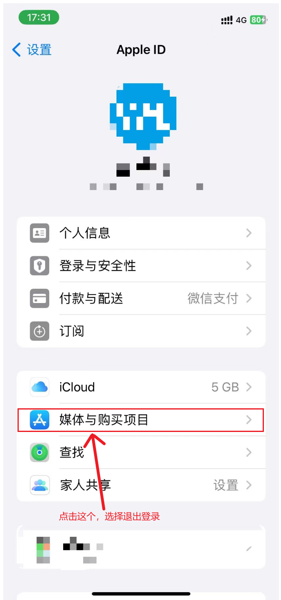
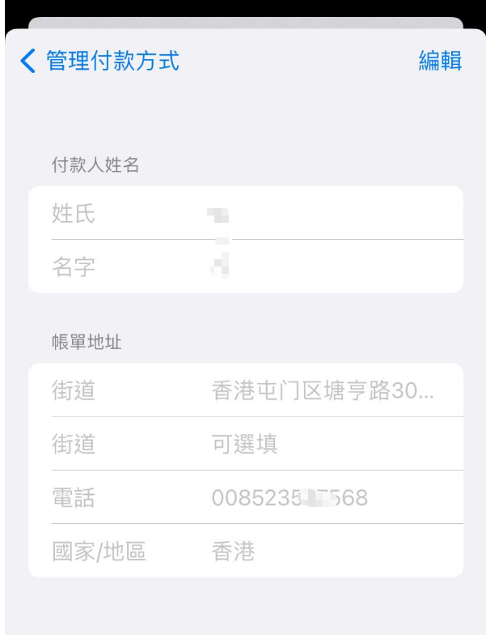
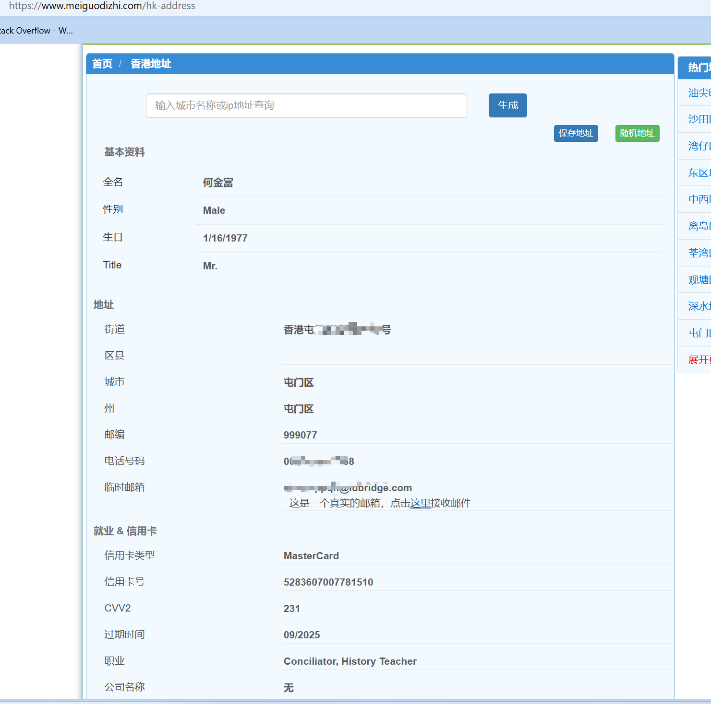

# 注册国外Apple ID

有些时候我们需要下载非大陆地区的软件或者游戏，这个时候就需要注册一个非大陆地区的Apple ID。使用这个非大陆地区的Apple ID登录App Store，就可以获得非大陆地区的软件或者游戏。

## 准备工作

- 能接收短信的手机号一个
- 没有注册过Apple ID的邮箱一个，推荐gmail
- 非大陆地区地址用于付款方式及账单地址，推荐[地址生成器](https://www.meiguodizhi.com)生成

## 注册Apple ID

登录[苹果官网](https://appleid.apple.com/)，创建新的Apple ID，这个过程中需要的是你拥有一个**没有注册过Apple ID**的邮箱(最好是国外的邮箱，例如gmail)，一个你可用的手机号，这个手机号只是接收一个短信验证码，只要你能接收到就可以。

后面是给你的邮箱及手机号发送验证码，输入验证码即可注册成功。

## 登录App Store

在设置中，选择Apple ID，选择 `媒体与购买项目`，点击退出登录，再次点击选择 `不是***?` 的选项，也就是不是以你原来的Apple ID登录，填写新的Apple ID及密码登录。

::: danger 危险，必读

一定要注意，这里退出登录的是 **媒体与购买项目** 。

- 无论是否是自己的Apple ID，都要注意**只退出登录媒体与购买项目，千万不要退出icloud**。退出媒体与购买项目并登录其他的Apple ID，只会影响你在App Store上的信息，不会影响你手机中其他的信息

- **如果你退出的是icloud**，那你相册中的图片会被上传到你登录的新Apple ID的icloud中，导致**隐私的泄露**，如果这个新的Apple ID不是你的，甚至这个Apple ID的主人可以直接锁住你的手机，**导致手机变砖，无法使用**。

:::

## 添加付款方式

在App Store中选择你要下载的游戏，然后点击下载按钮，会弹出未检查的Apple ID的提示，选择检查并勾选`同意条款与条例`，他会让你填写付款方式，**付款方式选择无**，账单邮寄地址必填，填写国外的邮寄地址即可。国外地址可以通过[地址生成器](https://www.meiguodizhi.com/)生成，选择**要生成的国家或者地区**，会自动生成对应的地址，填写进去即可。

这个是我已经填写过的示例

生成的地址示例 https://www.meiguodizhi.com/hk-address

