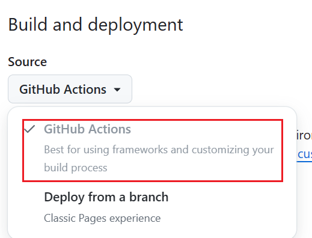

# 使用 VitePress 构建个人博客网站

## VitePress

[VitePress](https://vitepress.dev/) 是一个静态站点生成器 (SSG)，专为构建快速、以内容为中心的网站而设计。简而言之，VitePress 获取用 Markdown 编写的源内容，为其应用主题，并生成可以轻松部署在任何地方的静态 HTML 页面。

## 项目构建

- 安装 nodejs,版本需要 18 以上

- 安装vitepress

::: code-group

```sh [npm]
$ npm add -D vitepress
```

```sh [pnpm]
$ pnpm add -D vitepress
```

```sh [yarn]
$ yarn add -D vitepress
```

```sh [bun]
$ bun add -D vitepress
```

:::

- 构建项目结构

VitePress和Vite一样有构建项目的命令行工具

::: code-group

```sh [npm]
$ npx vitepress init
```

```sh [pnpm]
$ pnpm vitepress init
```

```sh [bun]
$ bunx vitepress init
```

:::

- 文件结构

默认的命令行构建的项目的目录如下

```
.
├─ docs
│  ├─ .vitepress
│  │  └─ config.mts
│  ├─ api-examples.md
│  ├─ markdown-examples.md
│  └─ index.md
└─ package.json
```

`docs`目录为站点项目的根目录

`.vitepress`目录为vitepress 的配置文件、缓存、构建输出等代码的位置

`public`为静态资源目录，public里的文件会原封不动的复制到输出目录中，public的位置为站点项目的根目录

- 运行项目

::: code-group

```sh [npm]
$ npm run docs:dev
```

```sh [pnpm]
$ pnpm run docs:dev
```

```sh [yarn]
$ yarn docs:dev
```

```sh [bun]
$ bun run docs:dev
```

:::

## 创建github工作流自动部署

- 创建GitHub仓库

创建一个名为`用户名.github.io`的仓库，要使用github pages进行静态网页的托管，对仓库名称有特殊要求，例如用户名为abc，则应该创建`abc.github.io`的仓库，将来访问的网址也就是`https://abc.github.io`

- .gitignore

```
node_modules
docs/.vitepress/cache
docs/.vitepress/dist
```

## 使用GitHub Actions自动构建及发布

- 创建github actions配置文件

创建文件`.github/workflows/deploy.yml` 如果没有特殊需要可以直接使用官网提供的github pages部署的示例

```yml
# 构建 VitePress 站点并将其部署到 GitHub Pages 的示例工作流程
#
name: Deploy VitePress site to Pages

on:
  # 在针对 `main` 分支的推送上运行。如果你
  # 使用 `master` 分支作为默认分支，请将其更改为 `master`
  push:
    branches: [main]

  # 允许你从 Actions 选项卡手动运行此工作流程
  workflow_dispatch:

# 设置 GITHUB_TOKEN 的权限，以允许部署到 GitHub Pages
permissions:
  contents: read
  pages: write
  id-token: write

# 只允许同时进行一次部署，跳过正在运行和最新队列之间的运行队列
# 但是，不要取消正在进行的运行，因为我们希望允许这些生产部署完成
concurrency:
  group: pages
  cancel-in-progress: false

jobs:
  # 构建工作
  build:
    runs-on: ubuntu-latest
    steps:
      - name: Checkout
        uses: actions/checkout@v4
        with:
          fetch-depth: 0 # 如果未启用 lastUpdated，则不需要
      # - uses: pnpm/action-setup@v3 # 如果使用 pnpm，请取消注释
      # - uses: oven-sh/setup-bun@v1 # 如果使用 Bun，请取消注释
      - name: Setup Node
        uses: actions/setup-node@v4
        with:
          node-version: 20
          cache: npm # 或 pnpm / yarn
      - name: Setup Pages
        uses: actions/configure-pages@v4
      - name: Install dependencies
        run: npm ci # 或 pnpm install / yarn install / bun install
      - name: Build with VitePress
        run: npm run docs:build # 或 pnpm docs:build / yarn docs:build / bun run docs:build
      - name: Upload artifact
        uses: actions/upload-pages-artifact@v3
        with:
          path: docs/.vitepress/dist

  # 部署工作
  deploy:
    environment:
      name: github-pages
      url: ${{ steps.deployment.outputs.page_url }}
    needs: build
    runs-on: ubuntu-latest
    name: Deploy
    steps:
      - name: Deploy to GitHub Pages
        id: deployment
        uses: actions/deploy-pages@v4
```

- 设置GitHub Pages

打开github仓库的进行配置，位置在：`Settings > Pages > Build and deployment > Source` 选择`GitHub Actions`



- 提交并推送代码

向main分支推送代码，github会自动触发actions进行构建并发布
