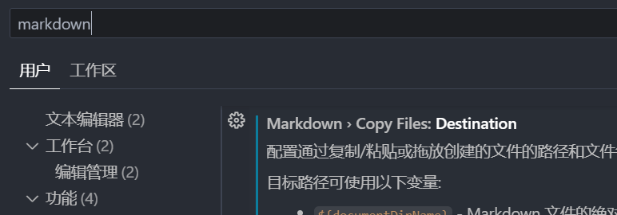
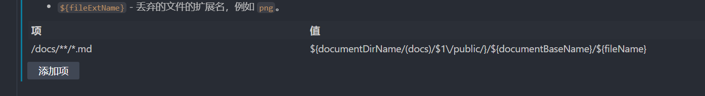

# Vscode Markdown 图片粘贴

::: danger 重要

VitePress 推荐使用相对路径来引用资源，常见的图像，媒体和字体文件会被自动检测并视作资源。所以图片可以直接使用相对路径，可以不必按照下面的配置。

不过为了文件夹的结构清晰，我是在markdown文件同级目录下建立一个`images`文件夹，然后粘贴图片到`images`文件夹下，然后使用相对路径引用。

:::

在vscode中编辑markdown文件时，粘贴图片默认会将图片粘贴到当前目录下，而在使用VitePress构建文档时，默认是在`docs/public`目录下引入图片，所以我们需要将vscode的默认粘贴行为修改为将图片粘贴到`docs/public`目录下。

- 首先打开vscode的markdown设置`Markdown › Copy Files: Destination`
- 添加用来转换图片路径的规则

| 项              | 值                                                                      |
| --------------- | ----------------------------------------------------------------------- |
| `/docs/**/*.md` | `${documentDirName/(docs)/$1\/public/}/${documentBaseName}/${fileName}` |

其中`${documentDirName/(docs)/$1\/public/}`这一节是将markdown文件所在目录路径中的`docs`替换成`docs/public`，例如：markdown文件所在路径为`D:/work/whlit.github.io/docs/blog`，则替换后为`D:/work/whlit.github.io/docs/public/blog`。

::: tip 可使用的变量

- ${documentDirName} - Markdown 文件的绝对父级目录路径，例如 /Users/me/myProject/docs。
- ${documentRelativeDirName} - Markdown 文档的相对父级目录路径，例如 docs。如果文件不是工作区的一部分，则与 ${documentDirName} 相同。
- ${documentFileName} - Markdown 文档的完整文件名，例如 README.md。
- ${documentBaseName} - Markdown 文档的基名，例如 README。
- ${documentExtName} - Markdown 文档的扩展，例如 md。
- ${documentFilePath} - Markdown 文档的绝对路径，例如 /Users/me/myProject/docs/README.md。
- ${documentRelativeFilePath} - Markdown 文档的相对路径，例如 docs/README.md。如果文件不是工作区的一部分，则与 ${documentFilePath} 相同。
- ${documentWorkspaceFolder} - Markdown 文档的工作区文件夹，例如 /Users/me/myProject。如果文件不是工作区的一部分，则与 ${documentDirName} 相同。
- ${fileName} - 丢弃的文件的文件名，例如 image.png。
- ${fileExtName} - 丢弃的文件的扩展名，例如 png。

:::

注意：在markdown文件中，粘贴出来的引用路径是个相对路径，也就是`../public/blog/vscode-markdown-image-paste/image.png`这样的形式，需要我们手动删除`../public`，因为在vitepress中静态资源的public目录必须是根绝对路径中。
