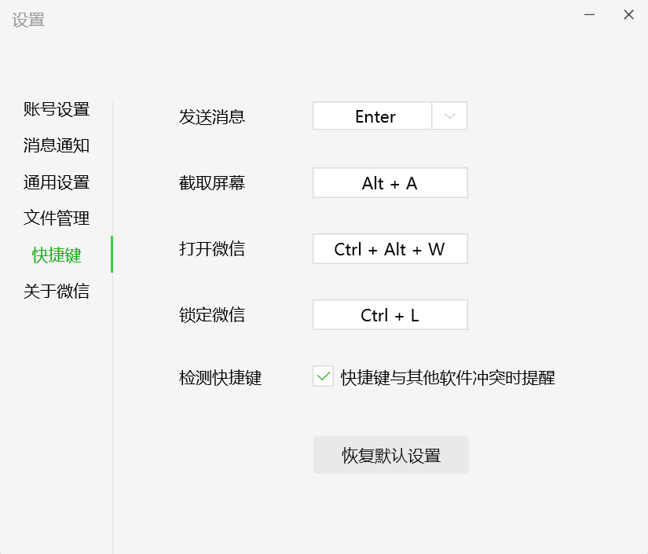
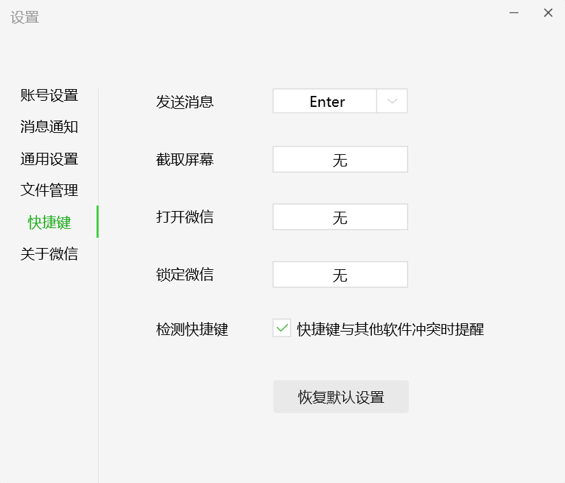

# 微信快捷键修改

在使用pc端微信的过程中，发现默认的微信的截图快捷键是`Alt + A`与其他软件的快捷键冲突了，而且平时也不用微信进行截图，所以想要关闭掉微信的快捷键。

## 快捷键设置

快捷键的修改在PC端微信的左下角的设置中，选择快捷键，选择需要修改的快捷键，鼠标左键点击后输入快捷键即可。

## 关闭快捷键

从界面上没有提供快捷键的关闭方式，也没有提供关闭快捷键的选项，但其实腾讯隐藏起来了，在鼠标左键点击修改的快捷键后，我们按下`删除键`即`Backspace`即可修改为`无`

