# AVL 树

AVL 树是一种平衡二叉树，它的每个节点都有一个平衡因子，这个平衡因子的值为左子树的高度减去右子树的高度，空节点的高度为 0。平衡因子允许的值为 -1、0、1，当平衡因子为 -2 或者 2 时，平衡二叉树失去平衡，需要重新进行平衡。平衡因子可以直接存储到节点中，也可以通过计算得到。

## 插入

节点的插入操作必然会导致平衡因子的变化，如果平衡因子的值为 -2 或者 2，树就变得不再平衡需要重新平衡。

- 当插入数字10时，树由(a)形态转变为(b)形态，此时由于节点高度的变化，节点8变得不在平衡`左子树高度(1) - 右子树高度(3) = 平衡因子(-2)`。
- 由于节点8的平衡因子小于-1，然后节点8的右子树平衡因子大于等于0，所以先对节点8的右子节点进行一次右旋，由形态(b)转变为(c)。
- 最后再将节点8进行左旋，由形态(c)转变为(d)。

## 删除

AVL 树本来就是一颗二叉搜索树，所以节点的删除与二叉搜索树时一样的，只是在删除后需要对AVL树进行平衡操作。

- 当删除数字27时，树由(a)形态转变为(b)形态，此时由于节点高度的变化，节点17变得不在平衡`左子树高度(3) - 右子树高度(1) = 平衡因子(2)`。
- 由于节点17的平衡因子大于1，然后节点17的左子树平衡因子大于等于0，所以只需要对节点17进行右旋即可，由形态(b)转变为(c)。

## 旋转

树的旋转是自平衡二叉树保持平衡性的关键操作，它分为两种左旋和右旋，下面是左旋和右旋的过程:

- 左旋：由形态(b)转变为(a)的操作，对节点Y进行左旋操作就是将节点Y的右节点X放到自己的位置，然后自己作为该节点X的左节点，同时X的左节点B作为自己的右节点。
- 右旋：由形态(a)转换为(b)的操作，对节点X进行右旋操作就是将节点X的左节点Y放到自己的位置，然后自己作为该节点Y的右节点，同时Y的右节点B作为自己的左节点。

## 旋转方式的选择

当节点不平衡时，我们发现所有的不平衡的树都可以归纳为四种情况：

| 不平衡的节点平衡因子 | 子节点平衡因子 | 旋转方式                     |
| -------------------- | -------------- | ---------------------------- |
| > 1                  | >= 0           | 不平衡节点右旋               |
| > 1                  | < 0            | 子节点左旋然后不平衡节点右旋 |
| < -1                 | <= 0           | 不平衡节点左旋               |
| < -1                 | > 0            | 子节点右旋然后不平衡节点左旋 |

图解如下：

## 链接

- [AVL 树可视化演示](https://www.cs.usfca.edu/~galles/visualization/AVLtree.html)
- [Hello Algo - AVL Tree](https://www.hello-algo.com/chapter_tree/avl_tree/)
