# 二叉搜索树

二叉搜索树是一种特殊的二叉树，它的每个节点的值都大于其左子树中的任何值，也小于其右子树中的任何值。

## 查询

二叉搜索树的查询，从根节点开始，比较根节点与目标值的大小，如果目标值小于根节点，那么目标值应该在根节点的左子树中，如果目标值大于根节点，那么目标值应该在根节点的右子树中，循环这个过程，直到节点的值等于目标值，或者到达空节点。

## 插入节点

二叉搜索树插入节点，首先搜索要插入的节点的位置，如果找到了就返回，如果没有找到就插入到指定位置。

## 删除节点

删除节点会涉及这个节点关联的其他节点的修改，主要有以下几种情况

- 如果要删除的节点是叶子节点，那么直接删除并修改父节点在该节点位置的指针指向空
- 如果要删除的节点只有一个子节点，那么直接删除并修改父节点在该节点位置的指针指向子节点
- 如果要删除的节点有两个子节点，那么需要找到后继节点，先将后节点取出，然后将后继节点的右子节点放到后继节点的位置上，然后将后继节点放到被删除节点的位置上，将后继节点的左右子节点指向被删除节点的左右子节点(如果后继节点原本就是被删除节点的右字节点则无需修改右字节点指针)

::: tip 后继节点

被删除的节点的后继节点是指在被删节点的右子树中，值最小的节点，也就是右子树中序遍历结果的第一个节点。也可以直接对右子树一直获取左子节点，直到这个节点没有左子节点，那它就是后继节点。

:::

## 二叉搜索树的中序遍历

由于二叉搜索树的左子树都比根节点小，右子树都比根节点大，所以二叉搜索树的[中序遍历](./binary-tree#中序遍历)的结果就会发现它是从小到大排序的。

## 链接

- [二叉搜索树可视化](https://www.cs.usfca.edu/~galles/visualization/BST.html)
