# 二叉搜索树

二叉搜索树是一种特殊的二叉树，它的每个节点的值都大于其左子树中的任何值，也小于其右子树中的任何值。

## 查询

二叉搜索树的查询，从根节点开始，比较根节点与目标值的大小，如果目标值小于根节点，那么目标值应该在根节点的左子树中，如果目标值大于根节点，那么目标值应该在根节点的右子树中，循环这个过程，直到节点的值等于目标值，或者到达空节点。

## 插入节点

二叉搜索树插入节点，首先搜索要插入的节点的位置，如果找到了就返回，如果没有找到就插入到指定位置。

## 二叉搜索树的中序遍历

由于二叉搜索树的左子树都比根节点小，右子树都比根节点大，所以二叉搜索树的[中序遍历](./binary-tree#中序遍历)的结果就会发现它是从小到大排序的。

## 链接

- [二叉搜索树可视化](https://www.cs.usfca.edu/~galles/visualization/BST.html)
