# 二叉树

在链表中我们通过存放下一个节点的指针的方式将多个数据串联成一条链，然后通过指针来遍历整个链表。现在我们将存放下一个节点的指针改为存放多个字节点的指针，这样的结构看起来很像一棵树不断的分叉，所以我们就称这种结构为**树**。



一般为了看起来方便，在展示时一般将树倒过来，根节点在最上方。对于普通的树来说，它的每个节点可以有任意数量的子节点，因为我们没有规定它字节的最大数量。现在我们规定每个节点最多只能有两个子节点，并且这两个节点分别用left和right表示，这样的树我们称为**二叉树**。



::: code-group

```java [BinaryTree]
public class BinaryTree<T> {
    T val;
    BinaryTree<T> left;
    BinaryTree<T> right;
}
```

```java [Tree]
public class Tree<T> {
    T val;
    List<Tree<T>> children;
}
```

:::

## 满二叉树

在一颗二叉树中如果每个节点都有0个或者2个子节点，那么这个二叉树就是满二叉树。



## 完美二叉树

一棵深度为 $k$ ，且有 $2^k-1$ 个节点的二叉树，称为完美二叉树。特点是所有的非叶子节点都有两个子节点，所有的叶子节点都在同一层。



## 完全二叉树

在一颗二叉树中除了最后一层其余层全部是满的，而且最后一层要么是满的，要么是全部集中在左侧。


## 二叉树遍历

二叉树的遍历一般分为四种：层次遍历、前序遍历、中序遍历和后序遍历。层次遍历也叫广度优先遍历，后三种也叫深度优先遍历，分别表示根节点在遍历中处于前、中、后的位置。对于深度优先的遍历，由于存储的结构优势，天生就很方便的使用递归的方式来遍历它，而对于非递归方式就一般需要借助栈来辅助了。

### 层次遍历

从根节点开始，一层一层地遍历，也叫广度优先遍历



::: code-group

```java [递归实现]
public void levelTraversal(Node<T> root) {
    if (root == null) {
        return;
    }
    levelTraversal(List.of(root));
}
private void levelTraversal(List<Node<T>> nodes) {
    if (nodes.isEmpty()) {
        return;
    }
    // 保存下一层的节点
    List<Node<T>> nextNodes = new ArrayList<>();
    for (Node<T> node : nodes) {
        // 打印这一层的节点
        System.out.println(node.val);
        // 保存下一层，先左后右
        if (node.left != null) {
            nextNodes.add(node.left);
        }
        if (node.right != null) {
            nextNodes.add(node.right);
        }
    }
    // 递归下一层
    levelTraversal(nextNodes);
}
```

```java [非递归实现]
public void levelTraversal(Node<T> root) {
    if (root == null) {
        return;
    }
    // 使用队列存放遍历的节点
    Queue<Node<T>> queue = new LinkedList<>();
    queue.offer(root);
    while (!queue.isEmpty()) {
        Node<T> node = queue.poll();
        System.out.println(node.val);
        // 保存下一层的节点到队列尾部，先左后右
        if (node.left != null) {
            queue.offer(node.left);
        }
        if (node.right != null) {
            queue.offer(node.right);
        }
    }
}
```

:::

### 前序遍历

先访问根节点，再访问左子树，再访问右子树



::: code-group

```java [递归实现]
public void preTraversal(Node<T> root) {
    if (root == null) {
        return;
    }
    System.out.println(root.val);
    preTraversal(root.left);
    preTraversal(root.right);
}
```

```java [非递归实现]
public void preTraversal(Node<T> root) {
    if (root == null) {
        return;
    }
    // 使用栈存放遍历的节点
    Deque<Node<T>> stack = new LinkedList<>();
    stack.push(root);
    while (!stack.isEmpty()) {
        Node<T> node = stack.pop();
        // 先打印节点
        System.out.println(node.val);
        // 因为栈是先进后出 所以先入栈右后入栈左 出的时候就会先出左再出右
        if (node.right != null) {
            stack.push(node.right);
        }
        if (node.left != null) {
            stack.push(node.left);
        }
    }
}
```

:::

### 中序遍历

先访问左子树，再访问根节点，再访问右子树



::: code-group

```java [递归实现]
public void inTraversal(Node<T> root) {
    if (root == null) {
        return;
    }
    inTraversal(root.left);
    System.out.println(root.val);
    inTraversal(root.right);
}
```

```java [非递归实现]
public void inTraversal(Node<T> root) {
    if (root == null) {
        return;
    }
    Deque<Node<T>> stack = new LinkedList<>();
    Node<T> node = root;
    while (node != null || !stack.isEmpty()) {
        if (node == null) {
            // 当前节点如果为父节点的左节点，则栈顶元素就是父节点
            // 当前节点如果为父节点的右节点，说明父节点已经访问完毕，栈顶元素就是父节点的父节点
            // 父节点出栈
            node = stack.pop();
            // 打印父节点
            System.out.println(node.val);
            // 将节点置为右节点，遍历右节点
            node = node.right;
        } else {
            // 节点不为空，需要将节点入栈，然后先遍历左节点
            stack.push(node);
            node = node.left;
        }
    }
}
```

:::

### 后序遍历

先访问左子树，再访问右子树，再访问根节点



在非递归实现中，我们在[前序遍历](#前序遍历)中的栈中存放的是**未遍历的左右子节点**，来确定遍历的次序。在[中序遍历](#中序遍历)中的栈中存放的是**已经访问过的父节点**，当左子树全部遍历完时，从栈中弹出父节点，然后访问父节点的数据。

这两种遍历过程中我们的栈中存放的节点它是否遍历过我们是很清楚的，但是现在的后序遍历中，我们首先访问了父节点，但此时父节点的数据我们是不能现在访问的，需要左右子树都访问完了，才能访问父节点中的数据，而在访问左子树的时候，右子树这时候我们和前序遍历一样先存放起来，等左子树访问完了，才能访问右子树，所以现在我们有两个数据需要存放，一个是已访问过的父节点，一个是未访问的右子节点，显然存放到同一个栈中是不可能的，那样就无法区分了，在这个基础上我们可以有以下以下一种方式来解决：

- 方式一：使用Map来存放节点的访问次数，已经访问过的直接获取其值，未访问的设置访问次数加一，然后将其放入栈中，再访问其左右子节点
- 方式二：遍历的过程中将未访问的节点放入一个栈中，将访问过的节点放入另一个栈中，遍历完成时，将访问过的节点依次弹出并获取值

::: code-group

```java [递归实现]
public void postTraversal(Node<T> root) {
    if (root == null) {
        return;
    }
    postTraversal(root.left);
    postTraversal(root.right);
    System.out.println(root.val);
}
```

```java [非递归实现-方式一]
public void postTraversal(Node<T> root) {
    if (root == null) {
        return;
    }
    Deque<Node<T>> stack = new LinkedList<>();
    stack.push(root);
    Map<Node<T>, Boolean> map = new HashMap<>();
    while (!stack.isEmpty()) {
        Node<T> node = stack.peek();
        // 已经访问过，直接打印，并弹出
        if (map.getOrDefault(node, false)) {
            System.out.println(node.val);
            stack.pop();
        } else {
            // 未访问，设置已访问
            map.put(node, true);
            if (node.right != null) {
                stack.push(node.right);
            }
            if (node.left != null) {
                stack.push(node.left);
            }
        }
    }
}
```

```java [非递归实现-方式二]
public void postTraversal(Node<T> root) {
    if (root == null) {
        return;
    }
    Deque<Node<T>> stack = new LinkedList<>();
    Deque<Node<T>> res = new LinkedList<>();
    stack.push(root);
    while (!stack.isEmpty()) {
        Node<T> node = stack.pop();
        // 将节点入已访问栈
        res.push(node);
        // 将左节点入未访问栈
        if (node.left != null) {
            stack.push(node.left);
        }
        // 将右节点入未访问栈
        if (node.right != null) {
            stack.push(node.right);
        }
    }
    // 从已访问栈中依次弹出
    while (!res.isEmpty()) {
        System.out.println(res.pop().val);
    }
}
```

:::
