# 链表

链表是一种按顺序排列的动态集合，与数组不同的是，它的顺序不是根据元素在数组中的下标决定，而是在节点对象中存储下一个节点的引用来实现顺序性。



```java
public class Node<T> {
    T val; // 节点中存储的数据
    Node<T> next; // 指向下一个节点
}
```

## 插入

在链表的头部插入一个节点只需要创建一个节点，然后将这个节点的 next 指向原来的第一个节点即可。在链表的尾部插入一个节点只需要创建一个节点，然后将链表尾部节点的 next 指向新的节点即可。而在链表中间位置插入一个节点需要将插入位置的前一个节点的 next 指向新的节点，将新节点的 next 指向插入位置的下一个节点即可。



::: tip 与数组的区别

- 内存空间不连续，无法通过下标直接访问
- 插入时只需要改变 next 指针即可，而数组需要迁移数据
- 长度没有限制，而数组的长度是固定的

:::

## 双向链表

单向链表只能从前往后遍历，即我们只能通过某一个节点来获取这个节点之后的节点，无法获取这个节点之前的节点。为了获取这个节点之前的节点，我们可以在节点中再保存一个指向前一个节点的指针，这样无论是向前还是向后就都可以遍历了。


