# 队列

队列是一种动态的数据集合，它的特点是先进先出(FIFO，First In First Out)，每次移除元素都是最先添加的元素。


::: tip 方法

- offer: 向队列的尾部插入一个元素
- poll: 从队列的头部删除一个元素

:::

# 数组实现

用两个变量 head 和 tail 来表示队列的头和尾，这样插入元素和删除元素的时候只需要移动对于的指针即可。



```java
public class Queue<E> {
    private E[] elements;
    private int head;
    private int tail;
    public Queue(int capacity) {
        elements = (E[]) new Object[capacity];
    }
    public boolean offer(E e) {
        if ((tail + 1) % elements.length == head) {
            return false;
        }
        tail = (tail + 1) % elements.length;
        elements[tail] = e;
        return true;
    }
    public E poll() {
        if (head == tail) {
            return null;
        }
        E e = elements[head];
        head = (head + 1) % elements.length;
        return e;
    }
}
```

# 链表实现

用一个链表来实现队列，通过头节点和尾节点来表示队列的头和尾。



```java
public class Queue<E> {
    private Node<E> head;
    private Node<E> tail;
    public Queue() {
    }
    public boolean offer(E e) {
        if (tail == null) {
            head = tail = new Node<>(e);
            return true;
        }
        Node<E> node = new Node<>(e);
        tail.next = node;
        tail = node;
        return true;
    }
    public E poll() {
        if (head == null) {
            return null;
        }
        E e = head;
        head = head.next;
        return e;
    }
}
```
