# 红黑树

红黑树是一种自平衡的二叉搜索树，除二叉搜索树的基本特性之外，它还具有以下性质：

- 每个节点都是红色或者黑色
- 根节点是黑色
- 每个叶子节点(Nil节点)都是黑色
- 如果一个节点是红色，那么它的两个子节点都是黑色
- 从任意节点到其每个叶子节点的所有路径都包含相同数目的黑色节点

为了方便处理红黑树的边界问题，红黑树使用一个哨兵来代表`NIL`，对于一颗红黑树`T`，哨兵`T.nil`是一个与树中普通节点有相同属性的对象，它的color属性是`Black`，其他属性可以是任意值，所有指向`NIL`的指针都改为指向哨兵`T.nil`。

## 插入

红黑树也是一颗二叉搜索树，所以和二叉树一样先找到插入的位置，然后插入节点，只不过这里需要将`插入的节点`染成`红色`，并且它的左右子节点都指向哨兵`T.nil`。

然后判断是否满足红黑树的性质，即插入节点的父节点是否为红色，因为红色节点的子节点都必须是黑色。当父节点是红色时由于插入节点是红色所以需要重新调整红黑树，以满足红色节点的子节点都是黑色的性质。

红黑树的调整也是通过[旋转](./avl-tree#旋转)操作来实现，只不过会在旋转前进行颜色调整，根据插入的位置可以分为以下几种情况：

| 插入节点是父节点的左子节点 | 父节点是爷爷节点的左节点 | 爷爷节点的另一子节点颜色 | 颜色变化                                   | 旋转方式     | 后续调整节点 |
| -------------------------- | ------------------------ | ------------------------ | ------------------------------------------ | ------------ | ------------ |
| 是                         | 是                       | 黑                       | 父节点变黑，爷爷节点变红                   | 爷爷节点右旋 | 爷爷节点     |
| 是                         | 是                       | 红                       | 父节点变黑，爷爷节点变红，爷爷右子节点变黑 | 不旋转       | 爷爷节点     |
| 否                         | 是                       | -                        | 颜色不变                                   | 父节点左旋   | 父节点       |
| 否                         | 否                       | 黑                       | 父节点变黑，爷爷节点变红                   | 爷爷节点左旋 | 爷爷节点     |
| 否                         | 否                       | 红                       | 父节点变黑，爷爷节点变红，爷爷左子节点变黑 | 不旋转       | 爷爷节点     |
| 是                         | 否                       | -                        | 颜色不变                                   | 父节点右旋   | 父节点       |

### 示例一

- 插入节点8是父节点9的左子节点，父节点9是爷爷节点12的左节点，爷爷节点12的另一子节点Nil颜色为黑，这种情况为表中的第一中情况，首先将父节点9变黑，爷爷节点12变红，然后对爷爷节点12进行右旋得到(b)的情况.
- 此时以爷爷节点12为基础进行下一轮判断，节点12的父节点为黑，所以树已经平衡，树的调整完毕。

### 示例二

- 插入节点8是父节点9的左子节点，父节点9是爷爷节点12的左节点，爷爷节点12的另一子节点15颜色为红，满足表中第二中情况，将父节点9染黑，爷爷节点12染红，子节点15染黑。
- 此时以节点12为基础继续判断，节点12的父节点7为红，所以需要进行调整，节点12是父节点7的右子节点，父节点7是爷爷节点17的左子节点，满足表中第三中情况，将父节点7进行左旋得到(c)的情况。
- 此时以节点7为基础进行下一轮判断，节点7的父节点12为红，所以需要进行调整，节点7是父节点12的左子节点，父节点12是爷爷节点17的左子节点，爷爷节点的另一子节点为黑色，满足表中第一中情况，首先将父节点12变黑，爷爷节点17变红，然后对爷爷节点17进行右旋得到(d)的情况。
- 此时以节点17为基础进行下一轮判断，节点17的父节点12为黑，所以树已经平衡，树的调整完毕。

### 示例三

- 插入节点10是父节点9的右子节点，父节点9是爷爷节点12的左节点，满足表中第三种情况，将父节点9左旋得到(b)的情况。
- 此时以节点9为基础进行下一轮判断。(由于此时结构和示例一中的结构完全一致，后续就不再进行叙述)

其他示例由于和上面的情况相反，只需要相反的操作就可以了，所以也不再进行叙述。同时我们在示例中发现这几种情况会相互进行转化

## 删除

删除的过程是在[二叉搜索树的节点删除](./binary-search-tree#删除节点)过程的基础上加上染色操作。

- 当删除的节点只有一个子节点或者没有子节点，此时只需要将该节点删除，然后将子节点放到删除节点的位置，颜色不变，然后判断删除的节点的颜色是黑色则需要重新进行调整。
- 当删除的节点有两个子节点，此时需要先找到其后续节点，并记录此时该节点的颜色，然后将该节点的右子节点放到其位置，颜色不变，然后将后继节点放到删除节点的位置，修改其颜色为被删除节点的颜色，最后判断之前后继节点的颜色是黑色则需要进行调整。

判断是否是黑色是因为去掉一个黑色的节点，就会破坏从**任意节点到其每个叶子节点的所有路径都包含相同数目的黑色节点**这条特性。所以现在我们将现在占有原来黑色节点位置的这个节点视为拥有一层额外的黑色，然后记这个拥有额外黑色的节点为x，兄弟节点为W，则红黑树的调整可以归纳为以下情况：

| X节点位于父节点位置 | 兄弟节点W颜色 | 兄弟节点W的子节点颜色          | 颜色变化                                             | 旋转方式     | 后续调整情况                    |
| ------------------- | ------------- | ------------------------------ | ---------------------------------------------------- | ------------ | ------------------------------- |
| 左子节点            | 红            | -                              | 父节点变红色，兄弟节点变黑色                         | 父节点左旋   | x不变，继续进行下一轮循环       |
| 左子节点            | 黑            | 两个子节点都是黑色             | 父节点新增一层额外的黑色，兄弟节点变红色             | 不旋转       | x改为父节点，继续进行下一轮循环 |
| 左子节点            | 黑            | 左子节点是红色，右子节点是黑色 | 兄弟节点变红色，兄弟节点左子节点变黑色               | 兄弟节点右旋 | x不变，继续进行下一轮循环       |
| 左子节点            | 黑            | 右子节点是红色                 | 父节点变黑色，兄弟节点变红色，兄弟节点右子节点变黑色 | 父节点左旋   | 结束循环                        |

### 示例一

- 如图中(a)所示，要删除节点8，此时找到后继节点9，此时后继节点9的颜色为红色，将后继节点9替换删除的节点8转换成(b)，由于后继节点的颜色为红色，所以后继节点的子节点放到其位置时，不会影响红黑树的性质。
- 当后继节点为黑色节点12也就是(c)时，首先将后继节点9替换删除的节点8转换成(d)，并染色为被删除的节点的颜色，再后继节点被放到被删除节点位置后，其位置被右子节点占据，但由于后继节点的颜色为黑色，相当于后续的子树相比其他子树少了一个黑色节点，所以要视右子节点拥有一层额外的黑色，
- 对于拥有额外黑色的节点，如果为红色，则可以直接将其染色为黑色转换为(e)来消除，这样染色后的树就符合红黑树的性质了。

### 示例二

上面叙述了拥有额外黑色的节点为红色的情况，接下来就是拥有额外黑色的节点为黑色的情况，也可以说是节点拥有双重黑色，首先是第一中情况：

- 记拥有额外黑色的节点为X，兄弟节点为W，X是父节点的左子节点，由于兄弟节点为红色，所以父节点必定为黑色，同时兄弟节点的子节点也必然是黑色，所以先对父节点进行左旋，将其从(a) 转换为 (b) ,节点9成为了新的兄弟节点W，转换成了兄弟节点为黑色的情况，接下来进入下一层循环进行其他情况的处理。

### 示例三

- 当兄弟节点W为黑色，并且W的两个子节点都是黑色时，此时可以对拥有额外黑色的节点X和兄弟节点W都减去一层黑色，然后给他们的父节点加上一层黑色，这样从父节点开始到叶子节点的黑色数量是没有变化的，如下面图 (a) -> (b)
- 然后将带有额外黑色的父节点视为X进行下一轮调整。图中的后续情况转换为了[示例一](#示例一)中的情况。

### 示例四

- 当兄弟节点W为黑色，并且W的左节点为红色，右节点为黑色，此时将w染成红色，W左节点染成红色，然后将W进行右旋，变成(b)中的样子，这个操作并没有红黑树的性质进行破坏，只是将情况进行转换成示例五。

### 示例五

- 当兄弟节点W为黑色，并且W的右子节点为红色，此时将W染成父节点8的颜色，然后父节点8和右子节点20都染成黑色，再将父节点8进行左旋，变成(b)中的样子，而此时我们发现，只有X节点位置的黑色节点数量增加了1，其他的并没有变化，所以此时我们可以将X节点的那一层额外的黑色去掉，这样X节点的父节点就满足了红黑树的性质了。此时就完成了调整，不用再进行后续的调整了。

## 链接

- [红黑树可视化演示](https://www.cs.usfca.edu/~galles/visualization/RedBlack.html)
