# 栈

栈是一种动态的集合，它的特点是后进先出(LIFO, Last In First Out)，每次移除元素都是最后添加的元素。



::: tip 方法

- push: 入栈，也就是添加元素，新增的元素在栈的顶部
- pop: 出栈，也就是删除元素，删除的元素会从栈的顶部删除

:::

## 数组实现栈

只要是满足后进先出的特性，就可以认为是栈，所以数组也可以用来实现栈，我们用一个变量来记录栈顶元素在数组中的索引，然后入栈和出栈的时候只需要改变这个索引即可。



```java
public class Stack<T> {
    private Object[] elements;
    private int top;
    public Stack(int capacity) {
        elements = new Object[capacity];
        top = 0;
    }
    public T pop() {
        if (top == 0) {
            return null;
        }
        return (T) elements[--top];
    }
    public void push(T element) {
        elements[top++] = element;
    }
}
```

## 链表实现栈

链表中节点中存放了指向下一个节点的引用，只要记录头节点，然后入栈时创建新的节点指向原来的头节点，这个新节点作为新的头节点，出栈的时候只需要删除头节点，然后把头节点的下一个节点作为新的头节点。这样一个实现了后进先出的栈就完成了。



```java
public class Stack<T> {
    private Node<T> top;
    public Stack() {
        top = null;
    }
    public T pop() {
        if (top == null) {
            return null;
        }
        T element = top.val;
        top = top.getNext();
        return element;
    }
    public void push(T element) {
        Node<T> newNode = new Node<T>(element);
        newNode.setNext(top);
        top = newNode;
    }
}
```
