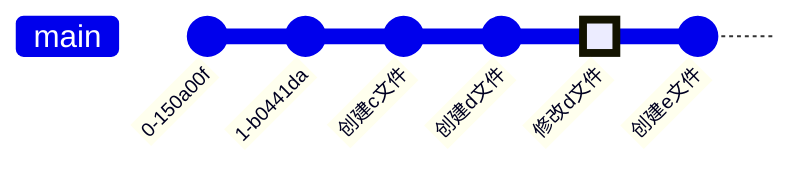
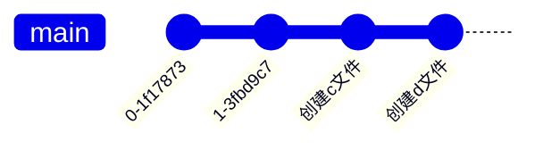
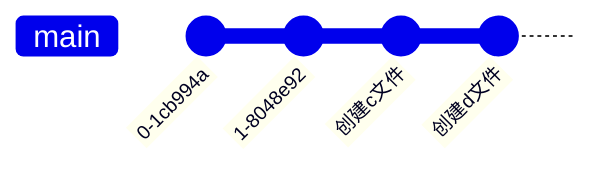
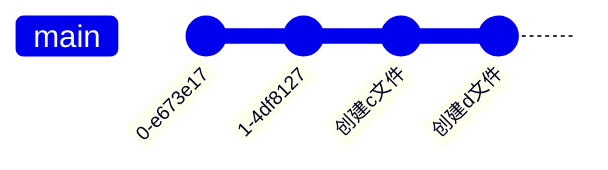

# Git 删除已经push的commit记录

不小心将存储有服务器账号密码的配置文件提交并推送到了远程仓库，此时我们需要将这个配置文件删除掉，如果只是删除文件内容，重新提交并推送，这是不行的，因为历史记录还在，别人还是可以通过历史记录查看到我们的提交内容。所以我们需要将提交记录也删除掉。

## git reset

`git reset`命令用于回退版本，可以指定回退到某一个版本。

::: tip 命令语法

`git reset [--soft | --mixed | --hard] <commit>`

:::

::: info 示例git提交记录

示例git提交记录，其中在修改d文件时不小心提交了账号密码的配置，并且已经push到远程仓库。暂存区中有创建f文件的修改，工作区有对d文件的修改。



```bash
$ git status
On branch main
Your branch is ahead of 'origin/main' by 2 commits.
  (use "git push" to publish your local commits)

Changes to be committed:
  (use "git restore --staged <file>..." to unstage)
        new file:   f.md

Changes not staged for commit:
  (use "git add <file>..." to update what will be committed)
  (use "git restore <file>..." to discard changes in working directory)
        modified:   d.md
```

:::

### --soft

`--soft`参数指定回退到某一个版本，是将已经提交的版本中的修改回退到暂存区，工作区的修改不会改变

`git reset --soft HEAD^^`



```bash
$ git status
On branch main
Your branch is up to date with 'origin/main'.

Changes to be committed:
  (use "git restore --staged <file>..." to unstage)
        modified:   d.md
        new file:   e.md
        new file:   f.md

Changes not staged for commit:
  (use "git add <file>..." to update what will be committed)
  (use "git restore <file>..." to discard changes in working directory)
        modified:   d.md
```

可以看到`修改d文件`和`创建e文件`这两次修改的内容以及退到`创建d文件`的状态，这是因为`git reset --soft`是将已经提交的版本中的修改回退到暂存区，工作区的修改不会改变。

### --mixed

`--mixed`参数指定回退到某一个版本，是将已经提交的版本中的修改回退到工作区。这个也是默认参数，可以不指定。

`git reset --mixed HEAD^^` 或者 `git reset HEAD^^`



```bash
$ git status
On branch main
Your branch is up to date with 'origin/main'.

Changes not staged for commit:
  (use "git add <file>..." to update what will be committed)
  (use "git restore <file>..." to discard changes in working directory)
        modified:   d.md

Untracked files:
  (use "git add <file>..." to include in what will be committed)
        e.md
        f.md
```

可以看到，`修改d文件`和`创建e文件`这两次修改的内容以及退到`创建d文件`的状态，所有的修改都被退到了工作区。两次修改的d文件内容也会被保留。

### --hard

`--hard`参数指定回退到某一个版本，撤销所有修改，工作区和暂存区都会清空所作的修改。

`git reset --hard HEAD^^`



```bash
$ git status
On branch main
Your branch is up to date with 'origin/main'.

nothing to commit, working tree clean
```

::: danger
`--hard`会删除所有回退的提交。所以要谨慎使用, 除非你确定这之后的提交一点用都没有了。
:::

## 重新提交

重新提交已经被回退的提交内容。

此时如果直接使用`git push`会报错，这是因为远程的提交记录和本地的提交记录不一致，这时我们要进行强推，覆盖远程分支的提交记录。

`git push -f`
