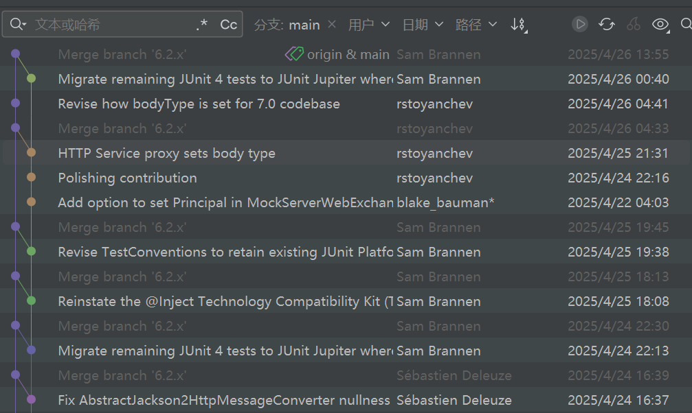
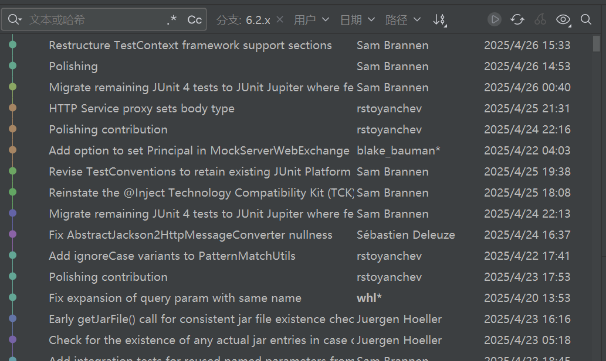

# Git Rebase 使用

## 合并多次提交记录

当本地仓库提交了很多次的记录，在push前为了提交记录的简洁，想要将其中的一部分提交记录合并成一条，再push到远程仓库，可以使用git rebase

```git-graph
commit6 id:"c"
commit5 id:"b"
commit4 id:"a"
commit3 id:"commit C"
commit2 id:"commit B"
commit1 id:"commit A"
```

将最近的三次提交合并：

```sh
$ git rebase -i HEAD~~~
$ git rebase -i HEAD~3
```

`-i` 表示进入交互界面，

下面显示的记录的顺序与log中的提交信息的顺序是相反的，也就是a是最先提交的，git会在执行时顺序执行a>b>c

```sh
pick 1cfe438 a
pick bcf5d95 b
pick bc623e0 c

# Rebase 19d8fa6..bc623e0 onto 19d8fa6 (3 commands)
#
# Commands:
```

`# Rebase 19d8fa6..bc623e0 onto 19d8fa6 (3 commands) `表示将1cfe438 bcf5d95 bc623e0合并放到bc623e0之后，但是具体是合并还是怎么着都是由上面的命令来决定的

```
# Commands:
# p, pick <commit> = 保留commit
# r, reword <commit> = 保留commit，但是要修改这条commit的提交信息
# e, edit <commit> = 保留commit，但是要修改这条commit（不仅仅是提交的注释，也包含代码修改）
# s, squash <commit> = 将该commit合并到前一个commit
# f, fixup [-C | -c] <commit> = 将该commit合并到前一个commit，但是不保留这条commit的注释信息
# x, exec <command> = 执行shell命令
# b, break = stop here (continue rebase later with 'git rebase --continue')
# d, drop <commit> = 删除该提交
# l, label <label> = label current HEAD with a name
# t, reset <label> = reset HEAD to a label
# m, merge [-C <commit> | -c <commit>] <label> [# <oneline>]
#         create a merge commit using the original merge commit's
#         message (or the oneline, if no original merge commit was
#         specified); use -c <commit> to reword the commit message
# u, update-ref <ref> = track a placeholder for the <ref> to be updated
#                       to this position in the new commits. The <ref> is
#                       updated at the end of the rebase
```

例如要保留a提交，然后将c合并到b上则应该修改为

```
pick 1cfe438 a
pick bcf5d95 b
s bc623e0 c
```

```git-graph
commit5 id:"b"
commit4 id:"a"
commit3 id:"commit C"
commit2 id:"commit B"
commit1 id:"commit A"
```

保存后会弹出新的交互界面，展示的是b和c的提交信息可以手动进行修改提交的信息，可以删除不要的提交信息，也可以直接注释掉不要的提交信息最终只会保留未注释的提交信息

```
# This is a combination of 2 commits.
# This is the 1st commit message:

b

# This is the commit message #2:

c

# Please enter the commit message for your changes. Lines starting
# with '#' will be ignored, and an empty message aborts the commit.
#
# Date:      Fri Mar 29 14:08:49 2024 +0800
#
# interactive rebase in progress; onto c376d93
# Last commands done (3 commands done):
#    pick b709ef9 b
#    squash 0627840 c
# No commands remaining.
# You are currently rebasing branch 'master' on 'c376d93'.
```

## 避免提交记录分叉

在日常开发中经常是多条分支开发，在进行合并时不可避免的发生提交记录的分叉

```git-graph
[main]
g<e 'merge feature to main' 7
f 'commit F' 6
d 'commit D' 4
b 'commit B' 2
a 'commit A' 1
[dev]
e 'commit E' 5
c<b 'commit C' 3
```

例如上面这样的情况，就是直接merge形成的，有了分叉既看着不美观，同时如果后面对代码进行回滚也不好操作

如果用rebase的方式就可以避免分叉的出现，但是要注意rebase是要在开发分支rebase主分支，而不要将开发分支rebase到主分支，操作顺序是：

- 在开发分支上rebase主分支

```sh
$ git rebase master
```

上面的示例如果使用这种方式的话，结果就是这样的

```git-graph
[main]
f 'commit F' 6
d 'commit D' 4
b 'commit B' 2
a 'commit A' 1
[dev]
e 'commit E' 5
c<f 'commit C' 3
```

可以看到C和E出现在了F之后，提交信息的hash值变了，但是整个分支的提交记录简洁了

- 如果有冲突解决冲突

- 在主分支上merge开发分支

```sh
$ git merge feature
```

merge后的master分支的提交记录如下

```git-graph
[main]
e 'commit E' 5
c 'commit C' 3
f 'commit F' 6
d 'commit D' 4
b 'commit B' 2
a 'commit A' 1
```

这样就保持了master分支的整洁，同时也不会存在merge提交记录

## 避免合并提交

当多个人共同开发一个分支时，由于其他人在这个分支上先推送了代码，导致推送代码失败，一般我们会使用`git pull`来拉取最新的代码并合并到本地，但是这样在查看提交记录的时候就会看到一个合并的提交，而且这个合并的提交是提交记录的分叉点，这样也会影响提交记录的简洁，所以需要避免这种情况的出现，可以通过rebase的方式避免，也就是`git pull --rebase`

```git-graph
[origin/dev]
f 'commit F' 6
d 'commit D' 4
b 'commit B' 2
a 'commit A' 1
[dev]
e 'commit E' 5
c<b 'commit C' 3
```

如果使用`git pull`，结果是这样的

```git-graph
[origin/dev]
f 'commit F' 6
d 'commit D' 4
b 'commit B' 2
a 'commit A' 1
[dev]
g<f 'merge origin/dev to dev' 7
e 'commit E' 5
c<b 'commit C' 3
```

如果使用`git pull --rebase`，结果是这样的

```git-graph
[origin/dev]
f 'commit F' 6
d 'commit D' 4
b 'commit B' 2
a 'commit A' 1
[dev]
e 'commit E' 5
c<f 'commit C' 3
```

此时再进行`git push`，结果是这样的

```git-graph
[origin/dev]
e 'commit E' 5
c 'commit C' 3
f 'commit F' 6
d 'commit D' 4
b 'commit B' 2
a 'commit A' 1
```

## 从spring仓库看rebase的使用

- main分支



- 6.2.x分支



从main分支的提交记录我们可以看到，它除了很少的在main分支上的提交记录外，就只有合并6.2.x分支的提交记录，没有出现记录交叉的现象。

而在6.2.x分支中，它是没有任何合并的记录存在的，而从提交时间看到它并不是一直都是先后的顺序提交，所以我门可以推断出它是通过rebase操作来保证分支提交记录的整洁。

首先在多人开发同一分支时，我们要拉取最新代码合并时，需要先通过fetch命令拉取最新代码，然后通过rebase命令将本地代码变基到远程分支，我们也可以这样理解，rebase操作使我们本地的没有推送的代码是基于该分支的最新代码的来修改的，所以这样就不会存在分叉的情况了。

同理在将分支合并到其他分支时，我们也需要先通过rebase命令将本地代码变基到目标分支，这样就可以认为我们这个分支是基于目标分支的最新代码的来修改的，所以后面将变基后的代码合并到目标分支时就不会存在分叉的情况了。

但是我们看到spring的main分支却不是用rebase来合并其他分支的，这样的做的原因个人猜想是因为rebase后的提交记录都是连续的，比较难以区分哪些记录是在同一个分支开发的，因为一般来说一个分支的开发功能是一致的，不会存在说多个功能的开发都在一个分支，为了方便在出问题时进行回滚或者将提交记录分段这样一个目的，所以他们在main分支上不使用rebase来合并其他分支，而是使用merge来合并其他分支，从而保留合并记录。
