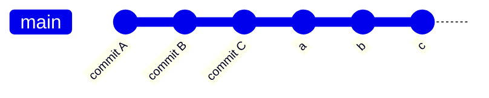
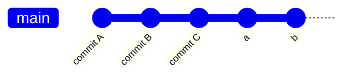
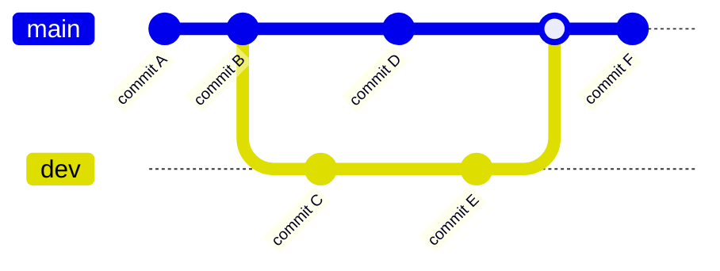
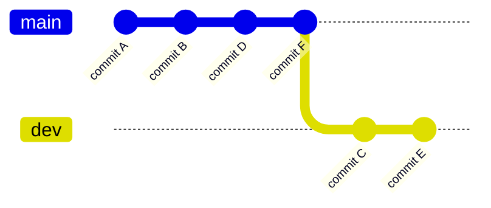
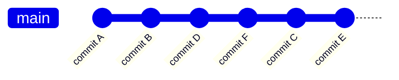
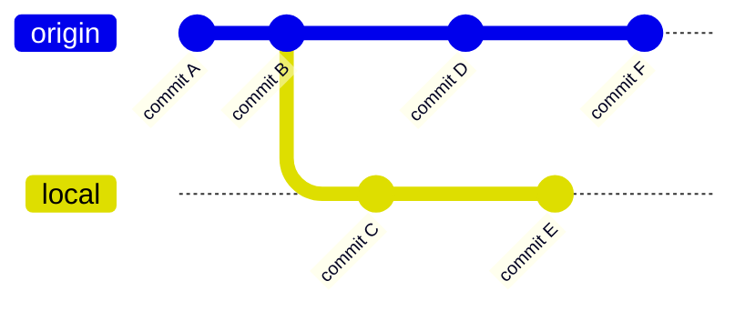
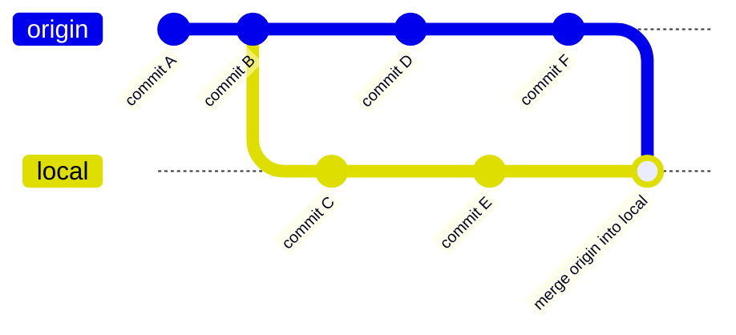

# Git Rebase 使用

## 合并多次提交记录

当本地仓库提交了很多次的记录，在push前为了提交记录的简洁，想要将其中的一部分提交记录合并成一条，再push到远程仓库，可以使用git rebase



将最近的三次提交合并：

```sh
$ git rebase -i HEAD~~~
$ git rebase -i HEAD~3
```

`-i` 表示进入交互界面，

下面显示的记录的顺序与log中的提交信息的顺序是相反的，也就是a是最先提交的，git会在执行时顺序执行a>b>c

```sh
pick 1cfe438 a
pick bcf5d95 b
pick bc623e0 c

# Rebase 19d8fa6..bc623e0 onto 19d8fa6 (3 commands)
#
# Commands:
```

`# Rebase 19d8fa6..bc623e0 onto 19d8fa6 (3 commands) `表示将1cfe438 bcf5d95 bc623e0合并放到bc623e0之后，但是具体是合并还是怎么着都是由上面的命令来决定的

```
# Commands:
# p, pick <commit> = 保留commit
# r, reword <commit> = 保留commit，但是要修改这条commit的提交信息
# e, edit <commit> = 保留commit，但是要修改这条commit（不仅仅是提交的注释，也包含代码修改）
# s, squash <commit> = 将该commit合并到前一个commit
# f, fixup [-C | -c] <commit> = 将该commit合并到前一个commit，但是不保留这条commit的注释信息
# x, exec <command> = 执行shell命令
# b, break = stop here (continue rebase later with 'git rebase --continue')
# d, drop <commit> = 删除该提交
# l, label <label> = label current HEAD with a name
# t, reset <label> = reset HEAD to a label
# m, merge [-C <commit> | -c <commit>] <label> [# <oneline>]
#         create a merge commit using the original merge commit's
#         message (or the oneline, if no original merge commit was
#         specified); use -c <commit> to reword the commit message
# u, update-ref <ref> = track a placeholder for the <ref> to be updated
#                       to this position in the new commits. The <ref> is
#                       updated at the end of the rebase
```

例如要保留a提交，然后将c合并到b上则应该修改为

```
pick 1cfe438 a
pick bcf5d95 b
s bc623e0 c
```



保存后会弹出新的交互界面，展示的是b和c的提交信息可以手动进行修改提交的信息，可以删除不要的提交信息，也可以直接注释掉不要的提交信息最终只会保留未注释的提交信息

```
# This is a combination of 2 commits.
# This is the 1st commit message:

b

# This is the commit message #2:

c

# Please enter the commit message for your changes. Lines starting
# with '#' will be ignored, and an empty message aborts the commit.
#
# Date:      Fri Mar 29 14:08:49 2024 +0800
#
# interactive rebase in progress; onto c376d93
# Last commands done (3 commands done):
#    pick b709ef9 b
#    squash 0627840 c
# No commands remaining.
# You are currently rebasing branch 'master' on 'c376d93'.
```

## 避免提交记录分叉

在日常开发中经常是多条分支开发，在进行合并时不可避免的发生提交记录的分叉



例如上面这样的情况，就是直接merge形成的，有了分叉既看着不美观，同时如果后面对代码进行回滚也不好操作

如果用rebase的方式就可以避免分叉的出现，但是要注意rebase是要在开发分支rebase主分支，而不要将开发分支rebase到主分支，操作顺序是：

- 在开发分支上rebase主分支

```sh
$ git rebase master
```

上面的示例如果使用这种方式的话，结果就是这样的



可以看到C和E出现在了F之后，提交信息的hash值变了，但是整个分支的提交记录简洁了

- 如果有冲突解决冲突

- 在主分支上merge开发分支

```sh
$ git merge feature
```

merge后的master分支的提交记录如下



这样就保持了master分支的整洁，以及开发顺序的查看也都很容易地看出来，即便后面进行回滚也容易了

## 避免合并提交

当多个人共同开发一个分支时，由于其他人在这个分支上先推送了代码，导致推送代码失败，一般我们会使用`git pull`来拉取最新的代码并合并到本地，但是这样在查看提交记录的时候就会看到一个合并的提交，而且这个合并的提交是提交记录的分叉点，这样也会影响提交记录的简洁，所以需要避免这种情况的出现，可以通过rebase的方式避免，也就是`git pull --rebase`



如果使用`git pull`，结果是这样的



如果使用`git pull --rebase`，结果是这样的


此时再进行`git push`，结果是这样的


