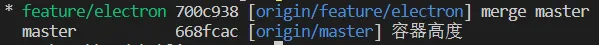

# Git 相关

### 查看本地分支与远程分支的对应关系

`git branch -vv`


### 初始化仓库

初始化一个项目仓库，纳入git版本管理

```sh
$ git init
```

### 将文件纳入管理

`git add`命令

1. git add .

只有一个点不加其他参数表示将所有修改的以及未跟踪的文件添加到git的暂存区，但是不包括删除的文件

2. git add -u

-u表示将所有已跟踪的文件的修改及删除添加到暂存区，但是不包括新增的未跟踪的文件

3. git add -A

-A/-all 表示将所有已跟踪的文件的修改及删除，以及新增的未跟踪的文件添加到暂存区

4. git add -i

-i命令是一个交互式的命令，作用于所有已跟踪的未跟踪的文件，不包含排除的

> status：查询所有已跟踪的修改
> update：添加已跟踪的修改到暂存区
> revert：撤销已添加到暂存区的修改，只要是添加到暂存区的都可以撤销
> patch：对一个文件中有多个修改时，可以挑选一部分进行提交到暂存区，而不是整个文件
> diff：查看暂存区中的修改与索引库中的区别
> quit：退出
> help：帮助

一般revert用的比较多，可以将误添加的修改撤销掉

5. git add -h

帮助，没什么好说的

#### patch

使用 `git add -i` 进入交互式命令后，patch功能

```
y - 暂存此区块
n - 不暂存此区块
q - 退出；不暂存包括此块在内的剩余的区块
a - 暂存此块与此文件后面所有的区块
d - 不暂存此块与此文件后面所有的 区块
g - 选择并跳转至一个区块
/ - 搜索与给定正则表达示匹配的区块
j - 暂不决定，转至下一个未决定的区块
J - 暂不决定，转至一个区块
k - 暂不决定，转至上一个未决定的区块
K - 暂不决定，转至上一个区块
s - 将当前的区块分割成多个较小的区块
e - 手动编辑当前的区块
? - 输出帮助
```

### 修改远程仓库地址

- 查看远程仓库地址

`$ git remote -v`

- 直接添加

```sh
$ git remote set-url origin [url] # origin 是对远程仓库地址起的名字，如果有多个，可以起不同的名字
```

- 先删除后添加

```sh
$ git remote rm origin
$ git remote add origin [url]
```

**注：origin 是对远程仓库地址起的名字，默认是这个名字，也可以取别的，本文中远程分支的名字都默认为这个**

### 本地与远程分支分歧

本地有一个git版本控制下的项目，然后又在远程创建了一个仓库，关联到远程仓库后，使用`pull`命令出现
`Your branch and 'origin/main' have diverged`
这样的错误信息，说明本地分支和远程分支有分歧，例如远程分支在创建的时候有自动生成的README文件，这样的两个分支就有了分歧，说明不是同一个分支，他们互不相关所以要先将两个分支进行合并。

```sh
$ git pull origin main --allow-unrelated-histories
```

### 新建分支

新建分支并切换到新分支

```sh
$ git checkout -b branchName
```

推送分支并建立远程分支

```sh
$ git push --set-upstream-to origin branchName
```

推送到指定远程分支

```sh
$ git push origin branchName
```

建立本地分支与远程分支的关联

```sh
$ git branch --set-upstream-to=origin/branchName
```

### 删除分支

删除本地分支

```sh
$ git branch -d branchName
```

删除远程分支

```sh
$ git push origin --delete branchName
```
