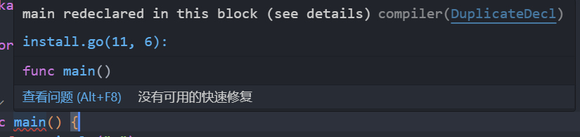

# 同一文件夹下多个main函数

在同一目录下创建多个go文件，每个文件都包含一个main函数，在Vscode中会显示`ain redeclared in this block`，这是因为在同一个目录下只能定义一个main函数。



解决办法：把两个文件分别放到不同的目录下。

## 构建二进制文件

在同一目录下有两个go文件，分别命名为`main1.go`和`main2.go`，分别包含一个main函数。此时构建二进制文件时，需要指定构建的文件，否则会报错。

```sh
go build -o main1 main1.go
```

在同一文件夹同一包下的多个文件可以直接调用方法，不需要指定包名，但是在main包中，如果两个文件都有main函数，则会报错，
