# 索引失效的场景

- 模糊查询，也就是`%`开头的模糊查询
- 对索引列使用函数
- 对索引列进行计算
- 联合索引非最左匹配
- 条件中or的一侧不是索引列
- 对索引进行隐式类型转换

## 模糊查询

当我们使用以`%`开头的模糊查询时索引会失效，例如：

```sql
SELECT id, name FROM user WHERE name LIKE '%三';
SELECT id, name FROM user WHERE name LIKE '%三%';
```

## 对索引列使用函数

索引中保存的是数据的原始值，而对索引使用函数后，就无法与原始值进行比较了。例如：

```sql
SELECT id, name FROM user WHERE length(name) = 2;
```

这里name字段的索引示例如下图，当我们使用`length(name)`时我们无法通过索引中的值进行比较。



## 对索引进行计算

对索引字段进行计算后进行条件查询时，索引会失效，例如：

```sql
SELECT id, name FROM user WHERE id + 1 = 3;
```

和使用函数其实是一样的道理，索引中存储的是数据的原始值，而不是计算后的值。

## 联合索引非最左匹配

多个字段组合在一起建立的索引叫做联合索引，联合索引中的字段是有顺序的，也就是(a,b,c)和(c,a,b)是不同的。我们在使用时需要遵循最左匹配原则，例如：

```sql
SELECT id FROM user WHERE a = 1 AND b = 2 AND c = 3;
SELECT id FROM user WHERE a = 1 AND b = 2;
SELECT id FROM user WHERE a = 1;
```

上面三种都是可以的，如果不符合最左匹配原则就不会走联合索引，例如：

```sql
SELECT id FROM user WHERE b = 2 AND c = 3;
SELECT id FROM user WHERE b = 2;
SELECT id FROM user WHERE c = 3;
```

如果是下面这种情况，则会进行索引下推，例如：

```sql
SELECT id, a, c, name FROM user WHERE a = 1 AND c = 3;
```

首先通过a = 1，走索引找到符合条件的叶子节点，然后因为c也是联合索引中的字段，这个时候会先对查询到的叶子节点进行过滤，再通过主键id到主键索引中查询。



## 条件中的OR

在where语句中如果or的一侧是索引列，而另一侧不是索引列，那么就不会走索引，例如：

```sql
SELECT id, name FROM user WHERE id = 1 OR name = 'tom';
```

因为or就是只要满足其中一个就可以，因此只有一个是索引列是没有意义的。

## 对索引隐式类型转换

如果索引字段是字符串类型，而where条件中的字段是数字类型，那么mysql会自动进行隐式类型转换，例如：

```sql
SELECT id FROM user WHERE age = 18;  //age字段是varchar类型
```
