# MySQL 如何避免回表

在sql优化中索引覆盖和避免不必要的回表是提高执行效率的有效手段。

## 什么是回表

在我们使用索引进行数据查询时，如果查询的字段不在索引的节点数据中，那么就需要通过聚集索引id去聚集索引中再查找一遍完整的数据。一般聚集索引就是主键索引。

例如：我们有一用户表，现在要查询出年龄为18岁的用户。

| id  | name  | age |
| --- | ----- | --- |
| 1   | tom   | 18  |
| 2   | jerry | 20  |
| 3   | lily  | 16  |
| 4   | jack  | 21  |

id为主键，在age上建立索引。查询的sql语句如下：

```sql
SELECT * FROM user WHERE age = 18;
```



可以看到，先通过age索引进行查询，在B+树的叶子节点，我们获取到的数据为`id=1,age=18`，由于name我们没有获取到，所以需要通过id再查询一次。这就产生了回表查询，那么我们怎么避免回表查询呢？如果我们只查询id，age，那么我们在第一步就已经完全得到我们需要的数据了，就不会再去通过id查询主键索引了，这样就避免了回表查询。

```sql
SELECT id, age FROM user WHERE age = 18;
```
