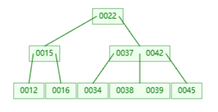
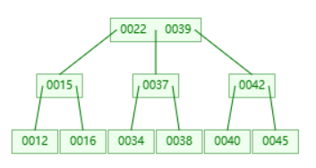
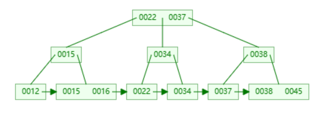

# B树与B+树

## B树

B树是一种平衡的多叉树，即查找路径不止两个。

[B树可视化演示](https://www.cs.usfca.edu/~galles/visualization/BTree.html)

::: tip 通常我们说m阶的B树，它必须满足如下条件：

- 每个节点最多只有m个子节点。
- 每个非叶子节点（除了根）具有至少 m/2 子节点。
- 如果根不是叶节点，则根至少有两个子节点。
- 具有k个子节点的非叶节点包含 k-1 个键。
- 所有叶子都出现在同一水平，高度一致。
- 所有节点的键值是升序排列的。

:::

m阶：指一个节点的子节点个数的最大值。

键：指节点中的键值。最大个数为 m-1。

### 查询

以上图的示例查询38为例：

1. 从根节点开始，根节点的键值是22，22<38，所以进入根节点的右子节点。
2. 节点的键值是[37,42]， 37< 38 < 42，所以进入该节点的中间节点。
3. 节点的键值是[38,39]， 38=38，所以返回该值。

### 插入

以上图的示例插入40为例：

1. 从根节点开始，根节点的键值是22，40>22，所以进入根节点的右子节点。
2. 节点的键值是[37,42]， 37< 40 < 42，所以进入该节点的中间节点。
3. 节点的键值是[38,39]， 39 < 40，由于该节点为叶节点，所以插入后面，键值为[38,39,40]，保证键值升序排列。
4. 由于该树为3阶，所以插入后，节点的键值个数超过2个，需要分裂。
5. 将分裂的键插入到父节点。如果插入后父节点的键值个数超过2个，则需要分裂。重复该步骤。
6. 插入后，根节点的键值个数超过2个，需要分裂并创建新的根节点。将分裂后的节点插入到新的根节点上。

::: tip 分裂逻辑

1. m阶的B树分裂时，需要将该满个数的节点的后 m/2 个键分裂出来创建新的节点
2. 剩余的键值的最大值，也就是最后一个键值，需要插入到父节点中。
3. 其他的键值作为原有的节点的键值。

**具体可以查看《算法导论》第283页B树的分裂逻辑。**

::: info 例如

上面的示例中[38,39,40]这个节点需要分裂，则将[40]创建新的节点，[39]提取到父节点中，[38]作为原有节点的键值。

如果是4阶的树，有节点[38,39,40,41]需要分裂，则将[40,41]创建新的节点，[39]提取到父节点中，[38]作为原有节点的键值。

:::

插入后的树结构如下：

## B+ 树

B+树是在B树基础上进一步改近得到的。B+树的非叶子节点不存储数据，只存储指关键字的指针，所有数据都保存在叶子节点。所有的叶子节点是从小到大排列的有序链表。

### 插入

1. 如果为叶子节点则直接插入，如果非叶子节点，向下查找，直到找到叶子节点，然后插入。
2. 如果插入后叶子节点的键值个数超过 m-1 ，则需要分裂。第 m/2 +1 值的键向上插入到父节点。
3. 如果插入后父节点的键值个数超过 m-1 ，则需要分裂。第 m/2 值的键向上插入到父节点。

::: tip 分裂逻辑

- 叶子节点

1. 分裂的节点中左节点包含前 m/2 个值，右节点包含剩下的值。
2. 第 m/2 + 1 个值的键向上插入到父节点。
3. 将叶子节点的左右叶子节点的链接更新。

- 非叶子节点

1. 分裂的节点中左节点包含前 m/2 个键，右节点包含 m/2 + 1 之后的键。
2. 第 m/2 + 1 个键向上插入到父节点。

:::

### B+树的优势

1. B+树查询更稳定，由于B+树的数据都存储于叶子节点上，所以每次查询都是相同的路径长度。
2. B+树具备排序性，B+树中所有的叶子节点是一个有序的链表。
3. B+树遍历更快，由于所有的数据都存储于叶子节点上，所以遍历树只需要遍历叶子节点的链表即可。

## 参考

- [数据结构可视化及算法](https://www.cs.usfca.edu/~galles/visualization/Algorithms.html)
- [B树和B+树详解](https://wardseptember.github.io/notes/#/docs/B树和B+树详解)
- [平衡二叉树、B树、B+树、B\*树 理解其中一种你就都明白了](https://zhuanlan.zhihu.com/p/27700617)
- [数据架构与算法———B树与B+原理和算法详细介绍(含图解简单易懂)](https://zhuanlan.zhihu.com/p/343767426)
