# 常用的集合

Java中的集合主要分为两大类`Collection`和`Map`。

## Collection

主要有`List`和`Set`以及`Queue`。

- `List`主要是有序可重复的集合，例如`ArrayList`、`LinkedList`
- `Set`是无序的集合，例如`HashSet`、`LinkedHashSet`、`TreeSet`
- `Queue`是有序的队列，例如`ArrayDeque`、`PriorityQueue`，`LinkedList`也实现了`Queue`

### ArrayList

底层是数组，在调用add方法时，会自动进行扩容。由于是数组所以支持随机访问，即通过数组下标直接访问元素，在数组的头部或者中间进行元素的插入及删除就比较麻烦，因为涉及到元素的复制及移动。
[ArrayList扩容](./arraylist-increase-capacity)

### LinkedList

底层是双向链表。由于是双向链表所以不支持随机访问，但是支持快速的插入和删除。存储占用的空间要比ArrayList要多，因为LinkedList中每个元素都包含了前一个元素和后一个元素的引用，因此插入和删除效率比ArrayList高。

### Vector

底层是数组，同样是在调用add方法时，会自动扩容，支持随机访问。与ArrayList不同的是`Vector`初始容量为10，扩容大小为指定的扩容步长，如果未指定扩容步长，则扩容大小为`size+1`，`Vector`是线程安全的，因为它在每个增删改查方法上都添加了`synchronized`关键字

### Stack

Vector的一个子类，也是数组实现，实现了先进后出的功能，也是线程安全的。

### HashSet

底层是使用[`HashMap`](#HashMap)实现的，值是由一个固定的对象填充。特点是元素不可重复，无序，不支持随机访问，

```java
private transient HashMap<E,Object> map;

// Dummy value to associate with an Object in the backing Map
private static final Object PRESENT = new Object();

public boolean add(E e) {
    return map.put(e, PRESENT)==null;
}
```

### LinkedHashSet

HashSet的一个子类，底层是使用`LinkedHashMap`实现的，值是由一个固定的对象填充。使用链表维护了元素顺序。特点是元素不可重复，有序，不支持随机访问

```java
HashSet(int initialCapacity, float loadFactor, boolean dummy) {
    map = new LinkedHashMap<>(initialCapacity, loadFactor);
}
```

### TreeSet

底层使用`TreeMap`实现的，值是由一个固定的对象填充。特点是元素不可重复，有序，不支持随机访问，排序方式默认为自然排序，也可以自定义。如果没有指定排序方式，则按照自然排序方式进行排序，`key`必须实现`Comparable`接口，同时不可以为null。

### ArrayDeque

ArrayDeque底层是数组实现的一个双端队列，由两个指针分别指向队列的头部和第一个可插入的空位，它是一个循环队列，head不一定比tail小，tail也不一定比head大，不可以存储Null值。



#### ArrayDeque的扩容

ArrayDeque至少有一个空位用于存储元素，如果添加一个元素后没有空位时，会触发扩容，也就是添加元素后`head == tail`



```java
public void addLast(E e) {
    if (e == null)
        throw new NullPointerException();
    final Object[] es = elements;
    es[tail] = e;
    if (head == (tail = inc(tail, es.length)))
        grow(1); // 触发扩容
}
```

- 初始容量为 16 + 1

```java
public ArrayDeque() {
    elements = new Object[16 + 1];
}
```

- 在容量小于64时，扩容为原容量的2倍+2，否则扩容为原容量的1.5倍

```java
private void grow(int needed) {
    // overflow-conscious code
    final int oldCapacity = elements.length;
    int newCapacity;
    // Double capacity if small; else grow by 50%
    int jump = (oldCapacity < 64) ? (oldCapacity + 2) : (oldCapacity >> 1); // 在容量小于64时，扩容为原容量的2倍+2，否则扩容为原容量的1.5倍
    if (jump < needed
        || (newCapacity = (oldCapacity + jump)) - MAX_ARRAY_SIZE > 0)
        newCapacity = newCapacity(needed, jump);
    final Object[] es = elements = Arrays.copyOf(elements, newCapacity);
    // Exceptionally, here tail == head needs to be disambiguated
    if (tail < head || (tail == head && es[head] != null)) {
        // wrap around; slide first leg forward to end of array
        int newSpace = newCapacity - oldCapacity;
        System.arraycopy(es, head,
                            es, head + newSpace,
                            oldCapacity - head);
        for (int i = head, to = (head += newSpace); i < to; i++)
            es[i] = null;
    }
}
```

### PriorityQueue

PriorityQueue是一个基于优先级堆实现的队列，但它不是根据插入顺序来排序的，而是根据优先级来排序的。也就是它在插入一个元素时会按照元素的优先级自动排序，出列时优先从优先级最高的元素开始出列。默认是自然排序，也可以自定义。

#### PriorityQueue 的扩容

- 初始容量为 11
- 在添加新的元素时，如果当前队列已满，则触发扩容，扩容后再进行元素插入
- 在容量小于64时，扩容为原容量的2倍+2，否则扩容为原容量的1.5倍

## Map

键值对类型的集合，常用有`HashMap`、`TreeMap`、`LinkedHashMap`等。

### HashMap

HashMap是最常用的Map的实现，特点是`key`和`value`都可以为null，`key`是无序的不可重复的，`value`可以重复。

HashMap底层是通过数组+链表/红黑树来实现的，当链表的长度达到8时，链表会转换为红黑树



#### HashMap的扩容

数组的初始大小为16，当添加后的键值对的数量超过了阈值(容量\*负载系数)时，会触发扩容，扩容为原来的2倍。

- tab扩容

```java
// 扩容源码如下
final Node<K,V>[] resize() {
    Node<K,V>[] oldTab = table;
    int oldCap = (oldTab == null) ? 0 : oldTab.length;
    int oldThr = threshold;
    int newCap, newThr = 0;
    if (oldCap > 0) { // 当有元素时进行的扩容
        if (oldCap >= MAXIMUM_CAPACITY) { // 超过最大容量，只将阈值设置为最大值，在满之前不会再触发扩容
            threshold = Integer.MAX_VALUE;
            return oldTab;
        }
        else if ((newCap = oldCap << 1) < MAXIMUM_CAPACITY && // 扩容后大小不会超过最大容量时，设置阈值为原有阈值的2倍
                    oldCap >= DEFAULT_INITIAL_CAPACITY)
            newThr = oldThr << 1; // double threshold
    }
    else if (oldThr > 0) // initial capacity was placed in threshold // 这个是默认的初始容量设置为0时的情况
        newCap = oldThr;
    else {               // zero initial threshold signifies using defaults
        newCap = DEFAULT_INITIAL_CAPACITY; // 默认初始容量 16
        newThr = (int)(DEFAULT_LOAD_FACTOR * DEFAULT_INITIAL_CAPACITY); // 默认阈值 16 * 0.75 = 12
    }
    if (newThr == 0) { // 设置阈值为 容量 * 负载系数
        float ft = (float)newCap * loadFactor;
        newThr = (newCap < MAXIMUM_CAPACITY && ft < (float)MAXIMUM_CAPACITY ?
                    (int)ft : Integer.MAX_VALUE);
    }
    threshold = newThr;
    @SuppressWarnings({"rawtypes","unchecked"})
    Node<K,V>[] newTab = (Node<K,V>[])new Node[newCap];
    table = newTab;
    // 将老数组中的元素放到新数组中
    // 源码在下面的数据迁移
    return newTab;
}
```

- 数据迁移

```java
if (oldTab != null) { // 遍历老的数组
    for (int j = 0; j < oldCap; ++j) {
        Node<K,V> e;
        if ((e = oldTab[j]) != null) {
            oldTab[j] = null;
            // 单个元素直接插入
            if (e.next == null)
                // 这个地方位置的计算相当于 `hash % newCap`
                newTab[e.hash & (newCap - 1)] = e;
            else if (e instanceof TreeNode)
                // 拆分红黑树
                ((TreeNode<K,V>)e).split(this, newTab, j, oldCap);
            else { // preserve order
                // 拆分链表，分别放到低索引位和高索引位
                Node<K,V> loHead = null, loTail = null;
                Node<K,V> hiHead = null, hiTail = null;
                Node<K,V> next;
                do {
                    next = e.next;
                    // 由于是两倍的扩容，所以与上旧的容量进行计算
                    //如果为0则落在0~oldCap-1之间，
                    //否则落在oldCap~newCap-1之间
                    if ((e.hash & oldCap) == 0) {
                        if (loTail == null)
                            loHead = e;
                        else
                            loTail.next = e;
                        loTail = e;
                    }
                    else {
                        if (hiTail == null)
                            hiHead = e;
                        else
                            hiTail.next = e;
                        hiTail = e;
                    }
                } while ((e = next) != null);
                // 清除结尾的节点的后续引用，并设置到指定位置
                if (loTail != null) {
                    loTail.next = null;
                    newTab[j] = loHead;
                }
                if (hiTail != null) {
                    hiTail.next = null;
                    newTab[j + oldCap] = hiHead;
                }
            }
        }
    }
}
```

#### HashMap链表转换为红黑树

当链表的长度达到8时，且链表中的元素个数达到了64，链表会转换为红黑树。

链表长度达到8是因为链表的时间复杂度为O(n)，为提高查询效率，在链表过长时转换为红黑树。

链表中的元素个数达到64是因为当链表中的元素个数如果没有达到64就要将链表转换为红黑树，这说明哈希冲突概率太高了，而容量却不是很大，所以考虑扩大容量以减少哈希冲突。

```java
for (int binCount = 0; ; ++binCount) {
    if ((e = p.next) == null) {
        p.next = newNode(hash, key, value, null);
        if (binCount >= TREEIFY_THRESHOLD - 1) // -1 for 1st
            treeifyBin(tab, hash);
        break;
    }
    if (e.hash == hash &&
        ((k = e.key) == key || (key != null && key.equals(k))))
        break;
    p = e;
}
```

```java
final void treeifyBin(Node<K,V>[] tab, int hash) {
    int n, index; Node<K,V> e;
    if (tab == null || (n = tab.length) < MIN_TREEIFY_CAPACITY)
        resize();
    else if ((e = tab[index = (n - 1) & hash]) != null) {
        TreeNode<K,V> hd = null, tl = null;
        do {
            TreeNode<K,V> p = replacementTreeNode(e, null);
            if (tl == null)
                hd = p;
            else {
                p.prev = tl;
                tl.next = p;
            }
            tl = p;
        } while ((e = e.next) != null);
        if ((tab[index] = hd) != null)
            hd.treeify(tab);
    }
}
```

### LinkedHashMap

[HashMap](#hashmap)的key是无序的不可重复的集合，而我们在某些情况下需要key是有序的，这个时候就可以是用[LinkedHashMap](#linkedhashmap)了。

LinkedHashMap是HashMap的一个子类，在HashMap的基础上添加了一个双向链表，用于维护元素的顺序。

- 插入顺序

在调用put方法时，LinkedHashMap会在创建新的节点时，插入到链表的末尾，来维护元素插入顺序。

```java
Node<K,V> newNode(int hash, K key, V value, Node<K,V> e) {
    LinkedHashMap.Entry<K,V> p =
        new LinkedHashMap.Entry<>(hash, key, value, e);
    linkNodeAtEnd(p);
    return p;
}
private void linkNodeAtEnd(LinkedHashMap.Entry<K,V> p) {
    if (putMode == PUT_FIRST) {
        LinkedHashMap.Entry<K,V> first = head;
        head = p;
        if (first == null)
            tail = p;
        else {
            p.after = first;
            first.before = p;
        }
    } else {
        LinkedHashMap.Entry<K,V> last = tail;
        tail = p;
        if (last == null)
            head = p;
        else {
            p.before = last;
            last.after = p;
        }
    }
}
```

- 删除顺序

删除时，LinkedHashMap，会从链表中删除元素，并维护链表的顺序。

```java
void afterNodeRemoval(Node<K,V> e) { // unlink
    LinkedHashMap.Entry<K,V> p =
        (LinkedHashMap.Entry<K,V>)e, b = p.before, a = p.after;
    p.before = p.after = null;
    if (b == null)
        head = a;
    else
        b.after = a;
    if (a == null)
        tail = b;
    else
        a.before = b;
}
```

- 查询顺序

LinkedHashMap不仅可以记录元素的插入顺序，还可以记录元素被访问的顺序。而查询的顺序是通过`LinkedHashMap.Entry`对象的`befor`、`after`属性来维护的。

```java
static class Entry<K,V> extends HashMap.Node<K,V> {
    Entry<K,V> before, after;
    Entry(int hash, K key, V value, Node<K,V> next) {
        super(hash, key, value, next);
    }
}
public V get(Object key) {
    Node<K,V> e;
    if ((e = getNode(key)) == null)
        return null;
    if (accessOrder)
        afterNodeAccess(e); // 重新设置访问顺序
    return e.value;
}
```

### TreeMap

TreeMap是一个基于红黑树的二叉搜索树，是一个有序的集合，可以有自定义的排序方式。

如果为指定排序方法，则按照自然排序方式进行排序，所以`key`必须实现`Comparable`接口，同时不可以为null。

```java
private V put(K key, V value, boolean replaceOld) {
    Entry<K,V> t = root;
    if (t == null) {
        addEntryToEmptyMap(key, value);
        return null;
    }
    int cmp;
    Entry<K,V> parent;
    // split comparator and comparable paths
    Comparator<? super K> cpr = comparator;
    if (cpr != null) { // 指定了排序方法，就使用自定义的排序
        do {
            parent = t;
            cmp = cpr.compare(key, t.key);
            if (cmp < 0)
                t = t.left;
            else if (cmp > 0)
                t = t.right;
            else {
                V oldValue = t.value;
                if (replaceOld || oldValue == null) {
                    t.value = value;
                }
                return oldValue;
            }
        } while (t != null);
    } else { // 未指定排序方法，按照自然排序方式排序
        Objects.requireNonNull(key); // key不为null
        @SuppressWarnings("unchecked")
        Comparable<? super K> k = (Comparable<? super K>) key; // key实现了Comparable
        do {
            parent = t;
            cmp = k.compareTo(t.key);
            if (cmp < 0)
                t = t.left;
            else if (cmp > 0)
                t = t.right;
            else {
                V oldValue = t.value;
                if (replaceOld || oldValue == null) {
                    t.value = value;
                }
                return oldValue;
            }
        } while (t != null);
    }
    addEntry(key, value, parent, cmp < 0);
    return null;
}
```

## 线程安全

上面提到的集合大部分是线程不安全的，而[Vector](#vector)、[Stack](#stack)这些线程安全的集合，是通过`synchronized`关键字来实现的导致性能不是很好，jdk提供了一些适用于多线程的集合，如ConcurrentHashMap、ArrayBlockingQueue、CopyOnWriteArrayList等。

### CopyOnWriteArrayList

在`java.util.concurrent`包中提供了`CopyOnWriteArrayList`类，可以保证线程安全，它是在集合的增删改方法进行加锁，同时先复制一个数组，再在新的数组上修改，修改完成后用新数组替换旧数组来实现的。但是get方法是没有加锁的，所以在读的时候可能会读到老的数据，导致数据的不一致，这个是在牺牲强一致性来提升性能的。

在Jdk1.8中加锁是通过`ReentrantLock`来实现的，而在jdk11后使用的是`synchronized`进行的加锁。这里只看了LTS版本的jdk，具体从哪个版本开始的没有具体去查询。

::: info 在使用时需要注意的地方：

- `CopyOnWriteArrayList`是写时复制的，每次写操作都会创建一个新的数组，所以需要注意内存占用。
- 在get方法中，没有加锁，所以读的时候可能会读到老的数据，导致数据的不一致。

:::

::: code-group

```java [jdk1.8]
public boolean add(E e) {
    final ReentrantLock lock = this.lock;
    lock.lock();
    try {
        Object[] elements = getArray();
        int len = elements.length;
        Object[] newElements = Arrays.copyOf(elements, len + 1);
        newElements[len] = e;
        setArray(newElements);
        return true;
    } finally {
        lock.unlock();
    }
}
```

```java [jdk11]
public boolean add(E e) {
    synchronized (lock) {
        Object[] es = getArray();
        int len = es.length;
        es = Arrays.copyOf(es, len + 1);
        es[len] = e;
        setArray(es);
        return true;
    }
}
```

:::

### CopyOnWriteArraySet

底层是`CopyOnWriteArrayList`实现的。在添加元素时是调用的`CopyOnWriteArrayList#addIfAbsent`方法，如果元素不存在则添加该元素，否则返回false。

```java
public class CopyOnWriteArraySet<E> extends AbstractSet<E>
        implements java.io.Serializable {

    private final CopyOnWriteArrayList<E> al;

    public CopyOnWriteArraySet() {
        al = new CopyOnWriteArrayList<E>();
    }
    public boolean add(E e) {
        return al.addIfAbsent(e);
    }
}
```

### ConcurrentHashMap

`ConcurrentHashMap`是`HashMap`的线程安全版本。

#### jdk7

在1.7中`ConcurrentHashMap`是通过分段锁来实现的，原本的[HashMap](#HashMap)是数组+链表的结构，要想保证线程安全，可以对写的操作加锁，但是这样是对整个数据结构加锁，所以性能不会很好，所以`ConcurrentHashMap`是将HashMap中的数组分成几段(Segment)，这样每次进行写的操作的时候只需要对操作的那段数组进行加锁就可以了，不影响其他段数组的读写。



- put方法

首先是通过hash值计算出在哪个Segment中进行操作，然后通过Segment的put方法进行操作。但是和[HashMap](#HashMap)不同的是，`ConcurrentHashMap`的`key`和`value`都不可以为空。

```java
public V put(K key, V value) {
    Segment<K,V> s;
    if (value == null)
        throw new NullPointerException();
    int hash = hash(key);
    int j = (hash >>> segmentShift) & segmentMask;
    if ((s = (Segment<K,V>)UNSAFE.getObject          // nonvolatile; recheck
            (segments, (j << SSHIFT) + SBASE)) == null) //  in ensureSegment
        s = ensureSegment(j);
    return s.put(key, hash, value, false);
}
```

`Segment`是继承`ReentrantLock`的，在进行put操作时会进行加锁。

```java
final V put(K key, int hash, V value, boolean onlyIfAbsent) {
    HashEntry<K,V> node = tryLock() ? null : // 加锁操作
        scanAndLockForPut(key, hash, value);
    V oldValue;
    try {
        HashEntry<K,V>[] tab = table;
        int index = (tab.length - 1) & hash; // 与HashMap一样，hash % table.length 计算索引
        HashEntry<K,V> first = entryAt(tab, index);
        for (HashEntry<K,V> e = first;;) {
            if (e != null) {
                K k;
                if ((k = e.key) == key ||
                    (e.hash == hash && key.equals(k))) {
                    oldValue = e.value;
                    if (!onlyIfAbsent) {
                        e.value = value;
                        ++modCount;
                    }
                    break;
                }
                e = e.next;
            }
            else {
                if (node != null)
                    node.setNext(first);
                else
                    node = new HashEntry<K,V>(hash, key, value, first);
                int c = count + 1;
                if (c > threshold && tab.length < MAXIMUM_CAPACITY)
                    rehash(node);
                else
                    setEntryAt(tab, index, node);
                ++modCount;
                count = c;
                oldValue = null;
                break;
            }
        }
    } finally {
        unlock(); // 释放锁
    }
    return oldValue;
}
```

#### jdk8

在Jdk8中`ConcurrentHashMap`取消了分段锁的设计，而使用了cas操作及synchronized来保证线程安全。

对于数组中空的位置的元素设置，是通过CAS来进行，对于数组中非空的位置的元素设置，是通过`synchronized`来保证线程安全。

```java
final V putVal(K key, V value, boolean onlyIfAbsent) {
    if (key == null || value == null) throw new NullPointerException();
    int hash = spread(key.hashCode());
    int binCount = 0;
    for (Node<K,V>[] tab = table;;) {
        Node<K,V> f; int n, i, fh;
        if (tab == null || (n = tab.length) == 0)
            tab = initTable();
        else if ((f = tabAt(tab, i = (n - 1) & hash)) == null) { // 要存储的位置是空的，使用cas进行设置
            if (casTabAt(tab, i, null,
                            new Node<K,V>(hash, key, value, null)))
                break;                   // no lock when adding to empty bin
        }
        else if ((fh = f.hash) == MOVED)
            tab = helpTransfer(tab, f);
        else {
            V oldVal = null;
            synchronized (f) { // 对于数组中非空的位置的元素，使用`synchronized`来保证线程安全
                if (tabAt(tab, i) == f) {
                    if (fh >= 0) {
                        binCount = 1;
                        for (Node<K,V> e = f;; ++binCount) {
                            K ek;
                            if (e.hash == hash &&
                                ((ek = e.key) == key ||
                                    (ek != null && key.equals(ek)))) {
                                oldVal = e.val;
                                if (!onlyIfAbsent)
                                    e.val = value;
                                break;
                            }
                            Node<K,V> pred = e;
                            if ((e = e.next) == null) {
                                pred.next = new Node<K,V>(hash, key,
                                                            value, null);
                                break;
                            }
                        }
                    }
                    else if (f instanceof TreeBin) {
                        Node<K,V> p;
                        binCount = 2;
                        if ((p = ((TreeBin<K,V>)f).putTreeVal(hash, key,
                                                        value)) != null) {
                            oldVal = p.val;
                            if (!onlyIfAbsent)
                                p.val = value;
                        }
                    }
                }
            }
            if (binCount != 0) {
                if (binCount >= TREEIFY_THRESHOLD)
                    treeifyBin(tab, i);
                if (oldVal != null)
                    return oldVal;
                break;
            }
        }
    }
    addCount(1L, binCount);
    return null;
}
```

### ArrayBlockingQueue

`ArrayBlockingQueue`是一个基于数组实现的有界阻塞队列。它是用`ReentrantLock`实现线程安全的。它不可以存入null值。

它的特点有：

- 有界：基于数组实现的队列，数组的长度在构造时就确定，无法扩容。
- 阻塞：当队列为空时取出元素会阻塞当前线程，当队列满时放入元素会阻塞当前线程。
- FIFO：先进先出，即先放入队列的元素先被取出。
- 独占锁：同一时间只有一个线程可以进行入队和出队操作。

#### offer操作

offer操作是向队列的尾部插入一个元素，如果队列有空位则插入成功并返回true，如果队列已满则丢弃该元素并返回false。这个方法是不阻塞的。

```java
public boolean offer(E e) {
    Objects.requireNonNull(e);
    final ReentrantLock lock = this.lock; // 使用`ReentrantLock`实现线程安全
    lock.lock();
    try {
        if (count == items.length) // 如果没有空位则直接返回false
            return false;
        else {
            enqueue(e); // 向队列尾部插入元素
            return true;
        }
    } finally {
        lock.unlock();
    }
}
```

#### put操作

put操作也是向队列的尾部插入一个元素，但是和offer操作不同的是，当队列空间已满时阻塞当前线程，直到队列有空间并插入成功。

```java
public void put(E e) throws InterruptedException {
    Objects.requireNonNull(e); // 元素不可为空
    final ReentrantLock lock = this.lock;
    lock.lockInterruptibly(); // 可中断的锁
    try {
        while (count == items.length) // 如果队列已满则阻塞当前线程
            notFull.await();
        enqueue(e); // 向队列尾部插入元素
    } finally {
        lock.unlock();
    }
}
```

#### poll操作

poll操作是从队列的头部获取并删除一个元素，如果队列为空则返回null。这个方法是不阻塞的。

```java
public E poll() {
    final ReentrantLock lock = this.lock;
    lock.lock();
    try {
        return (count == 0) ? null : dequeue(); // 从队列头部获取并删除元素
    } finally {
        lock.unlock();
    }
}
```

#### take操作

take操作也是从队列的头部获取并删除一个元素，但是和poll操作不同的是，当队列为空时阻塞当前线程，直到队列有元素并获取成功。

```java
public E take() throws InterruptedException {
    final ReentrantLock lock = this.lock;
    lock.lockInterruptibly(); // 可中断的锁
    try {
        while (count == 0) // 如果队列为空则阻塞当前线程
            notEmpty.await();
        return dequeue(); // 从队列头部获取并删除元素
    } finally {
        lock.unlock();
    }
}
```

#### peek操作

peek操作是从队列的头部获取一个元素，如果队列为空则返回null。这个方法是不阻塞的。

```java
public E peek() {
    final ReentrantLock lock = this.lock;
    lock.lock();
    try {
        return itemAt(takeIndex); // null when queue is empty
    } finally {
        lock.unlock();
    }
}
```

### LinkedBlockingQueue

`LinkedBlockingQueue`是一个基于链表实现的有界阻塞队列。它是用`ReentrantLock`实现线程安全的。它不可以存入null值。

它有以下几个特性：

- 有界：队列的容量是有限的，默认容量为`Integer.MAX_VALUE`，也可以在创建的时候自定义。
- 阻塞：当队列为空时取出元素会阻塞当前线程，当队列满时放入元素会阻塞当前线程。
- FIFO：先进先出，即先放入队列的元素先被取出。
- 独占锁：拥有两个`ReentrantLock`实例，一个用于`take`操作，保证同一时间只有一个线程可以执行获取元素，一个用于`put`操作，保证同一时间只有一个线程可以执行插入。

#### offer操作

offer操作是向队列的尾部插入一个元素，如果队列中有空位则插入成功，返回true，如果队列已满则丢弃该元素，返回false。这个方法时非阻塞的。

```java
public boolean offer(E e) {
    if (e == null) throw new NullPointerException();
    final AtomicInteger count = this.count;
    if (count.get() == capacity)
        return false;
    final int c;
    final Node<E> node = new Node<E>(e);
    final ReentrantLock putLock = this.putLock;
    putLock.lock(); // 获取put锁
    try {
        if (count.get() == capacity) // 如果队列已满则直接返回false
            return false;
        enqueue(node);
        c = count.getAndIncrement(); // 原子操作设置元素个数
        if (c + 1 < capacity) // 如果队列没有满则唤醒阻塞的put线程
            notFull.signal();
    } finally {
        putLock.unlock();
    }
    if (c == 0) // 如果队列之前为空，唤醒阻塞的take线程
        signalNotEmpty();
    return true;
}
```

#### put操作

put操作是向队列的尾部插入一个元素，如果队列中有空位则插入成功，返回true，如果队列已满则阻塞当前线程。这个方法是阻塞的。

```java
public void put(E e) throws InterruptedException {
    if (e == null) throw new NullPointerException(); // 不可以插入null
    final int c;
    final Node<E> node = new Node<E>(e);
    final ReentrantLock putLock = this.putLock;
    final AtomicInteger count = this.count;
    putLock.lockInterruptibly(); // 可中断的put锁
    try {
        /*
            * Note that count is used in wait guard even though it is
            * not protected by lock. This works because count can
            * only decrease at this point (all other puts are shut
            * out by lock), and we (or some other waiting put) are
            * signalled if it ever changes from capacity. Similarly
            * for all other uses of count in other wait guards.
            */
        while (count.get() == capacity) { // 如果队列已满则阻塞当前线程
            notFull.await();
        }
        enqueue(node);
        c = count.getAndIncrement();
        if (c + 1 < capacity) // 如果队列没有满则唤醒阻塞的put线程
            notFull.signal();
    } finally {
        putLock.unlock();
    }
    if (c == 0) // 如果队列之前为空，唤醒阻塞的take线程
        signalNotEmpty();
}
```

#### poll操作

poll操作是从队列的头部获取并删除一个元素，如果队列为空则返回null。这个方法是不阻塞的。

```java
public E poll() {
    final AtomicInteger count = this.count;
    if (count.get() == 0) // 如果队列为空则返回null
        return null;
    final E x;
    final int c;
    final ReentrantLock takeLock = this.takeLock;
    takeLock.lock(); // 获取take锁
    try {
        if (count.get() == 0) // 如果队列为空则返回null
            return null;
        x = dequeue();
        c = count.getAndDecrement(); // 原子操作设置元素个数
        if (c > 1) // 如果队列元素个数大于1，说明队列中还有元素，则唤醒阻塞的take线程
            notEmpty.signal();
    } finally {
        takeLock.unlock();
    }
    if (c == capacity)
        signalNotFull(); // 如果队列之前为满，唤醒阻塞的put线程
    return x;
}
```

#### take操作

take操作是从队列的头部获取并删除一个元素，如果队列为空则阻塞当前线程。这个方法是阻塞的。

```java
public E take() throws InterruptedException {
    final E x;
    final int c;
    final AtomicInteger count = this.count;
    final ReentrantLock takeLock = this.takeLock;
    takeLock.lockInterruptibly(); // 可中断的take锁
    try {
        while (count.get() == 0) { // 如果队列为空则阻塞当前线程
            notEmpty.await();
        }
        x = dequeue();
        c = count.getAndDecrement(); // 原子操作设置元素个数
        if (c > 1) // 如果队列元素个数大于1，说明队列中还有元素，则唤醒阻塞的take线程
            notEmpty.signal();
    } finally {
        takeLock.unlock(); // 释放take锁
    }
    if (c == capacity) // 如果队列之前为满，唤醒阻塞的put线程
        signalNotFull();
    return x;
}
```

#### peek操作

peek操作是从队列的头部获取一个元素，如果队列为空则返回null。这个方法是不阻塞的。

```java
public E peek() {
    final AtomicInteger count = this.count;
    if (count.get() == 0) // 如果队列为空则返回null
        return null;
    final ReentrantLock takeLock = this.takeLock;
    takeLock.lock(); // 获取take锁
    try {
        return (count.get() > 0) ? head.next.item : null; // 从队列头部获取元素
    } finally {
        takeLock.unlock();
    }
}
```
