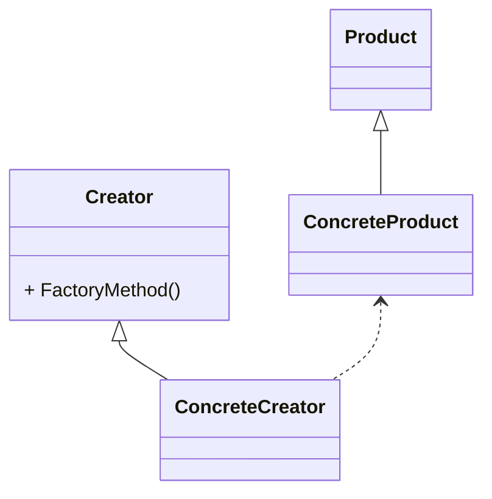
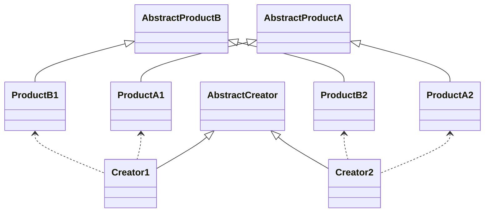
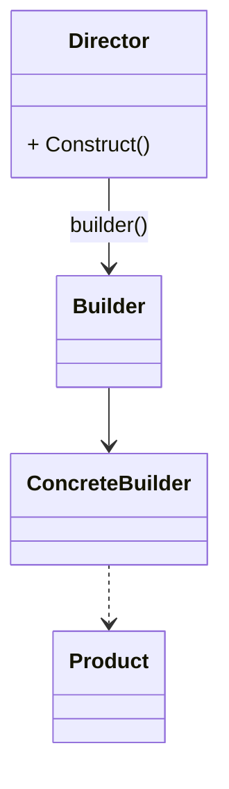
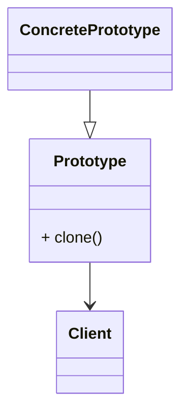

# 设计模式

《设计模式》中一共归纳了23中设计模式，而这23中设计模式又可以分为：创建型、结构型和行为型

## 设计模式六大原则

### 单一职责原则

单一职责的定义是：一个类应该有且仅有一个原因引起类的变更

### 里氏替换原则

里氏替换原则为良好的继承定义了一个规范，包含了四层含义

1. 子类必须完全实现父类的方法

对于父类中未实现的方法，必须将父类的方法实现，主要是子类完全实现父类未实现的方法，这样在使用的时候就可以不用去考虑方法是否实现，可以直接拿来使用。

2. 子类可以有自己的个性

反过来子类可以有自己独立的方法以及属性，可以有父类不能够适用的功能。

3. 覆盖或者实现父类的方法时输入参数可以被放大

子类覆盖或者实现父类的方法时，方法入参可以与父类一致，也可以是父类方法入参的范围更大的类型，例如：父类方法的入参为HashMap类型时，子类在是实现或者覆盖方法时入参类型可以为HashMap或者Map类型，这样的好处是子类入参的类型不会存在父类入参类型不存在的方法

4. 覆盖或者实现父类的方法时返回参数可以被缩小

子类覆盖或者实现父类的方法时，方法的返回参数可以与父类一致，也可以是父类方法返回参数范围更小的类型，例如：父类方法的返回参数类型为Map类型时，子类方法的返回类型可以为Map或者HashMap类型，这样的好处时子类方法的返回类型的方法都存在父类入参类型中。

### 依赖倒置原则

依赖倒置原则包含三层含义

1. 高层模块不应该依赖底层模块，两者都应该依赖其抽象
2. 抽象不应该依赖细节
3. 细节应该依赖抽象

在java中的表现是：

1. 模块间的依赖通过抽象发生，实现类之间不发生直接的依赖关系，其依赖是通过接口或者抽象类产生
2. 接口或者抽象类不依赖于实现类
3. 实现类依赖接口或者抽象类

依赖倒置原则的本质是通过抽象使各个类或者模块的实现彼此独立，不互相影响，实现模块间的松耦合。

### 接口隔离原则

1. 客户端不应该依赖它不需要的接口
2. 类间的依赖关系应该建立在最小的接口上

总结起来就是，建立单一接口，不要建立臃肿庞大的接口。也就是说接口尽量细化，同时接口中的方法尽量少。

### 迪米特法则

一个对象应该对其他对象有最少的了解。通俗的讲，一个类应该对自己需要耦合或者调用的类知道得最少。
迪米特法则对类的低耦合提出了明确的要求，其中包含了四层含义：

1. 只和朋友交流

   > 类鱼类之间的关系是建立在类间的，而不是方法间，因此一个方法尽量不引入一个类中不存在的对象。

2. 朋友之间也是有距离的

   > 尽量不对外公布太多的public方法和非静态的public变量，尽量内敛，多使用private、package-private、protected等访问权限

3. 自己的就是自己的

   > 如果一个方法放在本类中，既不增加类间关系，也对本类不产生负面影响，那就放在本类中

4. 谨慎使用Serializable

### 开闭原则

一个软件实体如类、模块和函数应该对扩展开放，对修改关闭。也就是尽量通过扩展软件实体的行为来实现变化，而不是通过修改已有的代码来完成变化，他是为软件实体的未来事件而制定的对现行开发设计进行约束的一个原则。

## 创建型

### 工厂方法模式

定义一个用于创建对象的接口，让子类决定实例化哪一个类。工厂方法使一个类的实例化延迟到其子类

::: code-group

```java [Product]
//抽象产品类
public abstract class Product {
    public void method1(){
        //产品业务逻辑
    }
    public abstract void methond2();
}
```

```java [ConcreteProduct]
//具体产品类
public class ConcreteProduct1 extends Product {
    public void methond2(){
        //业务处理逻辑
    }
}
public class ConcreteProduct2 extends Product {
    public void methond2(){
        //业务处理逻辑
    }
}
```

```java [Creator]
//抽象工厂类
public abstract class Creator {
    //创建一个产品对象，输入参数类型可以任意设置
    public abstract <T extends Product> T createProduct(Class<T> c);
}
```

```java [ConcreteCreator]
//具体工厂类
public class ConcreteCreator extends Creator {
    public <T extends Product> T createProduct(Class<T> c) {
        T pruduct = null;
        try {
            pruduct = (T) Class.forName(c.getName()).newInstance();
        } catch (Exception e) {
            //异常处理
        }
        return pruduct;
    }
}
```

:::



### 抽象工厂模式

为创建一组相关或相互依赖的对象提供一个接口，而且无需指定他们的具体类

::: code-group

```java [AbstractProduct]
//抽象产品A类
public abstract class AbstractProductA {
    //共有的方法
    public void method1(){
        //业务逻辑
    }
    //特有的相同方法，不同实现
    public abstract void method2();
}
//抽象产品B类
public abstract class AbstractProductB {
    //共有的方法
    public void method1(){
        //业务逻辑
    }
    //特有的相同方法，不同实现
    public abstract void method2();
}
```

```java [Product]
//产品A类1种
public class ProductA1 extends AbstractProductA{
    @Override
    public void method2() {
        //业务逻辑
    }
}
//产品A类2种
public class ProductA2 extends AbstractProductA{
    @Override
    public void method2() {
        //业务逻辑
    }
}
//产品B类1种
public class ProductB1 extends AbstractProductB{
    @Override
    public void method2() {
        //业务逻辑
    }
}
//产品B类2种
public class ProductB2 extends AbstractProductB{
    @Override
    public void method2() {
        //业务逻辑
    }
}
```

```java [AbstractCreator]
//抽象工厂类
public abstract class AbstractCreator {
    public abstract AbstractProductA createAbstractProductA();
    public abstract AbstractProductB createAbstractProductB();
}
```

```java [Creator]
//1类产品工厂
public class Creator1 extends AbstractCreator{
    @Override
    public AbstractProductA createAbstractProductA() {
        return new ProductA1();
    }
    @Override
    public AbstractProductB createAbstractProductB() {
        return new ProductB1();
    }
}
//2类产品工厂
public class Creator2 extends AbstractCreator{
    @Override
    public AbstractProductA createAbstractProductA() {
        return new ProductA2();
    }
    @Override
    public AbstractProductB createAbstractProductB() {
        return new ProductB2();
    }
}
```

```java [Main]
//场景类
public class Main {
    public static void main(String[] args) {
        AbstractCreator creator1 = new Creator1();
        AbstractCreator creator2 = new Creator2();
        AbstractProductB b1 = creator1.createAbstractProductB();
        AbstractProductA a1 = creator1.createAbstractProductA();
        AbstractProductA a2 = creator2.createAbstractProductA();
        AbstractProductB b2 = creator2.createAbstractProductB();
    }
}
```

:::



### 单例模式

单例模式是指在我们的系统程序当中保证该类的实例有且只有一个。

#### 饿汉式

饿汉式，在类加载时就进行初始化

```java
//饿汉式
public class SingleDemo{
	private static SingleDemo singleDemo = new SingleDemo();
    private SingleDemo{}//构造方法私有化
    public static SingleDemo getInstance(){
        return singleDemo;
    }
}
```

#### 懒汉式

懒汉式，在第一次需要进行调用时进行初始化

```java
public class SingleDemo{
	private static SingleDemo singleDemo;
    private SingleDemo{}
    public static SingleDemo getInstance(){
    	if(singleDemo == null){
        	singleDemo = new SingleDemo();
        }
        return singDemo;
    }
}
```

这是最简单的一种懒汉式的写法，但是会出现线程安全问题，解决方案一般有三种：双重加锁、静态内部类、枚举；

##### 双重加锁

```java
public class SingleDemo{
	private volatile static SingleDemo singleDemo;//保证多线程情况下singleDemo对象线程间可见
    private SingleDemo{}
    public static SingleDemo getInstance(){
    	if(singleDemo == null){
            synchronized(SingleDemo.class){
                if(singleDemo == null){
                	singleDemo = new SingleDemo();
                }
            }
        }
        return singDemo;
    }
}
```

##### 静态内部类

```java
public class SingleDemo{
    private SingleDemo{}
    public static SingleDemo getInstance(){
        return SingleDemoInstance.INSTANCE;
    }
    private static class SingleDemoInstance{
    	private static final SingleDemo INSTANCE = new SingleDemo();
    }
}
```

##### 枚举

```java
public enum SingleDemo{
	INSTANCE;
}
```

### 建造者模式

将一个复杂对象的构建与它的表示分离，使得同样的构建过程可以创建不同的表示。

::: code-group

```java [Director]
//导演类
public class Director {
    private Builder builder = new ConcreteBuilder();
    public Product getAProduct(){
        builder.setPart();
        return builder.buildProduct();
    }
}
```

```java [ConcreteBuilder]
//具体建造者
public class ConcreteBuilder extends Builder{
    private Product product = new Product();
    @Override
    public void setPart() {

    }
    @Override
    public Product buildProduct() {
        return product;
    }
}
```

```java [Builder]
//抽象建造者
public abstract class Builder {
    public abstract void setPart();
    public abstract Product buildProduct();
}
```

```java [Product]
//产品类
public class Product {
    public void doSomething(){
        //业务逻辑
    }
}
```

:::



#### 建造者模式与工厂模式的区别

建造者模式最主要的功能是基本方法的调用顺序安排，也就是这些基本方法已经实现了，通俗的讲就是零件的装配，顺序不同产生的对象也不同；而工厂方法则重点是创建，创建零件是他们的主要职责，组装顺序则不是它关心的。

### 原型模式

用原型实例指定创建对象的种类，并通过拷贝这些原型对象创建新的对象。

```java
//实现Cloneable接口，重写clone方法
public class Prototype implements Cloneable {
	@Override
    public Prototype clone(){
        Prototype prototype = null;
        try {
            prototype = (Prototype)super.clone();
        }catch (Exception e){
            //异常处理
        }
        return prototype;
    }
}
```



原型模式是在内存二进制流的拷贝，要比直接new一个对象性能要好很多。但是直接在内存中进行拷贝，构造函数是不会执行的。还有clone方法是继承于Object类的，这个方法只是拷贝对象本身，对其内部的数组、应用对象等都不拷贝，还是指向原生对象的内部地址，这种拷贝叫做浅拷贝。解决方法是重写clone方法，自行拷贝。

## 结构型

### 适配器模式

将一个类的接口变成客户端所期待的另一种接口，从而使因接口不匹配而无法在一起工作的两个类能够在一起工作。

```java
//目标角色
public interface Target {
    public void request();
}
//目标角色的实现类
public class ConcreteTarget implements Target{
    @Override
    public void request() {
        //doSomething
    }
}
//源角色
public class Source {
    public void doSomething(){
        //业务逻辑
    }
}
//适配器角色
public class Adapter extends Source implements Target{
    @Override
    public void request() {
        super.doSomething();
    }
}
public class Main {
    public static void main(String[] args) {
        //原有的业务逻辑
        Target target = new ConcreteTarget();
        target.request();
        //增加的适配器角色的业务逻辑
        Target adapter = new Adapter();
        adapter.request();
    }
}
```

### 装饰者模式

动态地给一个对象添加一些额外的职责。就增加功能来说，装饰者比生成子类更加灵活。


```java
//抽象构件
public abstract class Component {
    //抽象的方法
    public abstract void operate();
}
//具体构件
public class ConcreteComponent extends Component{
    @Override
    public void operate() {
        //业务逻辑
    }
}
//抽象装饰者
public abstract class Decorator extends Component{
    private Component component;
    //通过构造函数传递被修饰者
    public Decorator(Component component) {
        this.component = component;
    }
    //委托给被修饰者执行
    @Override
    public void operate() {
        this.component.operate();
    }
}
//具体装饰者
public class ConcreteDecorator1 extends Decorator{
    private void method(){
        //自己的修饰方法
    }
    @Override
    public void operate() {
        this.method();
        super.operate();
    }
    public ConcreteDecorator1(Component component) {
        super(component);
    }
}
public class ConcreteDecorator2 extends Decorator{
    private void method(){
        //自己的修饰方法
    }
    @Override
    public void operate() {
        this.method();
        super.operate();
    }
    public ConcreteDecorator2(Component component) {
        super(component);
    }
}
//场景
public class Main {
    public static void main(String[] args) {
        Component component = new ConcreteComponent();
        //第一次装饰
        component = new ConcreteDecorator1(component);
        //第二次装饰
        component = new ConcreteDecorator2(component);
        //装饰后执行
        component.operate();
    }
}
```

### 代理模式

代理模式是一个类为其他对象提供一种代理以控制对这个对象的访问。

#### 静态代理


1. User用户抽象类或者接口，抽象了用户的相关方法是实际类和代理类的共同方法，在使用时就可以无缝的以使用实际类的方式去使用代理类。实际调用的时候只需要对User类进行编程即可
2. AdminProxy是Admin用户的代理类，其中包含了Admin类实例的引用，由于都实现了User类的方法，所以可以在任何时候代替实际类。而且代理类还可以控制实际类的创建和删除，以及对实际类的方法进行加强，或者对实际类的调用进行权限的控制等。
3. Admin是执行业务逻辑的实际类。

```java
public interface User{
    public void write();
}

public class Admin implements User{
    public void write(){
        ...
    }
}

public class AdminProxy implements User{
    //包含对实际对象的引用
	private Admin admin;
    public AdminProxy(){
        //可以控制实际对象的创建
        admin = new Admin();
    }
    private void beforWrite(){
        ...
    }
    //对实际对象方法的加强
    public void write(){
        beforWrite();
        admin.wirte();
    }
}

```

#### 动态代理

动态代理是在实现阶段不用关心代理谁，而在运行阶段才指定代理哪一个对象

##### JDK动态代理

JDK自身提供的动态代理，主要原理是利用反射创建代理类，是基于接口层面的代理
**被代理类必须至少实现一个接口**


```java
//抽象主题
public interface Subject{
    public void doSomething();
}
//真实主题
public class RealSubject implements Subject{
    public void doSomething(){
        //业务逻辑
    }
}
//动态代理Handler类
public class MyInvocationHandler implements InvocationHandler{
    //被代理的对象
    private Object target = null;
    //通过构造函数传递被代理的对象
    public MyInvocationHandler(Object obj){
        this.target = obj;
    }
    //代理方法
    public Object invoke(Object proxy, Method method, Object[] args){
        //执行被代理的方法，在这前后可以做其他的事情来增强被代理的方法
        return method.invoke(this.target, args);
    }
}
//动态代理类
public class DynamicProxy<T> {
    public static <T> T newProxyInstacne(ClassLoader loader, Class<?>[] interfaces, InvocationHandler h){
        //寻找JoinPoint连接点,执行通知
        (new BeforeAdvice()).exec();
        return (T) Proxy.newProxyInstance(loader, interfaces, h);
    }
}
//通知接口
public interface IAdvice{
    public void exec();
}
//前置通知实现
public class BeforeAdvice implements IAdvice{
    public void exec(){
        //通知业务逻辑
    }
}
//场景
public class Client{
    public static void main(String[] args){
        Subject sub = new RealSubject();
        InvocationHandler handler = new MyInvocationHandler(sub);
        Subject proxy = DynamicProxy
            .newProxyInstance(sub.getClass().getClassLoader(), sub.getClass().getInterfaces(), handler);
        proxy.doSomething();
    }
}
```

##### CGLIB动态代理

通过动态的生成一个子类去覆盖所要代理的类。Enhancer允许为非接口类型创建一个JAVA代理，Enhancer动态的创建给定类的子类并且拦截代理类的所有的方法
**被代理的类可以是接口也可以是类**


```java
//被代理类
public class Subject {
    public void doSomething(){
        System.out.println("做一些事");
    }
}
//Callback实现类，MethodInterceptor是继承于Callback
public class MyCallback implements MethodInterceptor {
    @Override
    public Object intercept(Object obj, Method method, Object[] args, MethodProxy proxy) throws Throwable {
        System.out.println("增强方法开始");
        Object result = proxy.invokeSuper(obj, args);
        System.out.println("原有方法执行完成");
        System.out.println("增强方法结束");
        return result;
    }
}
//获取代理类，Enhancer用于创建代理类
public class ProxyFactory {
    public static <T> T createProxy(Class<T> c, Callback callback){
        Enhancer enhancer = new Enhancer();
        //设置被代理的类型，可以是类，也可以是接口
        enhancer.setSuperclass(c);
        //设置callback
        enhancer.setCallback(callback);
        //使用无参构造创建代理类，也提供了有参构造的
        return (T) enhancer.create();
    }
}
```

### 外观模式

### 桥接模式

### 组合模式

将对象组合成树性结构以表示“部分-整体”的层次结构，使得用户**对单个对象和组合对象的使用具有一致性**。


```java
//抽象构件
public abstract class Component {
    //个体和整体都有的共享
    public void doSomething(){
        //业务逻辑
    }
}
//树枝构件
public class Composite extends Component{
    private List<Component> components = new ArrayList<>();
    //增加一个叶子或者树枝构件
    public void add(Component component){
        this.components.add(component);
    }
    //删除一个叶子或者树枝构件
    public void remove(Component component){
        this.components.remove(component);
    }
    //获得分支下的所有叶子构件和树枝构件
    public List<Component> getChildren(){
        return this.components;
    }
}
//叶子构件
public class Leaf extends Component{
    //可以重写父类方法
    @Override
    public void doSomething() {
        super.doSomething();
    }
}
//场景
public class Main {
    public static void main(String[] args) {
        //创建一个根节点
        Composite root = new Composite();
        root.doSomething();
        //创建一个树枝构件
        Composite branch = new Composite();
        root.add(branch);
        //创建一个叶子节点
        Leaf leaf = new Leaf();
        root.add(leaf);
    }
}
```

### 享元模式

## 行为型

### 策略模式

### 模板方法模式

定义一个操作中的算法的框架，而将一些步骤延迟到子类中。使得子类可以不改变一个算法的结构即可重定义该算法的某些特定步骤。


```java
//抽象模板类
public abstract class AbstractClass {
    //基本方法
    protected abstract void doSomething();
    //基本方法
    protected abstract void doAnything();
    //模板方法
    public void templateMethod(){
        this.doAnything();
        this.doSomething();
    }

}
//具体模板类
public class ConcreteClass1 extends AbstractClass{
    @Override
    protected void doSomething() {
        //业务逻辑
    }
    @Override
    protected void doAnything() {
        //业务逻辑
    }
}
public class ConcreteClass2 extends AbstractClass{
    @Override
    protected void doSomething() {
        //业务逻辑
    }
    @Override
    protected void doAnything() {
        //业务逻辑
    }
}
```

### 观察者模式

观察者模式也叫做发布订阅模式，定义对象间一种一对多的依赖关系，使得每当一个对象改变状态，则所有依赖它的对象都会得到通知并被自动更新。


```java
//抽象被观察者
public abstract class Subject {
    private Vector<Observer> vector = new Vector<>();
    //增加一个观察者
    public void addObserver(Observer observer){
        this.vector.add(observer);
    }
    //删除一个观察者
    public void delObserver(Observer observer){
        this.vector.remove(observer);
    }
    //通知所有观察者
    public void notifyObservers(){
        for (Observer observer : this.vector) {
            observer.update();
        }
    }
}
//具体被观察者
public class ConcreteSubject extends Subject{
    //具体业务
    public void doSomething(){
        super.notifyObservers();
    }
}
//抽象观察者
public interface Observer {
    public void update();
}
//具体观察者
public class ConcreteObserver implements Observer{
    @Override
    public void update() {
        //业务逻辑
    }
}
public class Main {
    public static void main(String[] args) {
        //创建一个被观察者
        ConcreteSubject subject = new ConcreteSubject();
        //定义一个观察者
        Observer observer = new ConcreteObserver();
        //观察者观察被观察者
        subject.addObserver(observer);
        //观察者活动
        subject.doSomething();
    }

}
```

### 迭代器模式

它提供一种方法去访问一个容器对象中各个元素，而不需要暴露该对象的内部细节


```java
//抽象迭代器
public interface Iterator {
    public Object next();
    public boolean hasNext();
    public boolean remove();
}
//具体迭代器
public class ConcreteIterator implements Iterator {
    private Vector vector = new Vector();
    //当前游标
	public int cursor = 0;
    public ConcreteIterator(Vector vector){
        this.vector = vector;
    }
    //判断是否达到尾部
	public boolean hasNext(){
        return this.cursor != this.vector.size();
    }
    //返回下一个元素
	public Object next(){
        return this.hasNext() ? this.vector.get(this.cursor++) : null;
    }
    //删除当前元素
	public boolean remove(){
        this.vector.remove(this.cursor);
        return true;
    }
}
//抽象容器
public interface Aggregate {
    //增加一个元素
	public void add(Object obj);
    //删除一个元素
	public void remove(Object obj);
    //获取迭代器
	public Iterator iterator();
}
//具体容器
public class ConcreteAggregate implements Aggregate {
    private Vector vector = new Vector();
	public void add(Object obj){
        this.vector.add(obj);
    }
    public void remove(Object obj){
        this.vector.remove(obj);
    }
    public Iterator iterator(){
        return new ConcreteIterator(this.vector);
    }
}
//场景
public class Main{
    public static void main(String[] args){
        Aggregate agg = new ConcreteAggregate();
        agg.add("aaa");
        agg.add("bbb");
        agg.add("ccc");
        Iterator ite = agg.iterator();
    	while(ite.hasNext()){
            System.out.println(ite.next());
        }
    }
}
```

### 责任链模式

使多个对象都有机会处理请求，从而避免了请求的发送者和处理者之间的耦合关系。将这些对象连成一条链，并沿着这条链传递请求，直到有对象处理它为止。


```java
//请求类，包含了请求的处理级别
public class Request {
    private Level level;
    public Level getLevel() {
        return level;
    }
    public void setLevel(Level level) {
        this.level = level;
    }
}
//返回的数据
public class Response {
}
//处理的级别，一般为枚举
public class Level {
}
//抽象的处理者
public abstract class Handler {
    private Handler next;
    //设置下一个处理者
    public void setNext(Handler next) {
        this.next = next;
    }
    //每个处理者都必须对请求做处理
    public final Response handleMessage(Request request){
        Response response = null;
        //判断是否是自己的处理级别
        if (this.getHandlerLevel().equals(request.getLevel())){
            response = this.echo(request);
        }else {
            //不属于自己的级别
            //判断是否有下一个处理者
            if (this.next != null){
                response = this.next.handleMessage(request);
            }else {
                //没有合适的处理者
            }
        }
        return response;
    }
    //每个处理者都必须实现处理任务
    protected abstract Response echo(Request request);
    //每个处理者都有一个处理级别
    protected abstract Level getHandlerLevel();
}
//实际的处理者
public class ConcreteHandler1 extends Handler{
    @Override
    protected Response echo(Request request) {
        //完成处理逻辑
        return null;
    }
    @Override
    protected Level getHandlerLevel() {
        //设置处理级别
        return null;
    }
}
public class ConcreteHandler2 extends Handler{
    @Override
    protected Response echo(Request request) {
        //完成处理逻辑
        return null;
    }
    @Override
    protected Level getHandlerLevel() {
        //设置处理级别
        return null;
    }
}
public class ConcreteHandler3 extends Handler{
    @Override
    protected Response echo(Request request) {
        //完成处理逻辑
        return null;
    }
    @Override
    protected Level getHandlerLevel() {
        //设置处理级别
        return null;
    }
}
//场景测试
public class Main {
    public static void main(String[] args) {
        //声明所有的处理者
        Handler handler1 = new ConcreteHandler1();
        Handler handler2 = new ConcreteHandler2();
        Handler handler3 = new ConcreteHandler3();
        //设置链中的处理顺序
        handler1.setNext(handler2);
        handler2.setNext(handler3);
        //提交请求，返回处理结果
        Response response = handler1.handleMessage(new Request());
    }
}
```

### 命令模式

将一个请求封装成一个对象，从而让你使用不同的请求吧客户端参数化，对请求排队或者记录请求日志，可以提供命令的撤销和恢复功能。


```java
//抽象接收者
public abstract class Receiver {
    //抽象接收者，定义每个接收者都必须完成的业务
    public abstract void doSomething();
}
//具体接收者
public class ConcreteReceiver1 extends Receiver{
    //每个接收者都必须处理一定的业务逻辑
    @Override
    public void doSomething() {
        //业务逻辑
    }
}
//具体接收者
public class ConcreteReceiver2 extends Receiver{
    //每个接收者都必须处理一定的业务逻辑
    @Override
    public void doSomething() {
        //业务逻辑
    }
}
//抽象命令类
public abstract class Command {
    //每个命令类都必须有一个执行命令的方法
    public abstract void execute();
}
//具体命令类
public class ConcreteCommand1 extends Command{
    //对哪个接收类进行命令处理
    private Receiver receiver;
    //构造函数传递接收者
    public ConcreteCommand1(Receiver receiver) {
        this.receiver = receiver;
    }
    //必须实现一个命令
    @Override
    public void execute() {
        this.receiver.doSomething();
    }
}
//具体命令类
public class ConcreteCommand2 extends Command{
    //对哪个接收类进行命令处理
    private Receiver receiver;
    //构造函数传递接收者
    public ConcreteCommand2(Receiver receiver) {
        this.receiver = receiver;
    }
    //必须实现一个命令
    @Override
    public void execute() {
        this.receiver.doSomething();
    }
}
//调用者类
public class Invoker {
    private Command command;
    //接收命令
    public void setCommand(Command command) {
        this.command = command;
    }
    //执行命令
    public void action(){
        this.command.execute();
    }
}
//场景类
public class Main {
    public static void main(String[] args) {
        //首先声明调用者
        Invoker invoker = new Invoker();
        //定义接收者
        Receiver receiver = new ConcreteReceiver1();
        //定义发送给接收者的命令
        Command command = new ConcreteCommand1(receiver);
        把命令交给调用者去执行
        invoker.setCommand(command);
        invoker.action();
    }
}
```

### 备忘录模式

在不破坏封装性的前提下，捕获一个对象的内部状态，并在该对象之外保存这个状态。这样以后就可将该对象恢复到原先保存的状态。


```java
//备忘录对象
public class Memento {
    //发起人的内部状态
    private String state = "";
    //构造函数传递状态
    public Memento(String state) {
        this.state = state;
    }
    public String getState() {
        return state;
    }
    public void setState(String state) {
        this.state = state;
    }
}
//备忘录管理员
public class Caretaker {
    //备忘录对象
    private Memento memento;
    public Memento getMemento() {
        return memento;
    }
    public void setMemento(Memento memento) {
        this.memento = memento;
    }
}
//发起人
public class Originator {
    //内部状态
    private String state = "";
    public String getState() {
        return state;
    }
    public void setState(String state) {
        this.state = state;
    }
    //创建一个备忘录
    public Memento createMemento(){
        return new Memento(state);
    }
    //恢复一个备忘录
    public void restoreMemento(Memento memento){
        setState(memento.getState());
    }
}
public class Main {
    public static void main(String[] args) {
        //定义发起人
        Originator originator = new Originator();
        //定义备忘录管理员
        Caretaker caretaker = new Caretaker();
        //创建一个备忘录
        caretaker.setMemento(originator.createMemento());
        //恢复一个备忘录
        originator.restoreMemento(caretaker.getMemento());
    }
}
```

### 状态模式

当一个对象内在状态改变时允许其改变行为，这个对象看起来像改变了其类。


```java
//抽象状态对象
public abstract class State {
    //定义一个环境对象，提供子类访问
    protected Context context;
    //设置环境对象
    public void setContext(Context context) {
        this.context = context;
    }
    //行为1
    public abstract void handle1();
    //行为2
    public abstract void handle2();
}
//环境对象
public class Context {
    //定义状态
    public final static State STATE1 = new ConcreteState1();
    public final static State STATE2 = new ConcreteState2();
    //当前的状态
    private State currentState;
    public State getCurrentState() {
        return currentState;
    }
    public void setCurrentState(State currentState) {
        this.currentState = currentState;
        this.currentState.setContext(this);
    }
    public void handle1(){
        this.currentState.handle1();
    }
    public void handle2(){
        this.currentState.handle2();
    }
}
//具体状态对象
public class ConcreteState1 extends State{
    @Override
    public void handle1() {
        //本状态下必须处理的逻辑
    }
    @Override
    public void handle2() {
        super.context.setCurrentState(Context.STATE2);
        super.context.handle2();
    }
}
public class ConcreteState2 extends State{
    @Override
    public void handle1() {
        super.context.setCurrentState(Context.STATE1);
        super.context.handle1();
    }
    @Override
    public void handle2() {
        //本状态下必须处理的逻辑
    }
}
public class Main {
    public static void main(String[] args) {
        //定义环境对象
        Context context = new Context();
        //初始化状态
        context.setCurrentState(new ConcreteState1());
        //行为执行
        context.handle1();
        context.handle2();
    }
}
```

### 访问者模式

封装一些作用于某种数据结构中的各个元素的操作，它可以在不改变数据结构的前提下定义作用于这些元素的新的操作。


```java
//抽象元素
public abstract class Element {
    //定义业务逻辑
    public abstract void doSomething();
    //允许访问的访问者
    public abstract void accept(IVisitor visitor);
}
//具体元素
public class ConcreteElement1 extends Element{
    @Override
    public void doSomething() {
        //业务逻辑
    }

    @Override
    public void accept(IVisitor visitor) {
        visitor.visit(this);
    }
}
public class ConcreteElement2 extends Element{
    @Override
    public void doSomething() {
        //业务逻辑
    }

    @Override
    public void accept(IVisitor visitor) {
        visitor.visit(this);
    }
}
//抽象访问者
public interface IVisitor {
    //可以访问那些对象
    public void visit(ConcreteElement1 element);
    public void visit(ConcreteElement2 element);
}
//具体访问者
public class Visitor implements IVisitor{
    @Override
    public void visit(ConcreteElement1 element) {
        element.doSomething();
    }

    @Override
    public void visit(ConcreteElement2 element) {
        element.doSomething();
    }
}
//结构对象
public class ObjectStructure {
    public static Element createElement(){
        Random random = new Random();
        if (random.nextInt(100) > 50) {
            return new ConcreteElement1();
        }else {
            return new ConcreteElement2();
        }
    }
}

public class Main {
    public static void main(String[] args) {
        for (int i = 0; i < 10; i++) {
            Element element = ObjectStructure.createElement();
            element.accept(new Visitor());
        }
    }
}
```

### 中介者模式

用一个中介对象封装一系列的对象交互，中介者使各对象不需要显示地相互作用，从而使其耦合松散，而且可以独立地改变它们之间的交互。


```java
//抽象中介类
public abstract class Mediator {
    //定义同事类
    protected ConcreteColleague1 c1;
    protected ConcreteColleague2 c2;
    //省略get，set方法，通过getset方法将同事注入过来
    //中介者模式的业务逻辑
    public abstract void doSomething1();
    public abstract void doSomething2();
}
//实际中介类
public class ConcreteMediator extends Mediator{
    @Override
    public void doSomething1() {
        //调用同事类的方法
        super.c1.selfMethod1();
        super.c2.selfMethod2();
    }
    @Override
    public void doSomething2() {
        super.c1.depMethod1();
        super.c2.depMethod2();
    }
}
//抽象同事类
public abstract class Colleague {
    protected Mediator mediator;

    public Colleague(Mediator mediator) {
        this.mediator = mediator;
    }
}
//实际同事类
public class ConcreteColleague1 extends Colleague{

    //通过构造函数传递中介者
    public ConcreteColleague1(Mediator mediator) {
        super(mediator);
    }
    //自有方法
    public void selfMethod1(){
        //业务逻辑
    }
    //依赖方法
    public void depMethod1(){
        //业务逻辑
        //自己不能处理的业务逻辑，委托给中介者处理
        super.mediator.doSomething1();
    }
}
public class ConcreteColleague2 extends Colleague{
    //通过构造函数传递中介者
    public ConcreteColleague2(Mediator mediator) {
        super(mediator);
    }
    //自有方法
    public void selfMethod2(){
        //业务逻辑
    }
    //依赖方法
    public void depMethod2(){
        //业务逻辑
        //自己不能处理的业务逻辑，委托给中介者处理
        super.mediator.doSomething2();
    }
}
```

### 解释器模式
