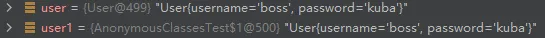
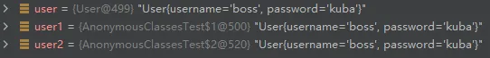

# 双大括号初始化

双大括号初始化：[https://www.jianshu.com/p/0ed87e80413e](https://www.jianshu.com/p/0ed87e80413e)

匿名内部类：[https://www.cnblogs.com/wuhenzhidu/p/anonymous.html](https://www.cnblogs.com/wuhenzhidu/p/anonymous.html)

```java
public class AnonymousClassesTest{
	public static void main(String[] args){
        //普通形式的类实例化
    	User user = new User();
        user.setUsername("boss");
        user.setPassword("kuba");
        System.out.println(user.toString());//User{username='boss', password='kuba'}
        //双大括号形式的类实例化
        User user1 = new User(){{
            setUsername("boss");
            setPassword("kuba");
        }};
        System.out.println(user1.toString());//User{username='boss', password='kuba'}
    }
}
class User{
	private String username;
    private String password;
    public String getUsername() {
        return username;
    }
    public void setUsername(String username) {
        this.username = username;
    }
    public String getPassword() {
        return password;
    }
    public void setPassword(String password) {
        this.password = password;
    }
    @Override
    public String toString() {
        return "User{" +
                "username='" + username + '\'' +
                ", password='" + password + '\'' +
                '}';
    }
}
```

两种方式的初始化从打印的结果上看是没有任何区别的，但是user2的类型？


```java
public class AnonymousClassesTest{
	public static void main(String[] args){
        //普通形式的类实例化
    	User user = new User();
        user.setUsername("boss");
        user.setPassword("kuba");
        System.out.println(user.toString());//User{username='boss', password='kuba'}
        //双大括号形式的类实例化
        User user1 = new User(){{
            setUsername("boss");
            setPassword("kuba");
        }};
        System.out.println(user1.toString());//User{username='boss', password='kuba'}
        //继承于User的匿名内部类
        User user2 = new User(){};
        user2.setUsername("boss");
        user2.setPassword("kuba");
        System.out.println(user2.toString());//User{username='boss', password='kuba'}
    }
}
```

user1和user2类型是不是很像？其实是一样的道理，就是双大括号形式的类初始化实例就是使用了匿名内部类的，而里面的大括号就很容易解释了，它就是一个代码块而已，在其中我们可以调用外部类的方法

