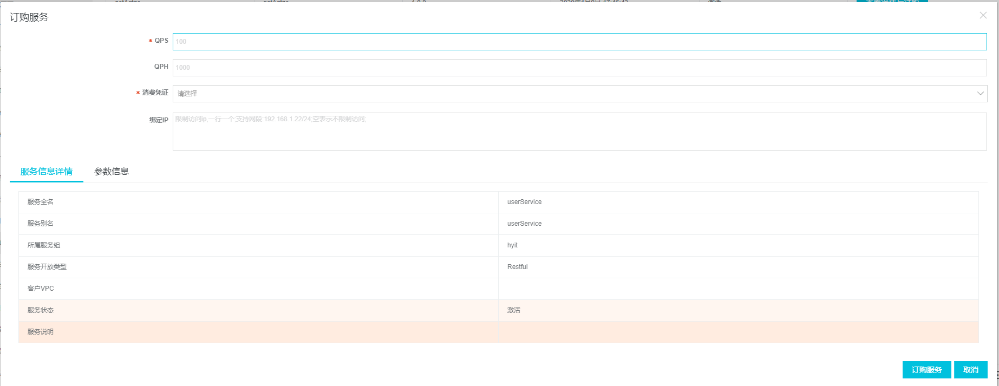

# ESB 工作总结

## ESB选型

### 选型范围

#### Spring Integration

- 优点：

1. 灵活、扩展性好；
2. 熟悉Spring框架的情况下，可以快速上手Spring Integration；
3. 可以使用Xml、注解、Flow等多种方式配置；
4. 直接集成在项目中，不需要额外的运行环境支持；

- 缺点：

1. Spring Integration只提供了技术非常基础的支持，提供的组件比较少；
2. 配置需要大量Xml，对于复杂的集成逻辑实现不太友好；

#### Mule

- 优点：

1. 架构简单清晰、容易上手；
2. Mule不需将消息转换成统一的格式，而只在需要时进行转换，提高了性能；
3. 开发过程中无需关注Mule代码，只需通过配置即可将服务暴露，减少了侵入性；
4. 提供可视化的开发工具，只需要进行拖拽及少量配置即可完成功能的开发
5. 提供了多种格式的数据模块支持
6. 提供了mel（mule表达式语言支持动态数据访问）

- 缺点：

1. 没有实现任何ESB规范；
2. 不支持热部署（企业版支持）；
3. 运行环境需要额外搭建和配置；
4. 不支持集群（企业版支持主从节点集群）；
5. 不支持web端的管理台（企业版支持）

#### ServiceMix

- 优点：

1. 基于JBI规范；
2. 可以热部署，；
3. 支持Camel（可以用DSL去开发集成流程）；
4. 提供基于web的管理端，提供组件状态、运行日志等
5. 支持基于ActiveMQ的消息集群
6. 提供了相当多的模块支持（但未提供相关文档，需要自己找）

- 缺点：

1. 由于所有消息要进行标准化处理，即生成和解析XML文件，所以会导致性能下降；
2. 开发过程中需要实现框架特定接口接收和处理上述标准消息，侵入性强；
3. 不够轻量化，本身结合了许多现有框架和中间件；
4. 运行环境需要额外搭建和配置；
5. 相关文档很少

### 对比

|                | Spring Integration | mule 社区版                | mule 企业版                | Service Mix            |
| -------------- | ------------------ | -------------------------- | -------------------------- | ---------------------- |
| 路由管理       | 消息Router         | Routing模块                | Routing模块                | 基于camel的route       |
| 事物支持       | Spring事物支持     | 无                         | 提供缓存及事物支持         | Apache Aries事物管理   |
| 数据转换       | 数据格式支持较少   | Transformer进行数据转换    | 更丰富的数据格式转换模块   | 50多种数据格式支持     |
| 定时任务       | spring Task        | muleSchedule、quartz       | muleSchedule、quartz       | Quartz-binding         |
| 消息代理       | Spring JMS         | JMS 代理，wmq模块          | Anypoint MQ                | JMS代理，ActiveMQ      |
| 安全管理       |                    | Filters                    | 专门Authority模块          |                        |
| 服务监控       | 无                 | 无                         | 提供web页面管理台          | 提供web console        |
| 高可用集群     | 无                 | 无                         | 主从节点集群，2个节点      | 基于ApacheMQ的消息集群 |
| 运行环境       | Spring项目结合     | Mule Runtime CE            | Mule Runtime EE            | Service Mix服务端      |
| 可视化开发环境 | 无                 | Anypoint Studio,拖拽式开发 | Anypoint Studio,拖拽式开发 | 无，手动编写xml文件    |
| 打包部署       | Spring项目结合     | zip包，手动部署            | zip包，管理界面部署        | xml文件，热部署        |
| 文档支持       |                    | 比较多                     | 较全面的官方文档           | 文档较少               |
| 自定义组件     |                    | 支持                       | 支持                       | OSGI bundle            |
| 中间数据传输   | Spring Message     | mule Message格式传输       | mule Message格式传输       |                        |

### 结论

Spring Integration 对Ftp、Sftp的支持不足，服务监控方面未做到足够的支持，并且与项目代码的耦合性太高。

ServiceMix 相关文档的缺少导致开发人员对问题的处理难，本身结合的框架及中间件导致其不够轻量级。

mule支持项目的Http、Ftp、Sftp等服务接口的调用，支持消息订阅推送类型的服务调用，支持方便快速的多服务编排，在安全性上mule无论是多种filter的提供还是其特有的安全认证模块都保证了数据的安全，mule的web管理台保证了项目的运行状态的实时监控，在高可用方面mule提供了主从节点集群的支持，并且mule的拖拽式可视化开发环境更有利于开发人员对项目的整体架构的把握。

在对比三种ESB产品的优缺点之后，决定选用Mule ESB作为本项目的企业服务总线。

## mule esb

mulesoft 文档首页：https://docs.mulesoft.com/general/

### mule介绍

MuleSoft ESB是ESB(企业服务总线)的一个较好的产品，ESB是传统中间件技术与XML、Web服务等技术结合的产物。ESB提供了网络中最基本的连接中枢，是构筑企业神经系统的必要元素。ESB的出现改变了传统的软件架构，可以提供比传统中间件产品更为廉价的解决方案，同时它还可以消除不同应用之间的技术差异，让不同的应用服务器协调运作，实现了不同服务之间的通信与整合。说到ESB，那就少不了SOA（面向服务架构）；首先，ESB不是SOA，SOA的最常见的实现方式方式是SCA和JBI，而SCA的实现需要ESB，相反JBI则不需要ESB，可以参看本人对JBI和SCA分析解读的文章；其次，因为IBM和Oracle（收购了BEA和SUN的牛X公司）都推崇SCA模式的SOA，因此SCA实际上已经成为SOA的事实标准，说到SOA，最先想到的就是SCA模式了；最后，ESB是SCA架构实现不可缺少的一部分，ESB产品脱离了具体的应用外，没有任何意义。ESB的作用在于实现服务间智能化集成与管理的中介。通过ESB可以访问所集成系统的所有已注册服务。

学习视频：https://v.youku.com/v_show/id_XODg3OTE3NDQ0.html?f=23395514

### mule企业版与社区版

#### 功能框架


#### 功能对比

|                           | 社区版 | 企业版 | 详细说明                                                                                                                                                                                                                                                                                                                                 |
| ------------------------- | ------ | ------ | ---------------------------------------------------------------------------------------------------------------------------------------------------------------------------------------------------------------------------------------------------------------------------------------------------------------------------------------- |
| 开放源代码                | 是     | 是     |                                                                                                                                                                                                                                                                                                                                          |
| 固化代码库                | 否     | 是     | 企业版拥有- - 个固化的代码库，它解决了当下所有已知的bug, Mulesoft 对其持续进行支持。这是社区版所不具备的，针对已知的bug.社区版的用户必领自行修改代码进行解决。                                                                                                                                                                           |
| 逆向移植bug修复           | 否     | 是     | Mule ESB企业版为稳定性和可靠性进行了优化，提供后端bug自动修复功能。修复补丁同时针对旧版本的Mule,所以及时你没有及时升级Mule,也可以实现bug自动修复，因此你可以随意安排升级计划，而不用担心正在运行的系统bug。                                                                                                                              |
| 多点企业安全              | 否     | 是     | 阻止未经授权的访问: 消除敏感数据和信息的暴露:通过主动式威胁管理防止攻击: 通过拖拽过滤器实现限制客户端IP访间: 防止DOS攻击，使用易于配置消息的过期策略: 应用循环冗余校验(CRC) .以检测消息篡改                                                                                                                                              |
| 支持SAMIL                 | 否     | 是     | 当在多个服务之间进行规划时，每一个服务都需要安全认证，安全性断言标记语言(SAML)可以大大降低难度,增加这些应用的安全。Mule企业版支持SAML,这意味着你将 能够管理不同应用之间的身份验证。企业版可以帮助你在执行服务流程时避免混乱和不安全逻辑的同时获得更大的安全。                                                                            |
| 基于角色的访问控制        | 否     | 是     | Mule企业版允许基于角色的访问控制分离。它允许你限制权限，通过这种方式你可以允许每个人访问他们需要的工具,同时保持一个最小特权的安全方式，减轻给予太多的特权的风险，以符合安全策略。例如，一个工程师可以上传代码，测试一个应用程序或收集性能信息但不来部署应用程序。                                                                        |
| 自动重连                  | 是     | 是     | Mule ESB企业版提供自动重连功能，通过定义重连策略来实现自动重连，减少因连接中斷带来的风险和损失。例如，你可以设定每隔1个小时自动重连10次,然后等待-一个小时，然后重复2天，最后再放弃。不需要任何编码即可完成该配置工作。                                                                                                                   |
| 高可用群集                | 否     | 是     | 企业版提供高可用群集功能，一 组群集由多个Mule实例节点服务器组成，所有Mule服务器通过分布式共享存储共享信息。当所有节点正常工作时，群集实现NLB(负载均衡)，当某一个节点因为故障或者计划内外的停机时，其他节点将接替它剩下的工作，不仅包括即将到来的消息，而且接管了包括流程处理中的消息。群集采用active- active模式，而非active-passive模式 |
| caching                   | 否     | 是     |                                                                                                                                                                                                                                                                                                                                          |
| 可视化调试                | 否     | 是     | Mule Studo提供可视化调试器，允许你在Debug模式下运行你的应用，设置断点来检查每一步消息内容，让定位异常更容易。                                                                                                                                                                                                                            |
| RCA (根本原因分析)        | 否     | 是     | 通过 “业务事件(Business Events)”选项功能，可以找到执行失败的记录，分析该执行流程中具体到哪一步是失败的，从而发现问题原因。                                                                                                                                                                                                               |
| 性能瓶颈检测              | 否     | 是     | 通过 “业务事件(Business Events)”选项功能，可以搜索那些经常需要花长时间运行的显示数据，找出性能瓶颈。                                                                                                                                                                                                                                     |
| 集成外部监控平台          | 否     | 是     | Mule企业版可以集成外部监控平台，如HP Openview。 这样一旦有警报或通知，可以快速反应到您的中央监控系统。                                                                                                                                                                                                                                   |
| 部署管理器                | 否     | 是     | Mule企业版提供部署管理器以便管理员在一台服务器上完成多台服务器的应用和服务部署。                                                                                                                                                                                                                                                         |
| 计划任务                  | 否     | 是     | 企业版Mule允许你建立计划任务自动执行管理任务。通过Groovy脚本，完成几乎任何你想做的事情，为您节省时间得同时确保及时完成常规任务。                                                                                                                                                                                                         |
| 远程控制                  | 否     | 是     | 当越来越多的应用运行在ESB上时，动态调整资源分配非常重要，Mule 企业版支持远程控制帮助管理员在不同的级别(服务器、服务、服务端点)启动、停止、暂停、重启ESB 资源。这对快速响应性能问题是至关重要的。                                                                                                                                         |
| 运行时性能管理            | 否     | 是     | 企业版提供运行时控制台监控，以便发现性能瓶颈，改进负载性能。                                                                                                                                                                                                                                                                             |
| SLA通知                   | 否     | 是     | 企业版能确保及时响应SLA (service level agreement)通知，可以让你主动管理应用从而发现问题，避免对服务造成影响。                                                                                                                                                                                                                            |
| 操作仪表板                | 否     | 是     | 企业版提供操作仪表板帮助您在集中在一-个地方查看当前Mule环境的各项指标，帮助您或您的这类角色做出决策。它提供包括性能、应用状态等等的全视图。                                                                                                                                                                                              |
| 社区版连接器              | 是     | 是     |                                                                                                                                                                                                                                                                                                                                          |
| Native Websphere MQ连接器 | 否     | 是     | 企业版提供了一个本机WebSphere MQ连接器。企业版将让你通过Mule集成到现有WMQ消息队列。                                                                                                                                                                                                                                                      |
| Premium JDBC连接器        | 否     | 是     | 该连接器支持sql批量处理以及存储过程                                                                                                                                                                                                                                                                                                      |
| 支持SAP的企业网关         | 否     | 是     |                                                                                                                                                                                                                                                                                                                                          |

### Mule Anypoint Studio

#### version 7.4.2

当前最新版本（当前时间2020.02.06）

版本集成如下

| Product                 | Version |
| :---------------------- | :------ |
| **Mule runtime engine** | 4.2.2   |
| **Apache Maven**        | 3.3.9   |
| **DataWeave**           | 2.2.1   |
| **MUnit**               | 2.4.0   |
| **Eclipse**             | 4.9.0   |

Studio组件兼容性

| Product                 | Version                                                                                                       |
| :---------------------- | :------------------------------------------------------------------------------------------------------------ |
| **Mule runtime engine** | 4.1.4 and later                                                                                               |
| **Apache Maven**        | 3.3.9 Studio comes with Maven 3.3.9 bundled, but you can externally use the versions: 3.3.3 or your own 3.3.9 |
| **DataWeave**           | 2.2.1 and later                                                                                               |
| **MUnit**               | 2.2.0 and later                                                                                               |
| **APIkit**              | 1.3.6 and later                                                                                               |

Mule Runtime兼容性

| Mule Runtime Engine Version   | Compatible |
| :---------------------------- | :--------- |
| **Mule runtime engine 3.8.x** | No         |
| **Mule runtime engine 3.9.x** | No         |
| **Mule runtime engine 4.1.x** | Yes        |
| **Mule runtime engine 4.2.x** | Yes        |

#### version 6.4

2017年10月6日，版本

兼容性如下

| **Mule Runtime**    | Version: 3.9.0 EE                               |
| ------------------- | ----------------------------------------------- |
| **Anypoint Studio** | Version: 6.4 Build Id: 201710062112             |
| **APIkit**          | Versions: 3.8.1 - 3.8.0 - 1.7.3 - 1.6.2 - 1.5.3 |
| **DataWeave**       | Version: 1.2.0                                  |
| **MUnit**           | Version: 1.6.0 (munit-studio-plugin)            |
| **SAP Connector**   | Versions: 3.2.0                                 |

### mule kernel 与 mule runtime

MuleESB方面的产品主要分为Mule Runtime Engine和Mule Kernel。Mule Kernel 是Mule runtime engine的开源版本。

Mule Runtime Engine：它是Anypoint平台的核心和引擎，是 Anypoint Platform 的单一且统一的runtime。

（1）对于不同连接器所连接的系统（包括本地和云），将数据和应用程序集成、将SaaS应用程序和APls与混合部署选项结合起来；

（2）将Mule代码变为底层可执行代码。

Mule Runtime Engine有三种应用场景：

（1）本地部署；

（2）iPass（企业集成平台即服务，指平台本身的云化和服务化），可以连接本地和云上系统，做到混合集成；

（3）API网关，保护、管理和分析简单对象访问协议(SOAP) 和 RESTful API，不受开发方式以及运行环境的限制。

Mule runtime engine相比开源的Mule Kernel 所多出的功能是：

（1）备份恢复。

（2）可以使用DataWeave data language对内部数据进行定制化处理。

（3）支持批处理。

（4）可视化调式代码界面。

（5）性能监控。

（6）企业版本可以使用资料库中全部资料，而开源版本只能使用资料库种提供的现成的Connector。

（7）提供24小时技术支持。

### mule connector

#### Http

##### basic security filter


基础权限认证过滤器，需要前置模块配合使用，例如


可以对http请求中参数进行校验

##### listener


提供http协议服务，不需要前置模块进行使用


可以配置监听路径


监听器配置可以配置允许访问的ip，以及监听的端口

经测试，该两个参数都是可以使用MEL表达式进行动态获取的

###### 文件上传

Post请求中请求体中的数据都会映射到[Mule Message](#Mule Message)中的payload中

例如：通过postman 进行文件的请求


请求报文如下：

```
POST /ftp/upload HTTP/1.1
Content-Type: application/x-www-form-urlencoded
User-Agent: PostmanRuntime/7.22.0
Accept: */*
Cache-Control: no-cache
Postman-Token: d97ab57d-7a8a-410a-9400-3289beb93955
Host: localhost
Accept-Encoding: gzip, deflate, br
Content-Length: 1165022
Connection: keep-alive
----------------------------postman
Content-Disposition: form-data; name="user"

test
----------------------------postman
Content-Disposition: form-data; name="username"

whl
----------------------------postman
Content-Disposition: form-data; name="port"

21
----------------------------postman
Content-Disposition: form-data; name="host"

192.168.136.101
----------------------------postman
Content-Disposition: form-data; name="filename"

test.txt
----------------------------postman
Content-Disposition: form-data; name="password"

12345678
----------------------------postman
Content-Disposition: form-data; name="filepath"

/home/whl/ftp/a.docx
----------------------------postman
Content-Disposition: form-data; name="msg"

a
----------------------------postman
Content-Disposition: form-data; name="file"; filename="工作总结.docx"; filename*="UTF-8''%E5%B7%A5%E4%BD%9C%E6%80%BB%E7%BB%93.docx"

<工作总结.docx>
----------------------------postman--
```

payload中接收到的报文如下：

```
----------------------------953135286790150356770656
Content-Disposition: form-data; name="user"

test
----------------------------953135286790150356770656
Content-Disposition: form-data; name="username"

whl
----------------------------953135286790150356770656
Content-Disposition: form-data; name="port"

21
----------------------------953135286790150356770656
Content-Disposition: form-data; name="host"

192.168.136.101
----------------------------953135286790150356770656
Content-Disposition: form-data; name="filename"

test.txt
----------------------------953135286790150356770656
Content-Disposition: form-data; name="password"

12345678
----------------------------953135286790150356770656
Content-Disposition: form-data; name="filepath"

/home/whl/ftp/a.docx
----------------------------953135286790150356770656
Content-Disposition: form-data; name="msg"

a
----------------------------953135286790150356770656
Content-Disposition: form-data; name="file"; filename="工作总结.docx"; filename*="UTF-8''%E5%B7%A5%E4%BD%9C%E6%80%BB%E7%BB%93.docx"
Content-Type: application/vnd.openxmlformats-officedocument.wordprocessingml.document

PK
```

此种请求查阅官网资料：

​ 可以通过`parts`对象通过名称或项目编号访问每个项目。例如，可以使用`payload.parts.logo`或访问第二部分`payload.parts[1]`。当没有提供名称时，后者很有用。在每个部分中，您都可以访问其内容和标题。例如，`payload.parts.color.content`return `blue`，而`payload.parts.logo.headers.'Content-Type'`return `application/png`。一个非常常见的情况是获取零件的文件名。因此，将`Content-Disposition`标头解析为允许类似的表达式`payload.parts.logo.headers.'Content-Disposition'.filename`，在这种情况下，该表达式返回`MuleSoft_logo.png`。

所以可以通过parts的参数名称获取对应的参数值如：`payload.parts.username.content`获取username的值

##### load static resource


用于静态资源的访问控制，需要前置模块配合使用，例如


可以对特定文件夹下的资源放行，以及对参数的校验

##### request


发送http请求的模块，需要前置模块配合使用，例如


可以对请求进行详细的配置


#### FTP

##### copy


对接ftp服务器，执行文件的复制，，需要前置模块配合使用


其中各项参数基本上都可以使用mel表达式进行赋值

##### create directory


对接ftp服务器，执行文件夹创建，需要前置模块配合使用


可以使用mel表达式动态传参

##### delete


删除文件或者文件夹，需要前置模块配合使用

##### list


列出文件夹中的文件列表


其中还支持对文件名称的过滤

##### move


对接ftp服务器，执行文件的移动，需要前置模块配合使用

其中各项参数的配置与复制相同

##### on new or updated file

##### read


对接ftp服务器，读取文件，需要前置模块配合使用

##### rename


对接ftp服务器，对文件进行重命名，需要前置模块配合使用


##### write


对接ftp服务器，修改文件内容，需要前置模块配合使用


文件名称，文件内容，修改模式（覆盖，追加等），文件锁定等配置

#### SFTP

功能和ftp一样只是公共参数配置不同


##### copy

##### create directory

##### delete

##### list

##### move

##### on new or updated file

##### read

##### rename

##### write

#### File

功能和ftp一样只是公共参数配置不同


没有了远程服务器的概念，只需要指定工作目录即可，工作目录可以使用mel表达式指定

##### copy

##### create directory

##### delete

##### list

##### move

##### on new or updated file

##### read

##### rename

##### write

#### Database

##### bulk delete


批量删除模块，批量相关模块是属于企业版拥有，现在是否可用待确认

##### bulk insert

##### bulk update

##### delete

##### execute ddl

##### execute script

##### insert

##### on table row

##### select


数据库查询模块，对接数据库，进行sql查询


内置几种数据库链接配置，也可使用通用配置，只要是可以通过jdbc的方式进行链接的sql数据库

##### stored procedure

##### update

#### Jms

##### ack

##### consume

##### listener

##### publish

##### publish consume

##### recover session

#### Kafka\*

mulesoft platform 上提供了kafka相关链接器，应该属于企业版使用权限

兼容性

| Software     | Version         |
| :----------- | :-------------- |
| Mule         | 4.2.0 and later |
| Apache Kafka | 2.4.0           |

字段说明

| Field                          | Description                                                                                                                                                                                                                                                                                                                                              |
| :----------------------------- | :------------------------------------------------------------------------------------------------------------------------------------------------------------------------------------------------------------------------------------------------------------------------------------------------------------------------------------------------------- |
| **Group id**                   | A unique string that identifies the consumer group this consumer belongs to.                                                                                                                                                                                                                                                                             |
| **Bootstrap Servers**          | Comma-separated host-port pairs used for establishing the initial connection to the Kafka cluster. This is the same as the `bootstrap.servers` value you provide to Kafka clients (producer and consumer). If this property is provided with producer and consumer properties files, this value is ignored and the one from the properties file is used. |
| **Principal**                  | (Kerberos and Kerberos SSL) [Kerberos principal](https://www.google.com/search?q=kerberos+principal).                                                                                                                                                                                                                                                    |
| **Service name**               | (Kerberos and Kerberos SSL) The Kerberos principal name that Kafka broker runs as.                                                                                                                                                                                                                                                                       |
| **Additional JAAS Properties** | (Kerberos and Kerberos SSL) Additional properties as key-value pairs that you need to set in the `sasl.jaas.config` file and that you can include in Java Authentication and Authorization Service (JAAS) configuration file.                                                                                                                            |
| **Key Store Type**             | (Kerbero SSL) The file format of the key store file. This is optional for a client.                                                                                                                                                                                                                                                                      |
| **Key Store Password**         | (Kerbero SSL) The store password for the key store file. This is optional for a client and only needed if **Key Store Location** is configured.                                                                                                                                                                                                          |
| **Key Store Location**         | (Kerbero SSL) The location of the key store file. This is optional for a client and can be used for two-way authentication for a client.                                                                                                                                                                                                                 |
| **Trust Store Type**           | (Kerbero SSL) The file format of the trust store file. The default is `JKS`.                                                                                                                                                                                                                                                                             |
| **Trust Store Password**       | (Kerbero SSL) The password for the trust store file. If a password is not set, access to the truststore is still available, but integrity checking is disabled.                                                                                                                                                                                          |
| **Trust Store Location**       | (Kerbero SSL) Location of the trust store.                                                                                                                                                                                                                                                                                                               |

| 领域             | 描述                                                                                                                                                                                                            |
| :--------------- | :-------------------------------------------------------------------------------------------------------------------------------------------------------------------------------------------------------------- |
| **群组编号**     | 标识此使用者所属的使用者组的唯一字符串。                                                                                                                                                                        |
| **引导服务器**   | 逗号分隔的主机端口对，用于建立与Kafka集群的初始连接。这与`bootstrap.servers`您提供给Kafka客户（生产者和消费者）的价值相同。如果生产者属性文件和消费者属性文件提供了此属性，则将忽略此值，并使用属性文件中的值。 |
| **主要**         | （Kerberos和Kerberos SSL）[Kerberos主体](https://www.google.com/search?q=kerberos+principal)。                                                                                                                  |
| **服务名称**     | （Kerberos和Kerberos SSL）Kafka代理运行时使用的Kerberos主体名称。                                                                                                                                               |
| **其他JAAS属性** | （Kerberos和Kerberos SSL）需要在`sasl.jaas.config`文件中设置并且可以包含在Java身份验证和授权服务（JAAS）配置文件中的其他属性（作为键-值对）。                                                                   |
| **密钥库类型**   | （Kerbero SSL）密钥存储文件的文件格式。这对于客户端是可选的。                                                                                                                                                   |
| **密钥库密码**   | （Kerbero SSL）密钥存储文件的存储密码。这对于客户端是可选的，并且仅在配置了**密钥存储位置**时才需要。                                                                                                           |
| **密钥库位置**   | （Kerbero SSL）密钥存储文件的位置。这对于客户端是可选的，并且可以用于客户端的双向身份验证。                                                                                                                     |
| **信托商店类型** | （Kerbero SSL）信任存储文件的文件格式。默认值为`JKS`。                                                                                                                                                          |
| **信任库密码**   | （Kerbero SSL）信任存储文件的密码。如果未设置密码，则对信任库的访问仍然可用，但是完整性检查已禁用。                                                                                                             |
| **信托商店位置** | （Kerbero SSL）信任库的位置。                                                                                                                                                                                   |

Before creating an app, you must:

- Have access to the Kafka target resource and Anypoint Platform

- Understand how to create a Mule app using Design Center or Anypoint Studio

- Have access to Kafka to get values for the fields that appear in Studio and Design Center:

| Field                 | Description                                                                                                                                                                                                                                                                                                                                              |
| :-------------------- | :------------------------------------------------------------------------------------------------------------------------------------------------------------------------------------------------------------------------------------------------------------------------------------------------------------------------------------------------------- |
| **Group id**          | A unique string that identifies the consumer group this consumer belongs to.                                                                                                                                                                                                                                                                             |
| **Bootstrap Servers** | Comma-separated host-port pairs used for establishing the initial connection to the Kafka cluster. This is the same as the `bootstrap.servers` value you provide to Kafka clients (producer and consumer). If this property is provided with producer and consumer properties files, this value is ignored and the one from the properties file is used. |

在创建应用之前，您必须：

- 有权访问Kafka目标资源和Anypoint平台
- 了解如何使用Design Center或Anypoint Studio创建Mule应用
- 有权访问Kafka以获取Studio和Design Center中显示的字段的值：

| 领域           | 描述                                                                                                                                                                                                            |
| :------------- | :-------------------------------------------------------------------------------------------------------------------------------------------------------------------------------------------------------------- |
| **群组编号**   | 标识此使用者所属的使用者组的唯一字符串。                                                                                                                                                                        |
| **引导服务器** | 逗号分隔的主机端口对，用于建立与Kafka集群的初始连接。这与`bootstrap.servers`您提供给Kafka客户（生产者和消费者）的价值相同。如果生产者属性文件和消费者属性文件提供了此属性，则将忽略此值，并使用属性文件中的值。 |

#### Web Service

### 应用部署

#### mule应用打包

项目右键->Export...->选择Anypoint Studio Project.....

mule3.9中项目打包方式为zip文件

mule4.2中项目打包方式为jar文件

#### mule部署运行

将打包好的压缩包或者jar包放到mule standalone中的apps文件夹中，相当于tomcat中的webapps文件夹，

windows下双击bin目录下的mule.bat文件启动服务

Linux下执行mule文件启动服务

### mule服务间通信

### Mule Message

Mule message是通过经由一个或多个流的应用程序将数据传递。它包括两个主要部分：

- 消息头，其中包含有关消息的元数据
- 消息有效负载，其中包含您的业务特定数据。

Mule消息本身嵌入在**Mule消息对象中**。一些Mule消息对象可能包含变量，附件和异常有效负载


### Mule Mel

MEL是一种轻量级的，特定于Mule的表达语言，您可以使用它访问和评估Mule消息的有效负载，属性和变量中的数据。MEL实际上可以从Mule中的每个消息处理器中访问和使用，MEL使您能够快速，优雅地过滤，路由或以其他方式对Mule消息对象的不同部分进行操作。

#### sizeOf()

`sizeOf（Array <Any>）`

获取数组中元素个数

### Mule SDK

通过创建可以在Mule应用程序中安装的新模块，使用Java或XML的Mule SDK来扩展Mule 4运行时。模块的示例包括连接器（例如HTTP）或具有自定义功能的模块（例如验证模块）。

#### Java SDK

##### 选择SDK版本

开发人员倾向于使用给定产品的最新可用版本，而使用Mule SDK时却并非如此。当你选择SDK版本开发一个自定义的mule组件时，你应该：

- 清楚哪些是你所需要的

- 选择一个包含你所需要的功能的最低版本

##### 扩展API

当你使用SDK开发时，你需要使用API，也就是扩展API。当你使用任何SDK注解对字段或者方法进行批注时，或者在实现任何接口时，都只是在使用此扩展API的一部分。开发的模块仅仅只包含自己的代码，他不包含任何用来连接模块和Mule Runtime内部构件的代码，而扩展API就是用来解决这个问题的。

##### 最低要求mule版本

每一个版本的Mule Runtime都有一个特定的支持的扩展API版本，以及后续的所有版本。例如：

- Mule4.1对应SDK1.1
- Mule4.2对应SDK1.2

Mule4.2支持基于SDK1.2、1.1、1.0开发的任何模块，即向下兼容

相反使用任何SDK版本开发的模块都不应低于所使用的SDK版本对应的Mule Runtime。例如：

- 使用SDK1.1开发的模块最低要在Mule4.1以上版本的Mule Runtime中运行。
- 使用SDK1.2开发的模块最低要在Mule4.2以上版本的Mule Runtime中运行。在Mule4.1的Mule Runtime中无法运行。

##### 确定所需的功能

你不应该以使用最新的SDK版本为目标，因为你的模块仅仅与最新的Mule Runtime兼容。相反，你应该使用包含所有所需功能的最老版本。例如：

- 如果你要创建仅需要连接和基本的DataSense的简单连接器，则应使用1.0版本
- 如果还需要使用PollingSource接口，请使用SDK1.1，它引入了对PoolingSource的支持。只用支持该功能的Mule Runtime才能运行该模块。

对于任何新的SDK功能，文档军包含其引入的版本。如果未指定特定版本，则该功能自第一个版本开始就存在。

## ServiceMix

## 阿里云CSB

csb服务总线文档：https://help.aliyun.com/product/31788.html?spm=a2c4g.750001.list.135.32717b13dHbVix

### csb介绍

云服务总线 CSB 可以把企业内外应用所提供的服务发布成 API，供消费方订阅调用，并提供审批授权、服务管控和计量监控等能力。CSB 不仅仅是把内部服务开放到外部，如图中标号为 ① 到 ④ 所示，还可以是内到内、内到外、外到内、外到外各种方向的灵活开放方式。如其中 ② 所示的开放方式，以及 ③ 和 ④ 的组合效果所示，一个服务可以同时开放成具有多个不同协议入口、甚至是不同开放方向的 API。


### 产品功能

#### API 服务总线

提供高可用、稳定高效、可线性扩容的服务能力以及丰富全面的访问控制功能。

- 协议转换：支持常用协议服务的接入和开放（HTTP/HSF/Dubbo/SOAP Web Service），支持复杂类型和结构的出入参数定义，以及高度定制化、灵活的数据变换。
- 认证鉴权：支持服务访问签名，检查请求是否合法，是否已授权，可对接企业自有账号认证系统（非公共云）。
- 服务控制：提供服务访问流量限制、[设置黑白名单](https://help.aliyun.com/document_detail/58489.html#section-7ba-6ix-ev7)、服务路由、响应过滤等访问控制，支持定制化实现的验签、请求校验、后端服务预请求和响应处理逻辑。

#### API 管理组织

提供可灵活定制的 API 全环节管理和组织功能。

- 服务发布：提供[发布服务](https://help.aliyun.com/document_detail/58436.html#multiTask3809)、[管理生命周期](https://help.aliyun.com/document_detail/58489.html#section-vr9-sx7-we2)、[管理服务组](https://help.aliyun.com/document_detail/58604.html#multiTask922)、[审批服务发布](https://help.aliyun.com/document_detail/58599.html#multiTask1117)、[审批服务订阅](https://help.aliyun.com/document_detail/151258.html#task-2380128)、[导出和导入服务](https://help.aliyun.com/document_detail/58489.html#section-4ms-bik-xt4)，以及适应复杂多环境连通场景，例如混合云的跨 CSB 实例联动发布机制。
- 服务授权：提供灵活的服务授权方式。
- 服务消费：提供[SDK 参考](https://help.aliyun.com/document_detail/58802.html#concept-1827750)，支持编程使用以及命令行调试调用。

#### API 运维监控

提供多样的运维管控工具用以获取及时详尽的系统状态信息，使得系统维护更加方便、快捷。

- 日志监控：提供系统管控、服务消费与管理审计日志，提供服务调用统计、链路分析，以及系统的监控和巡检。
- 平台配置：提供实例管理、用户管理、灵活的系统角色权限定制能力。

### csb管理台

#### 服务发布

服务命名


接入协议

restfull


hsf


web service


dubbo


jdbc


开放协议


#### 协议转换支持

| 接入协议   | 开放协议                |
| ---------- | ----------------------- |
| restfull   | restfull,webservice     |
| hsf        | restfull,webservice,hsf |
| webservice | restfull,webservice     |
| dubbo      | restfull,webservice     |
| jsbc       | restfull                |

### 服务订阅




### 调用统计


