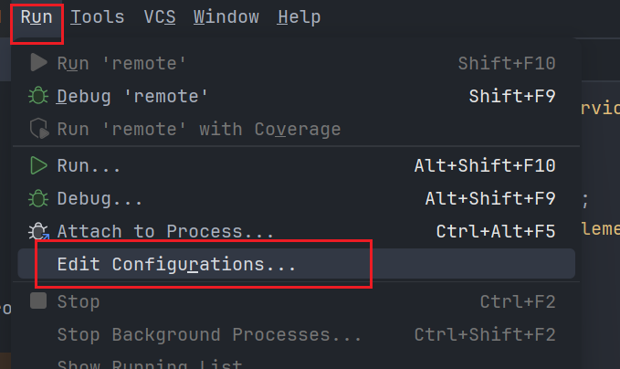
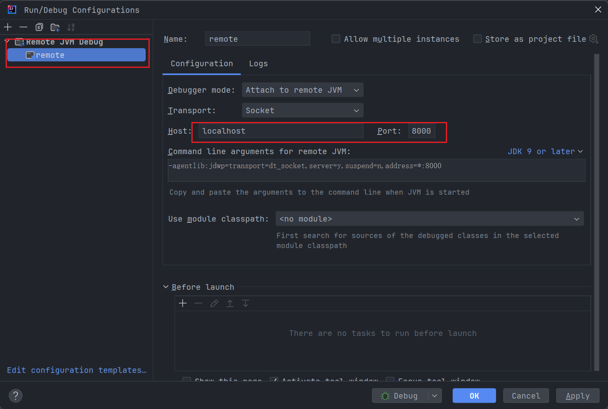
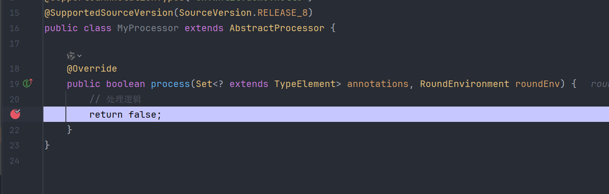

# Idea 调试注解处理器Processor

平时接触到的注解主要有两种:

- **编译时注解**:通过注解在编译期动态处理一些逻辑。例如：[Lombok](https://projectlombok.org/)的`@Data`、`@Builder`、`@Slf4j`等。

- **运行时注解**:通过反射在运行时动态处理一些逻辑。例如：[Spring](https://spring.io/projects/spring-framework)的`@Component`、`@Service`、`@Repository`等。

编译期注解一般都是自动生成代码，解放一些重复的工作，例如`@Data`自动生成构造方法和getter/setter方法。

编译期注解处理器`Processor`是编译时注解的核心，通过`Processor`可以动态处理一些编译时逻辑，它是注解处理器的接口类，`AnnotationProcessor`是`Processor`的一个抽象类，它已经实现了大部分的流程，我们只需要实现`process`方法即可方便的定义注解处理器。

## 自定义编译时注解处理器

自定义注解Processor可以查看：[自定义编译时注解处理器](/java/custom-annotation-processor)

## Idea调试注解处理器

- 添加Remote Debugger

在IDEA中添加Remote Debugger，端口为8000，位置在`Run>Edit Configurations`





- 编译

在终端使用`mvnDebug clean compile`命令编译项目，编译会显示监听端口8000。

```sh
$ mvnDebug clean compile
Listening for transport dt_socket at address: 8000
```

- 调试

添加断点，启动之前添加的Remote，使用dubug运行即可调试。



## 参考

- [Java注解编译期处理AbstractProcessor详解](https://blog.csdn.net/agonie201218/article/details/130940854)
- [IDEA调试注解处理器AbstractProcessor](https://www.jianshu.com/p/d0dd91c7c560)
