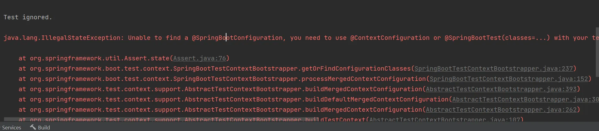

# java.lang.IllegalStateException: Unable to find a @SpringBootConfiguration, you need to use @Context

springboot在创建测试类进行测试时，出现了这个异常
java.lang.IllegalStateException: Unable to find a @SpringBootConfiguration, you need to use @Context

这个异常出现的原因是`@SpringBootTest`注释的测试类与`@SpringBootApplication`的启动类的路径不一致导致的，所以测试无法找到springboot的入口

## 解决方法

将测试类于Springboot的启动类的类路径保持一致
