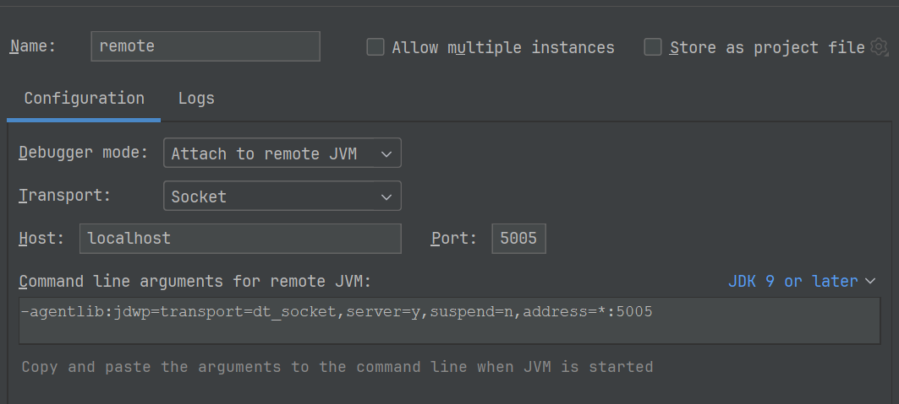

# Idea Remote Spring Boot Application

在开发中遇到需要在idea中调试Linux环境下的Spring Boot项目,正好电脑上安装了wsl,所以考虑通过在wsl中启动项目,但idea中wsl的插件需要idea Ultimate版本才支持,所以终考虑在wsl中启动项目,在idea中配置远程调试,通过idea远程调试

1. 在pom中配置spring-boot插件

[Spring::Debug the Application](https://docs.spring.io/spring-boot/maven-plugin/run.html#run.examples.debug)

```xml
<plugin>
    <groupId>org.springframework.boot</groupId>
    <artifactId>spring-boot-maven-plugin</artifactId>
    <version>2.7.5</version>
    <configuration>
        <jvmArguments>
            -Xrunjdwp:transport=dt_socket,server=y,suspend=y,address=5005
        </jvmArguments>
    </configuration>
</plugin>
```

2. 在wsl中执行`mvn spring-boot:run`，此时会在控制台看到如下日志并停在等待监听端口5005处

```
whl@WHLIT:/mnt/d/work/demo$ mvn spring-boot:run
[INFO] Scanning for projects...
... // 忽略中间日志
[INFO] Attaching agents: []
Listening for transport dt_socket at address: 5005
```

::: tip

也可以不在pom中添加`jvmArguments`,而是直接在命令后面添加`mvn spring-boot:run -Xrunjdwp:transport=dt_socket,server=y,suspend=y,address=5005`

:::

3. 在idea中配置远程调试，`Run/Debug -> Edit Configurations -> + Remote JVM Debug`，默认会以5005为端口，配置好后点击`Debug`，即可在idea中调试Spring Boot项目


