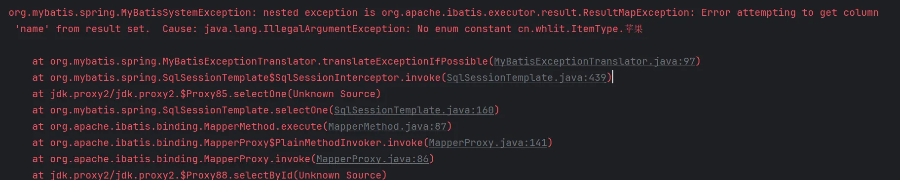

# 实体类与ResultMap中的属性顺序不一致的问题

> org.mybatis.spring.MyBatisSystemException: nested exception is org.apache.ibatis.executor.result.ResultMapException: Error attempting to get column 'name' from result set. Cause: java.lang.IllegalArgumentException: No enum constant cn.demo.ItemType.Apple

## 问题重现

在实体类中使用了[lombok](https://projectlombok.org/)的注解

```java
@Data
@Builder
public class Item {
    private Integer id;
    private String name;
    private ItemType type;
}
```

```xml
<resultMap id="item" type="cn.demo.entity.Item">
      <id column="id" property="id"/>
      <result column="name" property="name"/>
      <result column="type" property="type"/>
</resultMap>
<select id="selectById" resultMap="item" parameterType="integer">
    select id, `name`, `type` from item where id = #{id}
</select>
```

原有的类与resultMap是一样的顺序对应的，在查询的时候也是没有问题的。
当把实体类中的name和type换一下位置时

```java
@Data
@Builder
public class Item {
    private Integer id;
    private ItemType type;
    private String name;
}
```

就会报错



从报错的信息中可以发现在`applyColumnOrderBasedConstructorAutomapping`方法中是使用了构造函数中的数据类型的顺序进行的数据映射
而`[@Builder]()`生成的代码中只有全参构造函数，生成的构造函数的参数顺序又是和我们定义的类目属性的顺序是一致的，又因为name和type与resultMap中定义的映射中的顺序是不同的，所以在这里在进行数据类型的映射的时候就错误了。

```java
private boolean applyColumnOrderBasedConstructorAutomapping(ResultSetWrapper rsw, List<Class<?>> constructorArgTypes,
      List<Object> constructorArgs, Constructor<?> constructor, boolean foundValues) throws SQLException {
    for (int i = 0; i < constructor.getParameterTypes().length; i++) {
      Class<?> parameterType = constructor.getParameterTypes()[i];
      String columnName = rsw.getColumnNames().get(i);
      TypeHandler<?> typeHandler = rsw.getTypeHandler(parameterType, columnName);
      Object value = typeHandler.getResult(rsw.getResultSet(), columnName);
      constructorArgTypes.add(parameterType);
      constructorArgs.add(value);
      foundValues = value != null || foundValues;
    }
    return foundValues;
  }
```

## 解决方案

### 方案一：调整顺序

所以将实体类中定义的顺序与resultMap中的顺序一致就可以解决问题了，但是这个方式是一个治标不治本的方法，后面在增删改属性时，就需要对顺序进行仔细的观察了

### 方案二：添加构constructor标签

既然实体类中没有无参构造，mybatis选择了全参构造函数的方式，那么我们就使用mybatis的`constructor`标签来定义一个构造函数的映射，但是这种方法其实和方案一一样，都是要小心 构造函数中参数定义的顺序

```xml
<resultMap id="item" type="cn.demo.entity.Item">
      <constructor>
            <idArg column="id" javaType="integer"/>
            <arg column="type" javaType="cn.demo.ItemType"/>
            <arg column="name" javaType="string"/>
      </constructor>
</resultMap>
```

### 方案三：添加无参构造函数

要从根本上解决问题，那它现在使用的是顺序的方式进行数据映射，那我们让他去使用属性名称的方式去进行数据映射不就完美解决了。
而这里mybatis选择使用构造函数中的参数的顺序进行映射是因为实体类只有一个全参构造函数，所以我们只要给他加上无参构造函数就可以了

```java
@Data
@Builder
@NoArgsConstructor
public class Item {
    private Integer id;
    private ItemType type;
    private String name;
}
```

但是加上`[@NoArgsConstructor]()`注解后发现`[@Builder]()`报错了，查看字节码文件发现生成的builder中的build方法是调用实体类的全参构造方法进行的实例化，所以还要加上全参构造函数

### 最终的解决方案

最终还是选择方案三，避免以后的bug的产生

```java
@Data
@Builder
@NoArgsConstructor
@AllArgsConstructor
public class Item {
    private Integer id;
    private ItemType type;
    private String name;
}
```
