# ThreadLocal原理

当我们需要一个全局变量，并且线程独立，互不影响时，一般可以使用ThreadLocal。ThreadLocal是JDK包提供的线程本地变量，它在每一个线程中都有一个这个变量的本地副本。

## ThreadLocal的使用

直接创建静态成员变量即可，如下所示

```java
public class ThreadLocalDemo {
    static final ThreadLocal<String> THREAD_LOCAL = new ThreadLocal<>(); // 创建线程本地变量
    public static void main(String[] args) {
        Thread thread1 = new Thread(() -> {
            THREAD_LOCAL.set("thread one"); // 线程1设置变量值
            try {
                Thread.sleep(10); // 线程1休眠
            } catch (InterruptedException e) {
                throw new RuntimeException(e);
            }
            System.out.println(THREAD_LOCAL.get()); // 线程1获取变量值
        });
        Thread thread2 = new Thread(() -> {
            THREAD_LOCAL.set("thread two"); // 线程2设置变量值
            System.out.println(THREAD_LOCAL.get()); // 线程2获取变量值
        });
        thread1.start();
        thread2.start();
    }
}
// 运行结果
// thread two
// thread one
```

## ThreadLocal的原理

ThreadLocal的相关类图如下：



在`Thread`中有一个`threadLocals`变量，类型是`ThreadLocal.ThreadLocalMap`，`ThreadLocalMap`是一个特殊的`HashMap`，key是`ThreadLocal`的引用，value是通过`set`方法设置进去的值。

实际上每个线程的本地变量不是存放于ThreadLocal实例中，而是存放于线程的`threadLocals`变量中，即线程的内存空间中。也就是说ThreadLocal只是一个工具壳，当调用set方法时，它会将`value`值设置到线程的`threadLocals`变量里，当调用`get`方法时，它会从线程的`threadLocals`变量中获取`value`值。

```java
private T get(Thread t) {
    // 获取当前线程的`threadLocals`,即ThreadLocalMap
    ThreadLocalMap map = getMap(t);
    if (map != null) {
        // 通过`ThreadLocal`对象去获取`ThreadLocalMap`中的`value`值
        ThreadLocalMap.Entry e = map.getEntry(this);
        if (e != null) {
            @SuppressWarnings("unchecked")
            T result = (T) e.value;
            return result;
        }
    }
    // 如果没有`ThreadLocalMap`，那么就调用`setInitialValue`方法
    return setInitialValue(t);
}
```
