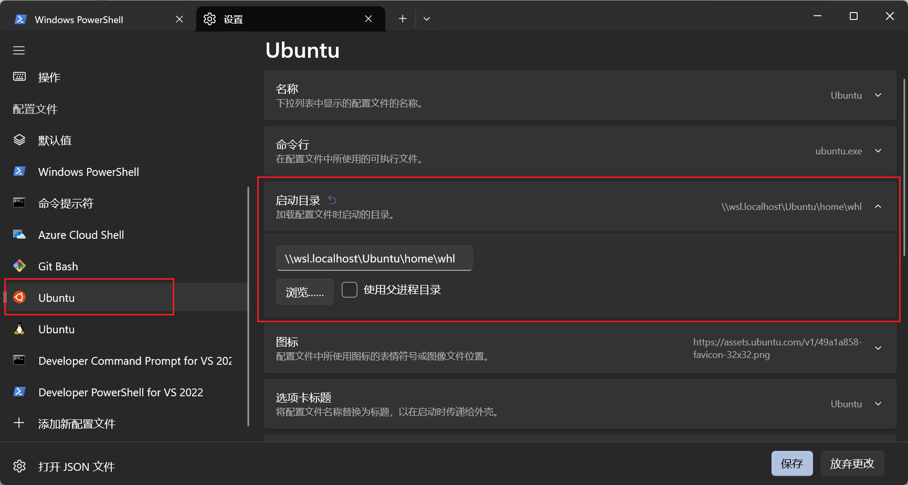

# wsl默认目录

在我们使用wsl时，会默认使用`C:\Users\用户名`作为wsl默认目录，也就是默认打开`/mnt/c/Users/用户名`目录，但正常来说我们希望在进入wsl时打开的默认目录是`/home/用户名`。

## 修改wsl默认目录

在`Windows Terminal`中可以对每个打开的终端环境进行设置，例如设置终端的外观配色、图标、交互等，其中就包含终端启动时的起始目录。

打开`Windows Terminal`，点击设置，点击需要修改的linux分发版对应的配置，可以看到有一个启动目录选项。或者直接修改json配置文件，在`profiles.list`中找到对应的配置项，修改`startingDirectory`值即可，对于值的规则可参考 [Windows 终端中的常规配置文件设置#起始目录](https://learn.microsoft.com/zh-cn/windows/terminal/customize-settings/profile-general#starting-directory)



## 修改 .bashrc 文件

上面的修改只能在`Windows Terminal`中新建标签页时选择对应的终端环境时有效，当我们使用`win + r`启动wsl时就没有作用了，我们可以直接在进入wsl时，默认直接`cd ~`进入用户目录。

修改`~/.bashrc`文件，在最后一行添加`cd ~`命令即可。

不过这个修改会导致我们在通过文件资源管理器的地址栏运行wsl打开指定目录的方式失效，所以这个方式也不是最佳解决方案。可以通过判断当前打开的目录是否是windows用户目录来解决。

```sh
if [ $PWD = "/mnt/c/Users/用户名" ]; then
  cd ~
fi
```

## 终极方案

- 共享`USERPROFILE`到wsl中

在windows中设置一个特殊的环境变量`WSLENV`，这个环境变量使得wsl和windows之间可以共享环境变量。相关配置语法可以参考：[在 WSL 和 Windows 之间共享环境变量](https://devblogs.microsoft.com/commandline/share-environment-vars-between-wsl-and-windows/)

```cmd
setx WSLENV USERPROFILE/up
```

- 判断当前目录是否是windows用户目录

在wsl中修改`~/.bashrc`文件，在文件末尾添加以下内容：

```sh
if [ $PWD = $USERPROFILE ]; then
  cd ~
fi
```

## 参考

- [Windows 终端中的常规配置文件设置#起始目录](https://learn.microsoft.com/zh-cn/windows/terminal/customize-settings/profile-general#starting-directory)
- [WSL修改默认进入路径最佳解决办法](https://blog.csdn.net/qq_24504083/article/details/123257600)
- [Is there a way to get access to Windows environment variables in wsl?](https://stackoverflow.com/questions/43794915/is-there-a-way-to-get-access-to-windows-environment-variables-in-wsl)
