# MySQL 执行计划

在我们的项目开发过程中，不可避免的会出现因我们的sql语句的不合适而导致的sql语句执行的慢的情况，要分析这条sql语句为什么执行慢，又要怎么优化它，我们最常用的一个方法就是查看这条语句的执行计划，也就是在sql语句前加上`EXPLAIN`。

EXPLAIN 语句提供有关MySQL如何执行语句的信息。 EXPLAIN 适用于 SELECT 、 DELETE 、 INSERT 、 REPLACE 和 UPDATE 语句。它可以为我们提供读取表的顺序、索引的使用情况、扫描的行数等信息。EXPLAIN 语句输出的列信息如下所示：

| 列名称          | 说明                     |
| --------------- | ------------------------ |
| `id`            | Select标识符             |
| `select_type`   | 查询类型                 |
| `table`         | 表名称                   |
| `partitions`    | 匹配的分区               |
| `type`          | 类型                     |
| `possible_keys` | 可供选择的索引           |
| `key`           | 实际使用的索引           |
| `key_len`       | 索引长度                 |
| `ref`           | 与索引进行比较的列       |
| `rows`          | 扫描的行数               |
| `filtered`      | 按表条件筛选的行的百分比 |
| `Extra`         | 其他信息                 |

## id

Select标识符，主要用来标识整个查询中查询语句的顺序，id越大越先执行，如果id相同，则从上往下执行。如果该行是引用其他行的并集结果，则可能为null

## select_type

查询类型，类型可以是下面的任何类型：

| 类型                   | 说明                                                |
| ---------------------- | --------------------------------------------------- |
| `SIMPLE`               | 简单查询，不使用UNION或者子查询                     |
| `PRIMARY`              | 主查询，在UNION中的第一个或者子查询中的最外层的查询 |
| `UNION`                | 在UNION中的第二个或者后面的SELECT语句               |
| `DEPENDENT UNION`      | 在UNION中的第二个或者后面的SELECT语句               |
| `UNION RESULT`         | UNION 的结果                                        |
| `SUBQUERY`             | 子查询中的第一个SELECT语句                          |
| `DEPENDENT SUBQUERY`   | 子查询中的第一个SELECT语句,基于外层查询             |
| `DERIVED`              | 派生表，From子句中Select查询的结果的临时表          |
| `MATERIALIZED`         | 物化表，将子查询结果生成为临时表来进行查询          |
| `UNCACHEABLE SUBQUERY` | 无法缓存的子查询结果                                |
| `UNCACHEABLE UNION`    | 无法缓存的UNION的第二个或者后面的Select的结果       |

### SIMPLE

简单查询，不使用UNION或者子查询

```sql
EXPLAIN SELECT * FROM page WHERE id = 1;
```

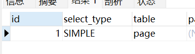

### PRIMARY

主查询，在UNION中的第一个查询，或者子查询中的最外层的查询。

- UNION查询

```sql
explain
select id, title FROM page WHERE id = 1
union
SELECT id, title from page WHERE id = 2;
```

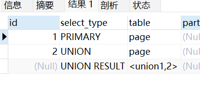

- 子查询

```sql
EXPLAIN
SELECT r.id, r.contributor_id FROM revision r WHERE r.id =
(SELECT p.revision_id FROM page p WHERE p.id = 22);
```


### UNION

在UNION中的第二个或者后面的SELECT语句

```sql
explain
select id, title FROM page WHERE id = 1
union
select id, title FROM page WHERE title = '音乐'
union
SELECT id, title from page WHERE ns = 4;
```

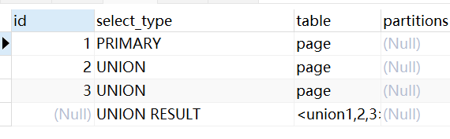

### DEPENDENT UNION

在子查询中的UNION中的第二个或者后面的SELECT语句

```sql
EXPLAIN
SELECT r.id, r.contributor_id FROM revision r WHERE r.id in(
SELECT p.revision_id FROM page p WHERE p.id = 22
UNION
SELECT p.revision_id FROM page p WHERE p.title = '音乐'
UNION
SELECT p.revision_id FROM page p WHERE p.ns = 4
);
```

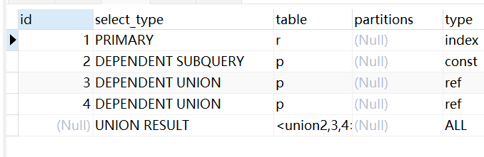

### UNION RESULT

UNION的结果，例如上面的例子

### SUBQUERY

子查询中的第一个SELECT语句

```sql
EXPLAIN
SELECT r.id, r.contributor_id FROM revision r WHERE r.id =
(SELECT p.revision_id FROM page p WHERE p.id = 22);
```


### DEPENDENT SUBQUERY

子查询中的第一个SELECT语句，基于外层查询

```sql
EXPLAIN
SELECT u.id, u.user_name FROM `user` u WHERE u.id < 1000 AND
(SELECT count(1) FROM revision r WHERE u.id = r.contributor_id ) > 10;
```

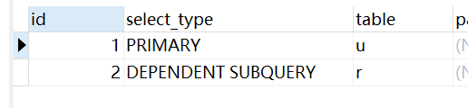

### DERIVED

派生表是From子句中Select查询的结果的临时表。

```sql
EXPLAIN
SELECT u.id, u.user_name FROM `user` u LEFT JOIN
(SELECT contributor_id, count(id) FROM revision GROUP BY contributor_id) t on u.id = t.contributor_id
```

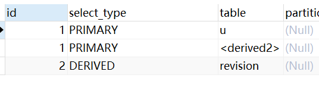

### MATERIALIZED

物化表，将子查询结果生成为临时表来进行查询。当Mysql第一次需要子查询结果时，它会将结果具体化为临时表，每当需要结果时，都会引用临时表，当临时表太大时，会退化到磁盘存储。

```sql
EXPLAIN
SELECT u.* FROM `user` u WHERE u.id in (
SELECT r.contributor_id FROM revision r WHERE r.id < 690000
);
```

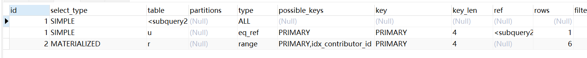

### UNCACHEABLE SUBQUERY

无法缓存的子查询结果

```sql
EXPLAIN
SELECT r.* FROM `revision` r WHERE EXISTS (
	SELECT u.* FROM `revision` u WHERE u.id < 690000
	UNION
	SELECT t.* FROM `revision` t WHERE t.id = r.parent_id
);
```

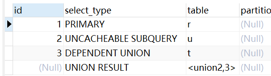

### UNCACHEABLE UNION

无法缓存的UNION的第二个或者后面的Select的结果

```sql
EXPLAIN
SELECT r.* FROM `revision` r WHERE EXISTS (
	SELECT t.* FROM `revision` t WHERE t.id = r.parent_id
	UNION
	SELECT u.* FROM `revision` u WHERE u.id < 690000
);
```

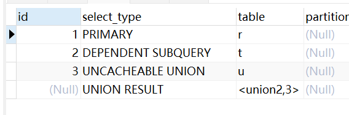

## table

输出行所引用的表名称。也可以是下列值：

- `<unionM,N>`：行是指 id 值为 M 和 N 的行的并集。
- `<derivedN>`：该行是指 id 值为 N 的行的派生表结果。
- `<subqueryN>`：该行是指 id 值为 N 的行的实例化子查询的结果

## partitions

查询将从中匹配记录的分区。如果没有分区，则为NULL。

## type

联接类型，指的是查询中如何关联表。

官方文档：[EXPLAIN Join Types](https://dev.mysql.com/doc/refman/5.7/en/explain-output.html#explain-join-types)

### system

该表只有一行(系统表)，这个是const类型的特例。

### const

该表最多只有一个匹配的行，在查询开始时读取，由于只有一行，所以此行数据的列会被优化器的其余部分视为常量。

```sql
EXPLAIN
SELECT * FROM `user` WHERE id = 3;
```

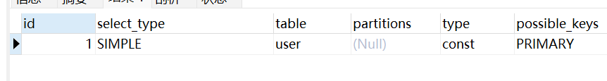

### eq_ref

对于前一个表的每一行，都从此表中读取一行，也就是一对一。当连接使用了索引的所有部分，并且索引是`PRIMARY KEY`或`UNIQUE NOT NULL`时，会使用这个类型。

```sql
EXPLAIN
SELECT * FROM revision r LEFT JOIN `user` u on r.contributor_id = u.id;
```

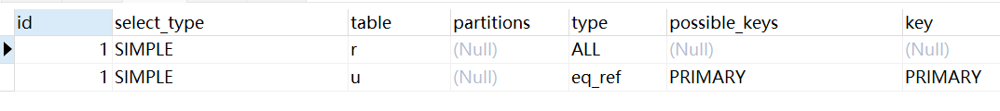

### ref

对于前一个表的每一行，都从此表中读取匹配的所有行，也就是一对多。当连接使用的是索引的左前缀，或者不是`PRIMARY KEY`或`UNIQUE NOT NULL`时，会使用这个类型。

```sql
EXPLAIN
SELECT * FROM revision r RIGHT JOIN `user` u on r.contributor_id = u.id;
```

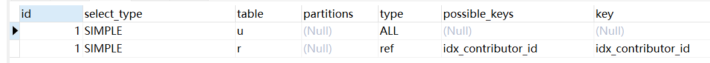

### fulltext

FULLTEXT索引的类型

### ref_or_null

类似于ref，但增加了对NULL值的查询。

```sql
EXPLAIN
SELECT * FROM revision WHERE contributor_id = 19228 or contributor_id is null;
```

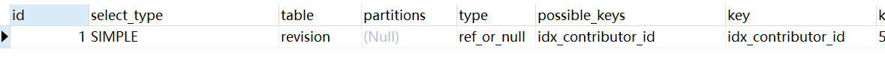

### index_merge

索引合并优化。索引合并交集算法对所有使用的索引执行同时扫描，并生成从合并索引扫描接收的行序列的交集。

```sql
EXPLAIN
SELECT * FROM revision WHERE contributor_id = 19228 or size = 30;
```

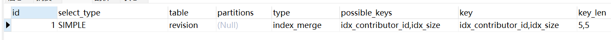

### unique_subquery

替换一些in子查询的情况，子查询是唯一索引。

### index_subquery

替换一些in子查询的情况，子查询是非唯一索引。

### range

仅检索给定范围内的行，使用索引选择行。用常量比较索引列时生效。

```sql
EXPLAIN
SELECT * FROM revision WHERE `size` > 100 and `size` < 110;
```

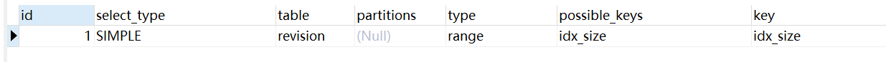

### index

于ALL相同，只不过是扫描索引树，也就是顺序扫描索所有行。这个情况是索引中的列已经可以满足所有需要的数据，也就是查询的字段都是索引中的字段。因为索引中字段要比表中的字段少，所以可以加快扫描。

```sql
EXPLAIN
SELECT id, size FROM revision;
```

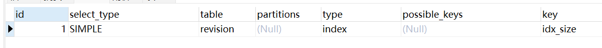

### ALL

对表中的所有行数据进行扫描。例如对没有索引的列查询。

```sql
EXPLAIN
SELECT * FROM revision WHERE `sha1` = 'buv8i0daojy7teo07lror5ybtcvoxa8';
```

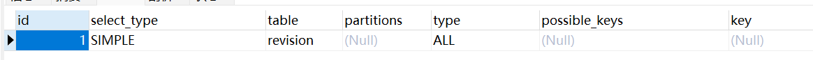

## posiable_keys

列出该行查询中可以选择使用的索引。如果为NULL则没有可用的索引。

如下图中我们看到revision表有两个可能用到的索引，PRIMARY和idx_contributor_id，page表有一个可能用到的索引，revision_id。

```sql
explain
SELECT p.title, r.size, r.contributor_id
FROM page p LEFT JOIN revision r on p.revision_id = r.id
WHERE r.contributor_id = '11110';
```

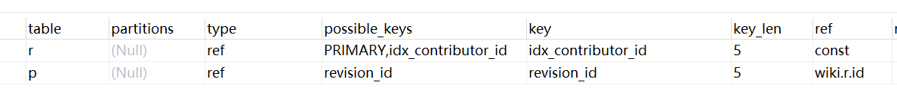

## key

在该行查询中实际使用到的索引。例如上面的例子中，revision表有两个可能用到的索引PRIMARY和idx_contributor_id，但实际使用了idx_contributor_id。


## key_len

实际使用到的索引的长度。

## ref

显示将哪些列或者常量与key命中的索引进行比较，以便从索引中选择行。

## rows

命中的数据的行数。对于InnoDB表，这个值是估计值，不一定准确。

## filtered

按条件筛选的行的百分比。也就是从表中筛选出百分之多少的行用于后面的查询。

## Extra

其他信息。

## 参考

- [MySQL 执行计划](https://dev.mysql.com/doc/refman/5.7/en/explain-output.html)
