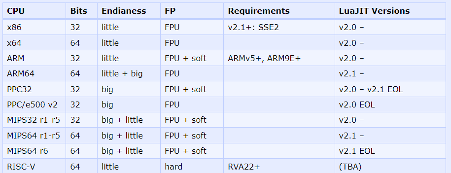

# Nginx 安装 Lua

Nginx 默认是没有 Lua 的，需要手动安装，Openresty 提供了 `lua-nginx-module` 来集成 Lua。

## 下载

下载 nginx 以及 lua-nginx-module 相关的模块的源码，通过源码自行编译nginx和lua。

| 名称             | 版本          | 说明                                                                                    |
| ---------------- | ------------- | --------------------------------------------------------------------------------------- |
| nginx            | 1.25.3        | [下载](https://github.com/nginx/nginx/archive/refs/tags/release-1.25.3.tar.gz)          |
| lua-nginx-module | 0.10.25       | [下载](https://github.com/openresty/lua-nginx-module/archive/refs/tags/v0.10.25.tar.gz) |
| lua-resty-core   | 0.1.27        | [下载](https://github.com/openresty/lua-resty-core/archive/refs/tags/v0.1.27.tar.gz)    |
| ngx_devel_kit    | 0.3.3         | [下载](https://github.com/vision5/ngx_devel_kit/archive/refs/tags/v0.3.3.tar.gz)        |
| luajit2          | v2.1-20231117 | [下载](https://github.com/openresty/luajit2/archive/refs/tags/v2.1-20231117.tar.gz)     |

以上版本是依据 [Openresty 1.25.3](https://openresty.org/cn/changelog-1025003.html) 的依赖列表配置的。

注意：`lua-nginx-module` 从 0.10.16 开始部分函数被拆分到 `lua-resty-core` 中，例如 `ngx.req.get_uri_args()`，所以需要安装 `lua-resty-core`，同时 `lua-resty-core` 对 `lua-nginx-module` 的版本有要求需要一一对应，对应关系可以在 `lib\resty\core\base.lua` 中找到。

[LuaJIT 支持的Cpu架构](https://luajit.org/status.html)，上面使用的luajit2是openresty在LuaJIT基础的修改版本，可以更好的和lua-nginx-module配合使用。



## 编译安装 luajit

将`luajit2`编译安装到`/usr/local/luajit2`中。

```sh
# 解压缩
tar zxvf luajit2.tar.gz
cd luajit2
# 编译
make
# 安装
make install PREFIX=/usr/local/luajit2
# 配置环境变量
echo "export LUAJIT_LIB=/usr/local/luajit2/lib" >> /etc/profile
echo "export LUAJIT_INC=/usr/local/luajit2/include/luajit-2.1" >> /etc/profile
```

## 编译安装 lua-nginx-module

```sh
# 解压缩
tar zxvf lua-nginx-module-0.10.25.tar.gz
cd lua-nginx-module-0.10.25
# 编译
make
# 安装
make install PREFIX=/usr/local
```

## 编译安装 lua-resty-core

```sh
# 解压缩
tar zxvf lua-resty-core-0.1.27.tar.gz
cd lua-resty-core-0.1.27
# 编译
make
# 安装
make install PREFIX=/usr/local
```

## 解压缩 ngx_devel_kit

不需要安装，直接解压即可

```sh
# 解压缩
tar zxvf ngx_devel_kit-0.3.0.tar.gz
```

## 编译安装 nginx

```sh
# 解压缩
tar -zxvf nginx-1.25.3.tar.gz
cd nginx-1.25.3
# 编译参数配置
./configure --prefix=/usr/local/nginx --with-http_stub_status_module --with-http_ssl_module --with-http_realip_module --with-http_sub_module --with-http_gzip_static_module --with-pcre --with-ld-opt=-Wl,-rpath,/usr/local/luajit2/lib --add-module=/usr/local/ngx_devel_kit-0.3.0 --add-module=/usr/local/lua-nginx-module-0.10.25
# 编译
make
# 安装
make install
```

## 引用 lua-resty-core 模块

修改nginx配置文件，在http全局配置添加lua配置：

```lua
lua_package_path "/usr/local/lib/lua/../?.lua;;";
```

## 参考

- [Nginx](https://nginx.org/en/)
- [Openresty](https://openresty.org/cn/)
- [luajit2](https://github.com/openresty/luajit2)
- [ngx_devel_kit](https://github.com/vision5/ngx_devel_kit)
- [lua-resty-core](https://github.com/openresty/lua-resty-core)
- [lua-nginx-module](https://github.com/openresty/lua-nginx-module)
- [Nginx官方版本集成lua-nginx模块](https://blog.csdn.net/txtang123/article/details/134609791)
- [Openresty 1.25.3 ChangeLog](https://openresty.org/cn/changelog-1025003.html)
