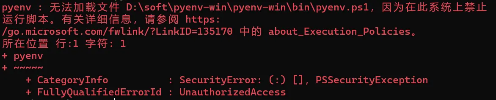

# 无法加载xxx.ps1,因为在此系统上禁止运行脚本

**报错信息：**



因为powershell默认是不允许运行任何脚本文件的，需要更改为RemoteSigned
微软官方对于执行策略的说明：[PowerShell 执行策略](https://learn.microsoft.com/zh-cn/powershell/module/microsoft.powershell.core/about/about_execution_policies?view=powershell-7.4)
管理员打开powershell

```shell
## 查询执行策略
C:\>Get-ExecutionPolicy
## 设置执行策略
C:\>Set-ExecutionPolicy RemoteSigned
```
