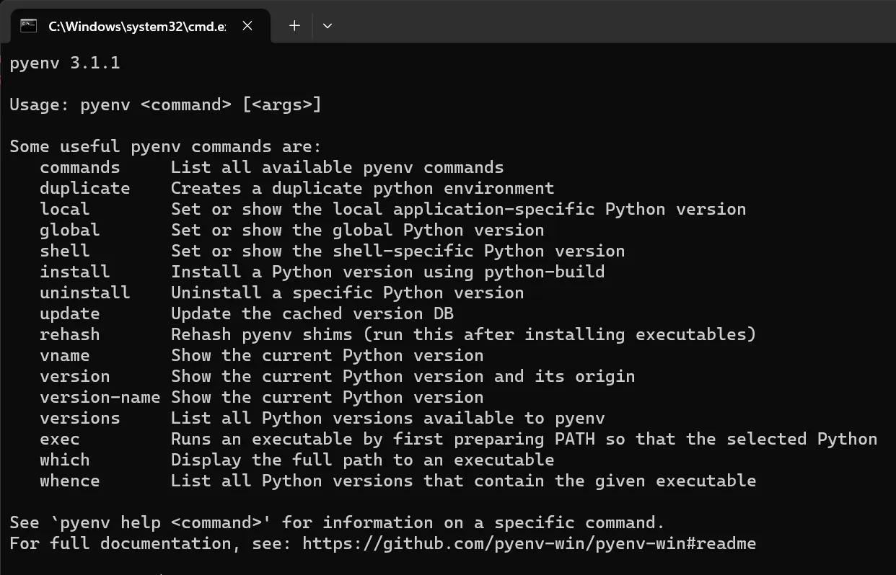
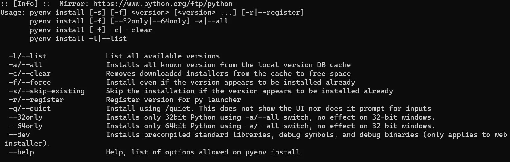

# Python 版本管理

在日常的学习和工作中经常会在系统中安装多个版本的 python，其中pyenv就是一个python版本管理的工具，但是它并不支持windows，不过有pyenv-win的代替版本

[GitHub - pyenv/pyenv](https://github.com/pyenv/pyenv)

[GitHub - pyenv-win/pyenv-win](https://github.com/pyenv-win/pyenv-win)

## git 方式安装pyenv-win

1. 克隆pyenv-win代码库

`git clone https://github.com/pyenv-win/pyenv-win.git`

2. 设置环境变量

| PYENV      | 安装目录                    |                              |
| ---------- | --------------------------- | ---------------------------- |
| PYENV_ROOT | 安装目录                    |                              |
| PYENV_HOME | 安装目录                    |                              |
| PATH       | %PYENV%\\bin;%PYENV%\\shims | 将bin和shims中的添加到path中 |

3. 测试

打开cmd，输入pyenv，出现版本号即表示安装成功



## wsl ubuntu安装pyenv

1. 自动安装程序

```shell
curl https://pyenv.run | bash
```

2. 设置环境变量

- 官网中第二步`command -v pyenv >/dev/null`不需要加，加上导致后面的参数没有生效

```shell
echo 'export PYENV_ROOT="$HOME/.pyenv"' >> ~/.bashrc
echo 'export PATH="$PYENV_ROOT/bin:$PATH"' >> ~/.bashrc
echo 'eval "$(pyenv init -)"' >> ~/.bashrc
```

- 添加到：~/.profileecho 官网中提到可以添加，我有这个文件但是没添加也没有问题

```shell
echo 'export PYENV_ROOT="$HOME/.pyenv"' >> ~/.profile
echo 'export PATH="$PYENV_ROOT/bin:$PATH"' >> ~/.profile
echo 'eval "$(pyenv init -)"' >> ~/.profile
```

## pyenv使用

pyenv install



1. 列出所有可安装的python版本

```shell
C:\>pyenv install -l
```

2. 安装指定版本的python

```shell
C:\>pyenv install 版本号
```

3. 查看所有已安装版本

```shell
C:\>pyenv versions
```

4. 使用已安装的某个版本

```shell
C:\>pyenv local 3.11.5 ## 表示在本文件夹中使用3.11.5版本
C:\>pyenv global 3.11.5 ## 表示全局的python版本为3.11.5
```

5. 查看当前使用的版本

```shell
C:\>pyenv version
```

## 可能出现的问题

### no acceptable C compiler found in $PATH

在安装python版本时会出现该问题，意思是安装的过程中需要c/c++的编辑环境，所以可以安装gcc来解决

```shell
apt-get install gcc
apt-get install build-essential
```

### subprocess.CalledProcessError: Command ....

在安装python版本时出现的该问题，也是python的编译环境的缺失，从官网找到的安装环境

```shell
sudo apt update; sudo apt install build-essential libssl-dev zlib1g-dev \
libbz2-dev libreadline-dev libsqlite3-dev curl \
libncursesw5-dev xz-utils tk-dev libxml2-dev libxmlsec1-dev libffi-dev liblzma-dev
```
