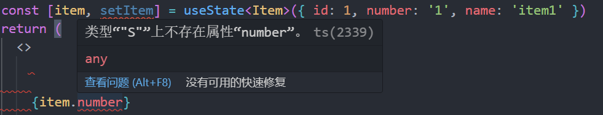

# 不小心修改了node_modules中包的内容

在学习React时，我意外修改了node_modules中包的内容，导致项目中原本的代码报错。

```ts
function useState<S>(initialState: S | (() => S)): [S, Dispatch<SetStateAction<S>>]
```

`useState`原来的定义是上面这样的，不知啥时候不小心把类型给改了，变成了下面这个样子

```ts
function useState<S>(initialState: S | (() => S)): [`S`, Dispatch<SetStateAction<S>>]
```

在`S`的两端添加了反引号，在使用useState时，返回的类型不是期望的


