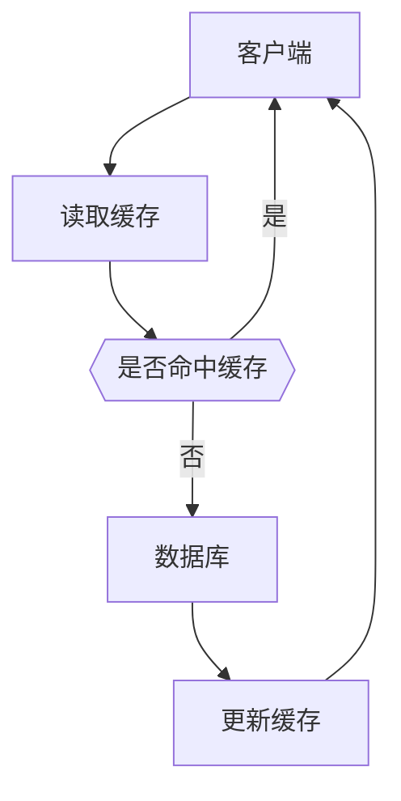

# 使用Redis进行数据缓存

## 延时双删

### 缓存一致性

一般项目中的缓存设计都是先从缓存中读数据，如果命中缓存，则直接从缓存中返回数据，如果没有命中缓存，再从数据库中读数据，并将数据写入缓存。

当数据需要进行修改时，则肯定要进行缓存的更新，而在高并发下数据库的更新以及缓存的更新可能会导致数据不一致。所以缓存的更新时机就尤为重要了。一般有以下几种情况

- 先删除缓存，再更新数据库
- 先更新数据库，再删除缓存
- 先删除缓存，再更新数据库，再删除缓存
- 先删除缓存，再更新数据库，等待一段时间再删除缓存

### 先删除缓存，再更新数据库

先删除缓存，再更新数据库存在的问题是当缓存失效后，此时还未进行数据库的更新操作，有一个线程恰好查询这条数据，就从数据库查询出更新前的数据，并把数据更新到缓存，之后查询到的缓存数据就还是之前的数据，导致缓存及数据库的数据不一致。

### 先更新数据库，再删除缓存

先更新数据库，再删除缓存，存在的问题是数据库更新操作期间，数据的查询操作都会命中缓存，查询到缓存中的数据。

### 先删除缓存，再更新数据库，再删除缓存

先删除缓存，避免数据库更新期间的数据查询，更新数据库后删除缓存，是避免缓存中存储的数据是更新前的数据。保证最终的缓存中的数据是更新后的数据。

### 先删除缓存，再更新数据库，等待一段时间再删除缓存

当数据库是读写分离的架构时，读数据库和写数据库的数据进行同步也是有一定的延时的，虽然这个延时时间是很短的。但是如果在这个时间段内，进行了缓存的更新，那在读数据库时读的可就是更新前的数据了，导致了缓存的不一致，所以在第二次的缓存失效前要等待一段时间再删除缓存。

## 缓存雪崩

当缓存机器意外发生故障，导致全盘宕机，缓存挂了。此时大量的请求会全部落到数据库，数据库不出意外地也挂掉了，而此时如果贸然重启数据库，数据库依然会被大量的请求打挂掉。

解决方案：

- Redis高可用：主从+哨兵，避免缓存全面崩盘
- 数据库请求降流，避免数据库被打死
- Redis持久化，当Redis重启时自动从磁盘加载数据快速恢复缓存数据

## 缓存穿透

当存在大量的数据库不存在的数据请求时，此时由于数据库中不存在该数据，那缓存中也当然不会存在该数据，所以这些请求就直接查询数据库。

解决方案：

- 对不存在的数据，写一个特定的空值到缓存中
- 在缓存之前增加布隆过滤器，如果请求的数据存在于布隆过滤器中，则立即返回数据不存在，反之则查询缓存

## 缓存击穿

当某个缓存数据的访问非常频繁，处于集中高并发的情况下，此时这个数据缓存失效。在失效的瞬间大量的请求直接击穿缓存请求数据库。

解决方案：

- 如果缓存的数据基本不会发生更新，可以尝试将热点数据设置为永不过期
- 如果缓存数据更新不频繁，且缓存刷新的整个流程的耗时较少的情况下可以采用Redis、zookeeper等分布式中间件的分布式互斥锁或者本地互斥锁以保证仅少量的请求能请求数据库并重新构建缓存，其余则在缓存释放锁后能访问到缓存
- 如果缓存数据更新频繁或者在缓存刷新的流程耗时较长的情况下，可以利用定时的线程在缓存过期前主动的重新构建缓存或者延后缓存的过期时间，以保证缓存能够一直被访问到
